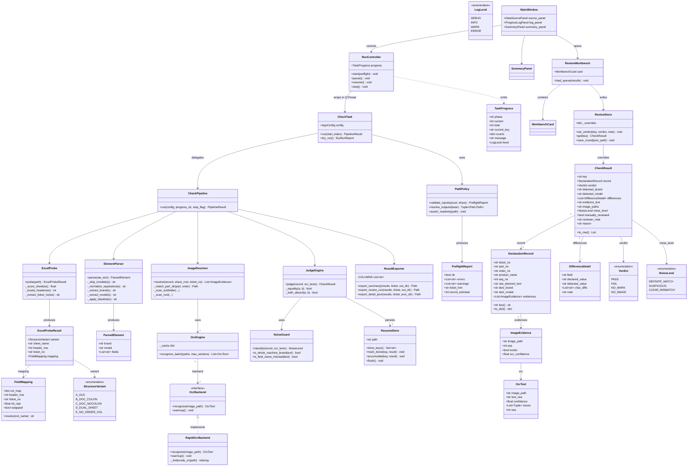
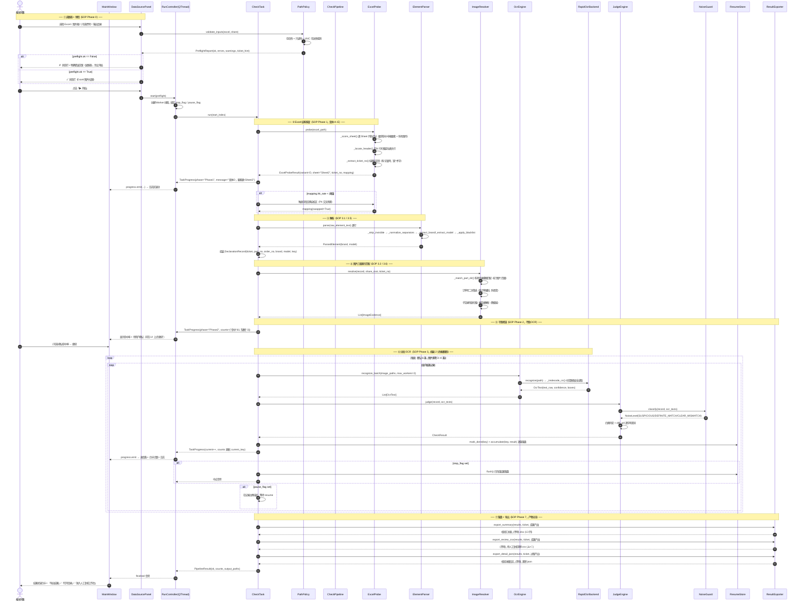
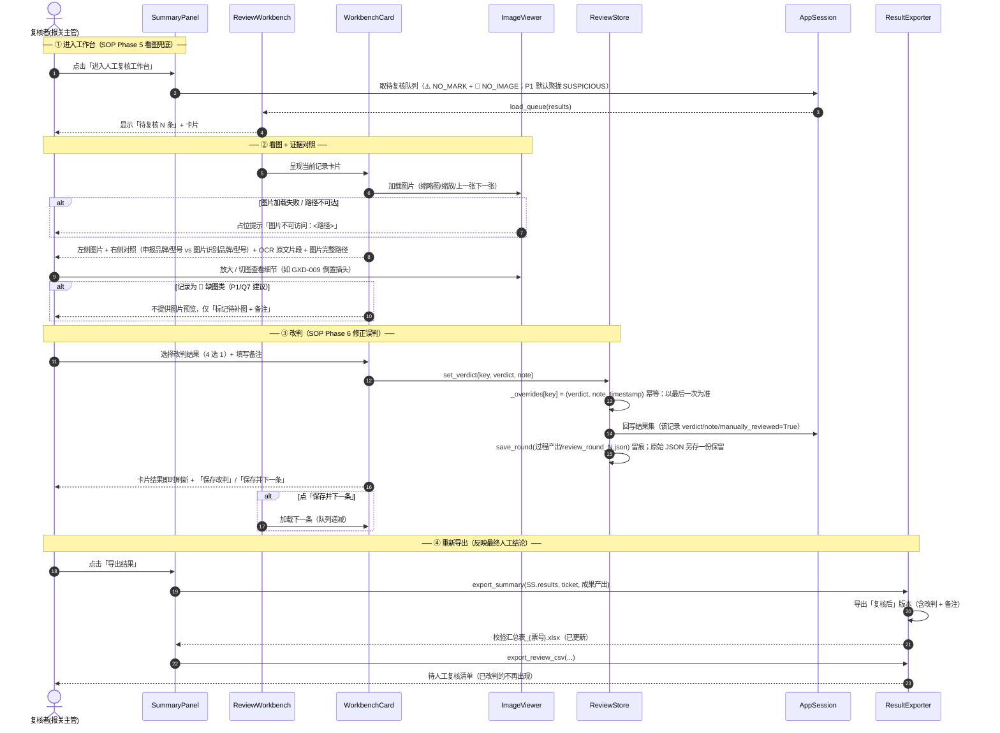
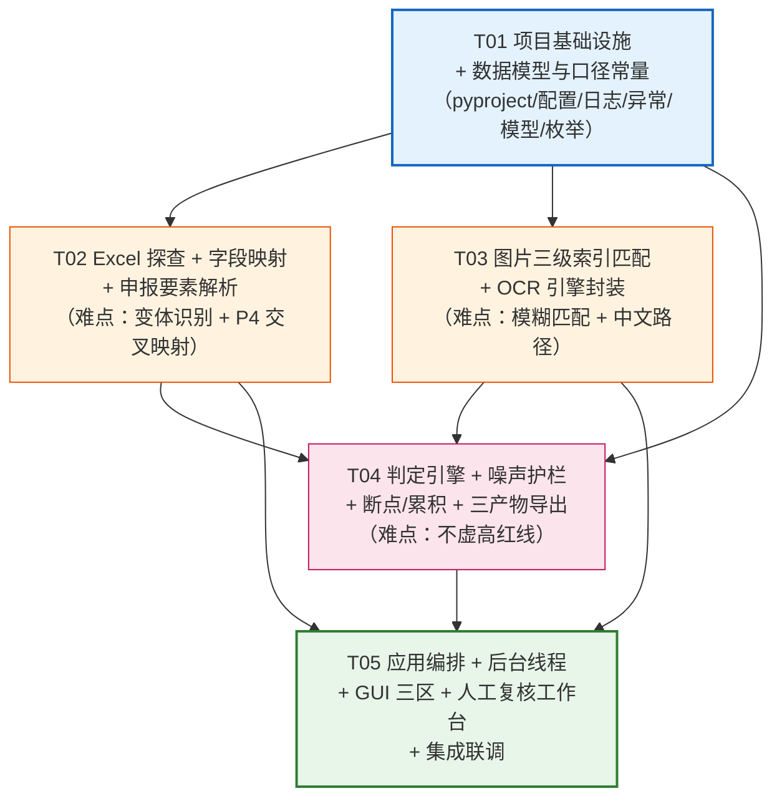

# 架构设计 · 报关申报要素自动校验桌面工具

> 版本：**v1.2**（v1.0 基线 + v1.1 用户 5 点硬约束 + v1.2 环境实测结论；增量见文末「第 12 节」「第 13 节」）
> 作者：高见远（架构师 / Bob）
> 日期：2026-09-16
> 上游输入：`过程产出/PRD_报关申报要素自动校验工具_0916.md`（许清楚）
> 口径权威来源：`成果产出/报关申报要素自动校验SOP_0916.md`（v2.0）
> **口径声明：本设计仅负责"让 SOP 口径可被实现"，不新增、不改写、不弱化任何判定口径。四类判定、8 Phase、防误提取 8 规则、三级索引、三条铁律原样承接。**

> 📌 **v1.1 修订速览（Jason 老板批准的 5 点硬约束）**
> - **A. 断点续跑 UI**（推翻原 Q1 结论）：改为**显式断点交互** —— 开始按钮→「重新开始」、暂停按钮→「继续执行」、预检行红字标识断点状态；新增**断点↔数据源绑定校验**防串票。
> - **B. Win10 兼容**：运行环境由 `Windows 11+` 修订为 **Windows 10 1809+ / LTSC 2019+ 及以上**（Qt 6.2+ 的硬要求）；补充 VC++ 运行库与 PyInstaller 注意事项。
> - **C. 规则外置配置**：新增 `rules/` YAML 规则目录，**补规则 = 改 YAML 不改代码**；口径语义不变。
> - **D. 共享文件夹（UNC）支持**：Excel 文件本身也可在 UNC；`{年份}` 变量 UI 化；层级解析规则对齐用户示例路径；共享盘断连强化。
> - **E. 一键运行/极简操作**：路径记忆、配置复用、默认输出目录、启动即预检。
>
> 📌 **v1.2 修订速览（环境实测结论）**
> - **OCR 封装库更换**：`rapidocr_onnxruntime`（硬卡 Python<3.13，装不上）→ **`rapidocr>=3.9,<4.0`**；**推理后端仍是 onnxruntime**，属"封装库版本升级"非"口径变更"。
> - **依赖版本按实测锁定**（见 13.6）：PySide6 6.9.3 / numpy 2.1.3 / onnxruntime 1.30.0 / opencv-headless 4.14 等。
> - **条件**：`headless` 版**保持**（accept pip warning 换避 Qt 冲突）；**新增 R11**（pip 空壳包污染）+ `tools/check_env.py` 打包前体检。
> - **验证**：`cv2.imread` 中文路径静默失败（实锤）；`SKYHORTH P/H` 噪声实测复现 → NoiseGuard 新增易混字符模糊匹配规则。
>
> 正文第 1–11 节为 v1.0 基线（其中 **Q1 结论被第 12 节修订覆盖**，其余保留）；**第 12 节（v1.1）与第 13 节（v1.2）为权威增量，凡冲突处以增量节为准。**

---

## 〇、真实数据探查结论（本次动笔的事实依据）

在动手设计前，我对样本 SA26090215 做了实测探查（openpyxl + 目录遍历），结论如下，**其中 3 条纠正了上游口头描述，请务必以本节为准**：

| # | 探查项 | 实测结论 | 对设计的影响 |
|---|---|---|---|
| P1 | Excel Sheet 结构 | `Sheet1`(77×108) 是箱明细，**首列第 3 列 C1 就是表头「出货通知书号」**；`Sheet2`(20×8) 才是要素表 | 变体 D 确认。Sheet 定位**不能**用"含出货通知书号列的 Sheet"，必须用"含申报要素列 + 表头特征"打分 |
| P2 | 要素表标题行 | Sheet2 `A1='出货通知号SA26090215'`，**缺"书"字**、**无冒号**、单单元格 | 票号提取正则须容忍 `出货通知书号 / 出货通知号`，且有/无冒号 |
| P3 | 要素表表头行 | `R2 = 序号\|物料编号\|订单号\|名称\|数量\|重量\|(空)\|申报要素`，**表头是第 2 行不是第 1 行** | 表头行须"扫描前 N 行 + 列名命中打分"定位，不可假定第 1 行 |
| P4 | ⚠️ **列名与数据语义交叉（最危险）** | `物料编号`列 值 = `N011901-007386-001`；`订单号`列 值 = `2660326M`。而**图片文件名 = `2660326M&N011901-007386-001&001.jpg`**：首段=`2660326M`（=Excel"订单号"列值），第二段=`N011901-007386-001`（=Excel"物料编号"列值） | **SOP 陷阱 #11「表头与实际数据可能相反」实锤**。三级索引 key 的构造与文件名解析必须按实测语义映射，**不能按列名字面理解**（详见第 6 节字段映射表） |
| P5 | 料号目录名 | `2660308M图片`（**带"图片"后缀**）、`2660310M`、`2660326M`、`2660328M`、`2660689M`（无后缀），共 5 个子目录、**129 张 jpg** | 料号目录模糊匹配须吃掉 `图片`/`-0-xx` 等后缀；命中后要能区分"目录名实际内容" |
| P6 | 同料号多订单 | `2660310M` 下含 **5 个订单**（009350 / 009690 / 001217-906 / 023966-905 / 003211-001），共 36 张图 | 必须叠加订单号二次筛选（SOP 3.6 强制），否则必串货 |
| P7 | 序号跳号 | `...003211-001&001…&006,&008,&009`（缺 &007） | 序号不可假设连续，必须按实际文件名枚举 |
| P8 | 申报要素文本 | 分隔符混用 `\|`(半角竖线) 与 `、`(顿号) 与 `;`(分号)；冒号混用 `:` 与 `：`；品牌形态 4 种：`品牌:baori` / `品牌:无` / `无品牌`(无冒号) / `宇同品牌`(中文+品牌后缀)；还有 `品牌;无;`(分号夹空) | 解析器须用"分隔符归一化 + 多形态正则 + 黑名单护栏"三段式，见第 4 节 |
| P9 | 型号脏尾 | `型号:A7A01G ，电视机用/`、`型号：HS-8A50J-12  蓝牙遥控器…`、`功率：300W 精度± 10%` | 型号清洗须"头部锚定首个 ASCII 型号主体"，并防误伤 `2.402GHz` |
| P10 | 环境 | Python 3.13.12 可用；**仅 openpyxl 3.1.5 已装**，rapidocr_onnxruntime / Pillow / numpy / opencv / PySide6 / PyInstaller **均未安装** | 任务列表须含"依赖安装与环境初始化"环节 |

> **P4 是本次设计最关键的发现。** 若工程师按列名字面理解（把 `物料编号`当料号去匹配文件名首段），会导致 **0 命中、全票判"缺图"**，正是 SOP README 6.1 「图片全部报缺图」的根因。本设计在第 6 节给出**双通道自校正映射**。

---

## Part A · 系统设计

### 1. 实现方案总览

#### 1.1 核心设计原则：让 SOP 口径与 GUI 物理解耦

本工具最大的技术风险不是 GUI，而是**"口径被 GUI 污染"**——一旦把判定规则写进按钮回调里，后续 SOP 口径迭代（SOP 有自我进化机制，8.4 节）就需要动 UI 代码，回归测试也做不了。

因此采用 **四层架构 + 引擎可脱离 GUI 独立运行**：

```
┌─────────────────────────────────────────────────────────────────────┐
│  L4  UI 层（PySide6 / Qt Widgets）                                   │
│  MainWindow · DataSourcePanel · ProgressLogPanel · SummaryPanel      │
│  ReviewWorkbench(卡片式看图) · WorkbenchCard · ImageViewer            │
│  ── 只做：收集输入、展示事件、转发命令；零判定逻辑 ──                  │
└───────────────────────────┬─────────────────────────────────────────┘
                            │ Qt Signal/Slot（跨线程安全）
┌───────────────────────────▼─────────────────────────────────────────┐
│  L3  应用服务层（Application / Orchestration）                        │
│  CheckTask(一次跑批编排) · TaskProgress(进度事件) · ReviewStore(改判)  │
│  RunController(QThread Worker 封装 · 暂停/中止) · PathPolicy(只读红线) │
│  ── 只做：编排引擎调用顺序、发进度事件、管生命周期；不含判定 ──        │
└───────────────────────────┬─────────────────────────────────────────┘
                            │ 纯 Python 调用（无 Qt 依赖）
┌───────────────────────────▼─────────────────────────────────────────┐
│  L2  核心引擎层（Pure Python，可 CLI 独立运行 / 可单测）              │
│  ┌──────────────┬────────────────┬───────────────┬───────────────┐   │
│  │ ExcelProbe   │ ElementParser  │ ImageResolver │ OcrEngine     │   │
│  │ (结构探查)   │ (要素解析)     │ (三级索引匹配)│ (OCR 封装)    │   │
│  │  SOP Phase1  │  SOP 3.1/3.5   │  SOP 3.2/3.6  │  SOP 3.3      │   │
│  └──────────────┴────────────────┴───────────────┴───────────────┘   │
│  ┌──────────────┬────────────────┬───────────────┬───────────────┐   │
│  │ JudgeEngine  │ ResultExporter │ ResumeStore   │ NoiseGuard    │   │
│  │ (判定)       │ (13 列导出)    │ (断点/累积)   │ (疑似噪声)    │   │
│  │  SOP 3.4     │  SOP 七        │  SOP Phase3   │  SOP 红线不虚高│  │
│  └──────────────┴────────────────┴───────────────┴───────────────┘   │
│  models.py（数据模型 + 枚举，全层共享）                               │
└───────────────────────────┬─────────────────────────────────────────┘
                            │ 系统调用
┌───────────────────────────▼─────────────────────────────────────────┐
│  L1  基础设施层（Infrastructure）                                     │
│  config.py(配置/默认路径) · logger.py(统一日志) · errors.py(异常)     │
│  fs_lock.py(只读读写守卫) · encoding.py(UTF-8 强制) · resources.py   │
│  ── 第三方库唯一边界：openpyxl / rapidocr / PIL / cv2 只在此层被 import│
└─────────────────────────────────────────────────────────────────────┘
```

#### 1.2 关键切入点：三处"必须解耦"的设计

| 解耦点 | 做法 | 收益 |
|---|---|---|
| **判定口径 ↔ GUI** | `JudgeEngine` 是纯函数式类：输入 `DeclarationRecord + List[OcrText]`，输出 `CheckResult`。GUI 只消费 `CheckResult` | 口径迭代只动 `judge_engine.py`；可写 pytest 回归（SOP Phase 2 要求） |
| **OCR 引擎 ↔ 上层** | `OcrEngine` 定义抽象接口，`RapidOcrBackend` 为实现，未来可换 PaddleOCR/云 OCR 而不改上层 | 规避 onnxruntime 打包风险时可替换后端 |
| **线程 ↔ UI** | `RunController` 用 QThread + Signal/Slot；引擎完全不知道 Qt 存在 | 引擎可在 pytest / CLI 中同步跑；UI 卡死风险归零 |

#### 1.3 核心难点与技术挑战

| # | 难点 | 挑战 | 架构对策 |
|---|---|---|---|
| C1 | 结构变体 A–E 自动识别 | 变体 D 的"陷阱 Sheet1"会把票号误中 | `ExcelProbe` 用**列名打分矩阵**选要素表（要求同时命中"申报要素"+"料号类列"），而非"第一个含票号的 Sheet" |
| C2 | 列名与数据语义交叉（P4） | 按列名映射会全票失配 | `FieldMapping` **双通道自校正**：先用列名映射，再用"命中率探针"验证；命中率 < 阈值则交换 料号/订单 两列重试（详见 6.3） |
| C3 | 申报要素文本脏 | 分隔符/冒号/品牌形态 4+ 种 | `ElementParser` 三段式：① 不可见字符剥离 → ② 分隔符归一化 → ③ 多形态正则 + 黑名单护栏 |
| C4 | 三级索引模糊匹配 | 目录带"图片"后缀、序号跳号、多订单串货 | `ImageResolver` 四级降级策略（精确→模糊→子目录扫描→根目录解析），每级记日志 |
| C5 | 长任务不卡 UI | 60 条 × 129 图 OCR 分钟级 | QThread worker + 事件队列 + **分批（默认 6 条/批，图片多降 3 条）** + 逐条落盘 + 断点 |
| C6 | 不虚高红线落到代码 | "疑似噪声"是模糊概念 | `NoiseGuard` 输出**三态**：`DEFINITE_MATCH / SUSPICIOUS / CLEAR_MISMATCH`；SUSPICIOUS **强制**降级为 ⚠️，禁止直达 ❌ |
| C7 | 单文件 exe + OCR 依赖 | 200MB+ / onnxruntime 动态库 | 见第 10 节风险对策 |

---

### 2. 框架与库选型

| 依赖 | 选定版本约束 | 选型理由 | 备选与否决原因 |
|---|---|---|---|
| **PySide6** | `>=6.6,<6.9` | 用户/CIO 已拍板 Qt for Python；LGPL 友好；QThread/Signal-Slot 成熟；`QGraphicsView` 天然支持图片缩放 | 否决 Tkinter（图片缩放/卡片式布局太弱）、Electron（体积/非原生） |
| **openpyxl** | `>=3.1,<4.0` | 已实测可用（3.1.5）；纯 Python 无 C 依赖，打包友好；支持只读模式 `read_only=True` 守只读红线 | 否决 pandas（拖入 numpy 重依赖，只为读表不划算）；否决 xlrd（不支持 xlsx） |
| **rapidocr_onnxruntime** | `>=1.3,<2.0` | SOP 2.5 指定的既有引擎，**能力已实战验证**，换引擎=改口径风险；onnxruntime 无需 GPU，CPU 可跑 | 否决 PaddleOCR（重）、云 OCR（共享盘图片不出内网要求 + 成本） |
| **Pillow** | `>=10.0` | 图片预览 / EXIF 方向校正 / 缩略图；`ImageQt` 直连 Qt | 必选 |
| **numpy** | `>=1.26,<2.2` | rapidocr / cv2 的传递依赖；显式声明版本避免 ABI 冲突 | 必选（间接） |
| **opencv-python** | `>=4.8,<5.0` | rapidocr 的图像预处理依赖；`cv2.imdecode` 可**正确读中文路径**（`cv2.imread` 中文路径会失败） | 必选。**打包用 `opencv-python-headless` 更小**（无 GUI 依赖） |
| **PyInstaller** | `>=6.0,<7.0` | 单文件 exe；`--collect-all` 可打包 rapidocr 的模型与配置；支持 `--add-data` 注入模型 | 否决 Nuitka（编译久、onnxruntime 兼容坑多） |
| **pytest** | `>=8.0`（dev） | SOP Phase 2 明确要求跑回归测试；引擎分层后可纯单测 | 必选（dev 依赖） |

**并发模型选型**：**QThread + Worker 对象 + Signal/Slot**（而非 `QProcess` 子进程）。

- 理由：单进程符合 PRD 技术决策；Signal/Slot 天然跨线程安全（`QueuedConnection`），进度回调用 `Signal.emit` 即可。
- 为什么不用 `QThreadPool`/`QRunnable`：需要**暂停/恢复/中止**三态控制，长命 Worker + `threading.Event` 标志位最直观。
- 为什么不用 `asyncio`：rapidocr 是同步阻塞 C 扩展，`asyncio` 无收益且增加复杂度。
- **OCR 内部并行**：`OcrEngine` 内部可用 `ThreadPoolExecutor(max_workers=2~4)` 并行处理同一条记录的多张图（onnxruntime 的 `intra_op_num_threads` 需限制，避免线程爆炸）。

---

### 3. 文件列表及相对路径

> 工程根：`D:\Data\workspace\workdoc\AI测试\customs_declaration_checker\`
> 分层：`ui/`（L4）· `app/`（L3）· `core/`（L2）· `infra/`（L1）· `tests/`（回归）
> **`core/` 与 `app/` 不得 import 任何 PySide6**（用测试强制，见第 9 节）。

```
customs_declaration_checker/
├── pyproject.toml                                   # 项目元数据 + 依赖声明 + pytest/ruff 配置
├── requirements.txt                                 # 运行时依赖锁定（含版本约束）
├── requirements-dev.txt                             # 开发依赖（pytest/ruff/pyinstaller）
├── build_exe.ps1                                    # 一键打包脚本（PyInstaller 参数 + 环境变量）
├── customs_checker.spec                             # PyInstaller spec：注入 rapidocr 模型与配置
├── README.md                                        # 面向实施者的部署/打包/排错说明
├── main.py                                          # 程序唯一入口：main() → 编解码预置 + QApplication + MainWindow
│
├── infra/                                           # ── L1 基础设施层 ──
│   ├── __init__.py
│   ├── config.py                                    # AppConfig：默认共享根（含年份）、输出落点、批大小阈值、OCR 参数；支持 JSON 落盘记忆
│   ├── encoding.py                                  # 启动即强制 PYTHONUTF8/PYTHONIOENCODING=utf-8，中文/UNC 路径安全读写封装
│   ├── logger.py                                    # 统一日志工厂：滚动文件 + Qt 信号双通道，统一格式「HH:MM:SS LEVEL msg」
│   ├── errors.py                                    # 异常体系：CustomsCheckerError 基类 + 路径/解析/OCR/导出 四类子异常 + 用户友好文案映射
│   ├── fs_lock.py                                   # 只读红线守卫：input_readonly() 上下文管理器、路径只读断言、Windows ReadOnly 属性探测
│   └── resources.py                                 # 资源定位：兼容 PyInstaller 的 sys._MEIPASS 与开发态双模式路径解析
│
├── core/                                            # ── L2 核心引擎层（纯 Python，可 CLI/pytest 独立跑）──
│   ├── __init__.py
│   ├── models.py                                    # 全部数据模型与枚举：DeclarationRecord / ImageEvidence / OcrText / CheckResult / DifferenceDetail / Verdict / LogLevel / NoiseLevel
│   ├── constants.py                                 # 口径常量：四类判定字符串、字段名黑名单、分隔符表、脏尾清洗字符集、外箱整机品牌上下文词表
│   ├── excel_probe.py                               # 【SOP Phase1】结构探查：Sheet 变体 A–E 识别、表头行定位、票号提取、列映射产出 FieldMapping
│   ├── field_mapping.py                             # 【SOP 3.1 + 陷阱#11】列名→内部字段映射 + 命中率自校正（P4 双通道）
│   ├── element_parser.py                            # 【SOP 3.1/3.5】申报要素解析：不可见字符剥离→分隔符归一化→多形态品牌/型号正则→黑名单护栏
│   ├── image_resolver.py                            # 【SOP 3.2/3.6】三级索引匹配：料号目录模糊匹配→订单号二次筛选→子目录兜底→根目录解析
│   ├── ocr_engine.py                                # 【SOP 3.3】OCR 抽象基类 + RapidOcrBackend 实现 + 结果缓存（按图片哈希）
│   ├── judge_engine.py                              # 【SOP 3.4】判定引擎：四类口径、等价证据、逐字符差异、双方均无判合格
│   ├── noise_guard.py                               # 【SOP 3.5 + 红线不虚高】疑似噪声三态判定：字段名误读/残片/整机品牌上下文 → 强制降级 ⚠️
│   ├── diff_util.py                                 # 型号逐字符差异计算（P5 要求"必须列出不同点"）
│   ├── resume_store.py                              # 【SOP Phase3】断点 + 累积：按 key 幂等写 resume.json / accum.json，逐条落盘
│   ├── result_exporter.py                           # 【SOP 七】13 列汇总表 xlsx + 待人工复核清单 csv + 详细日志 json 三产物导出
│   └── pipeline.py                                  # 引擎编排（无 Qt）：CheckPipeline 串起 Probe→Parse→Match→OCR→Judge→Export，可 CLI 直跑
│
├── app/                                             # ── L3 应用服务层（业务编排，仅依赖 core + infra）──
│   ├── __init__.py
│   ├── path_policy.py                               # 三铁律落地：输入只读校验、产物分流（成果/过程产出）、路径可达性与 UNC 探测
│   ├── preflight.py                                 # 【SOP Phase0】数据源预检：Excel/图片/权限存在性、票号一致性预警、预览摘要
│   ├── events.py                                    # TaskProgress 事件定义（阶段/当前条/总数/当前料号/四类计数/日志行）+ 事件类型枚举
│   ├── check_task.py                                # 【一次跑批编排】CheckTask：串接预检→探查→解析→干跑→分批 OCR→判定→落盘→导出
│   ├── run_controller.py                            # QThread Worker 封装：start/pause/resume/stop 三态控制（threading.Event）
│   ├── review_store.py                              # 人工改判存储：基于 key 的幂等赋值、历史留痕、复核后 JSON 另存
│   └── session.py                                   # AppSession：一次会话的结果集内存持有 + 供 UI 查询（持锁）
│
├── ui/                                              # ── L4 表现层（PySide6）──
│   ├── __init__.py
│   ├── main_window.py                               # 主窗口：三区布局（数据源/进度日志/结果总览）+ 菜单栏 + 状态栏 + 信号接线
│   ├── widgets/
│   │   ├── __init__.py
│   │   ├── data_source_panel.py                     # 数据源区：Excel/图片根/票号/输出目录选择 + 预检状态灯 + 开始/暂停/中止按钮
│   │   ├── progress_log_panel.py                    # 进度区：进度条 + "N/M 条" + 当前料号 + 级别过滤 + 滚动日志视图
│   │   ├── summary_panel.py                         # 结果总览：四类计数卡片 + 合计 + 进工作台/导出/打开目录三按钮
│   │   ├── review_workbench.py                      # 人工复核工作台：卡片容器 + 上一条/下一条 + 待复核计数 + 改判区
│   │   ├── workbench_card.py                        # 单张复核卡片：左图右证布局 + 申报/识别对照 + OCR 原文 + 改判单选 + 备注
│   │   └── image_viewer.py                          # 图片预览控件：缩放/适应/上一张下一张/加载失败占位（QGraphicsView）
│   └── styles/
│       ├── app.qss                                  # 全局样式表（字体、间距、四类结果色板）
│       └── palette.py                               # 四类判定与日志级别的颜色常量（与 constants.py 枚举对齐）
│
└── tests/                                           # ── 回归测试（SOP Phase2 要求）──
    ├── __init__.py
    ├── conftest.py                                  # 夹具：样本路径、临时工程空间、离线 OCR mock
    ├── fixtures/
    │   ├── element_samples.json                     # 申报要素解析回归集（覆盖 4 种品牌形态/脏尾/零宽字符）
    │   └── mapping_cases.json                       # 字段映射回归集（覆盖变体 A–E 及 P4 交叉场景）
    ├── test_excel_probe.py                          # 变体识别 + 表头定位 + 票号提取（含 Sheet1 陷阱用例）
    ├── test_field_mapping.py                        # 列名映射 + 命中率自校正（P4 场景必测）
    ├── test_element_parser.py                       # 品牌/型号解析 + 8 条防误提取规则
    ├── test_image_resolver.py                       # 三级索引 + "图片"后缀 + 序号跳号 + 多订单区分
    ├── test_judge_engine.py                         # 四类判定 + 等价证据 + 双方均无判合格 + 差异明细
    ├── test_noise_guard.py                          # 疑似噪声三态 + 不虚高红线断言
    └── test_exporter.py                             # 13 列结构 + 产物分流落点
```

**文件数统计**：32 个源文件 + 10 个测试文件。GUI（`ui/`）与引擎（`core/`）**物理分目录**，依赖方向单向（`ui → app → core → infra`）。

---

### 4. 数据结构与接口（类图）



**接口契约要点（供工程师照写）**：

| 接口 | 签名 | 契约 |
|---|---|---|
| `JudgementEngine.judge` | `(record: DeclarationRecord, ocr_texts: List[OcrText]) -> CheckResult` | 纯函数，无副作用，可重复调用结果一致 |
| `ExcelProbe.probe` | `(path: Path) -> ExcelProbeResult` | 只读打开；失败抛 `ExcelParseError` |
| `ElementParser.parse` | `(raw_text: str) -> ParsedElement` | **永不抛异常**，最坏返回空 brand/model（再由 Judge 判"缺图内标识"） |
| `ImageResolver.resolve` | `(record, share_root: Path, ticket_no: str) -> List[ImageEvidence]` | 失败返回空列表（不抛），由 Judge 判 `NO_IMAGE` |
| `OcrEngine.recognize_batch` | `(paths: List[Path], max_workers=2) -> List[OcrText]` | 单张失败不中断，该张返回低置信占位并记 WARN |
| `ResultExporter.export_summary` | `(results: List[CheckResult], ticket: str, out_dir: Path) -> Path` | 13 列固定顺序；返回落盘路径 |
| `ReviewStore.set_verdict` | `(key: str, verdict: Verdict, note: str) -> None` | **幂等**：同 key 重复调用以最后一次为准 |
| `RunController.stop` | `() -> None` | 设置 stop flag，Worker 在当前记录边界退出，已完成结果 flush |

---

### 5. 程序调用流程（时序图）

#### 链路 A · 主流程（选路径 → 预检 → 探查 → 解析 → 干跑预演 → 分批 OCR → 判定 → 落盘 → 导出）



#### 链路 B · 人工复核改判（打开工作台 → 看图 → 改判 → 幂等回写 → 重新导出）



#### 后台线程模型（明确说明）

| 关注点 | 实现方案 |
|---|---|
| **不阻塞 Qt 主线程** | `RunController` 继承 `QObject`，`moveToThread(QThread)`；`CheckTask.run()` 在子线程执行。所有 UI 更新**只**通过 `Signal.emit(TaskProgress)` 触发，Qt 自动走 `QueuedConnection` 跨线程投递 |
| **进度回调** | `RunController.progress = Signal(object)`（携带 `TaskProgress`）。Worker 每处理完一条记录 emit 一次；UI 侧滑动窗口节流（如 50ms 合并）避免高频刷新卡界面 |
| **暂停** | `threading.Event` 作为 `pause_flag`。Worker 在**记录边界**（每条开始前）检查：若 set 则 `pause_flag.wait()` 阻塞挂起，UI 进度冻结；恢复时 `clear()` |
| **中止** | `threading.Event` 作为 `stop_flag`。Worker 在记录边界检查：若 set 则跳出循环 → `ResumeStore.flush()` 落盘已完成结果 → emit `finished(aborted=True)`；**已完成的记录绝不丢失** |
| **异常隔离** | 单条记录的任何异常被 `try/except` 捕获 → 记 ERROR 日志 + 该条不进结果集（或按 SOP 落入 ⚠️）→ **继续下一批**，不中断整批 |
| **OCR 内部并行** | `OcrEngine` 内部 `ThreadPoolExecutor(max_workers=2)` 并行同条记录多图；onnxruntime `intra_op_num_threads` 限为 2，避免线程爆炸 |
| **安全退出** | `MainWindow.closeEvent` 检测 Worker 存活 → 弹确认 → 触发 `stop()` 并 `thread.wait(5000)` |

---

### 6. 字段映射表

#### 6.1 内部字段定义

| 内部字段 | 类型 | 含义 | 用途 |
|---|---|---|---|
| `ticket_no` | str | 出货通知书号（票号） | 一级索引，定位 `{票号}` 目录；产物命名 |
| `part_no` | str | **成品料号**（内部语义） | 二级索引 |
| `order_no` | str | **订单号**（内部语义） | 三级索引，多订单二次筛选 |
| `product_name` | str | 中文品名 | 汇总表辅助列 / 人工识别 |
| `seq_no` | int | Excel 序号 | 追溯对齐（**非图片文件名序号**） |
| `raw_element_text` | str | 申报要素整段原文 | 解析输入 + 证据留存 |
| `decl_brand` | str | 申报品牌 | 比对基准 |
| `decl_model` | str | 申报型号 | 比对基准 |
| `detected_brand` | str | 图片识别品牌 | 比对结果 |
| `detected_model` | str | 图片识别型号 | 比对结果 |

#### 6.2 列名 → 内部字段映射（覆盖实测变体）

| Excel 实际列名（含变体） | 内部字段 | 用途 | 备注 |
|---|---|---|---|
| `出货通知书号` / `出货通知号` / 标题单元格 `出货通知书号:SA…` / `出货通知号SA…` | `ticket_no` | 一级索引 | 标题在**单单元格**内；须容忍**缺"书"字**与**有/无冒号**；列名形式则取整列首值 |
| `物料编号` / `成品料号` / `料号` / `产品料号` | `part_no` | 二级索引 | ⚠️ **实测此列值形如 `N011901-007386-001`**（带 `-001` 三段式），对应图片文件名**第二个 `&` 段** |
| `订单号` / `订单编号` | `order_no` | 三级索引 | ⚠️ **实测此列值形如 `2660310M`**（料号式短码），对应图片**目录名**与文件名**首段** |
| `名称` / `中文品名` / `品名` | `product_name` | 辅助列 | 变体实测为「名称」 |
| `序号` / `No.` / `项次` | `seq_no` | 追溯 | 与图片文件名序号**无强制对应**（序号会跳号） |
| `申报要素` / `申报要素 `（带尾空格） / 位于末列 | `raw_element_text` | 解析输入 | 可能带空格或位于末列，须 strip 后匹配 |
| （拼接辅助列，无表头） | — | 忽略 | 实测 G 列 `N011901-007386-0012660326M` 是料号+订单号连写，**不参与映射**，仅可作自校正交叉验证 |

#### 6.3 ⚠️ P4 双通道自校正映射（本设计核心）

**问题**：实测 `物料编号`列值 = `N011901-007386-001`、`订单号`列值 = `2660310M`；而图片路径为：
```
SA26090215\2660310M\2660310M&N011901-009350-001&001.jpg
  票号      ↑目录=Excel"订单号"列   ↑文件名首段=Excel"订单号"列   ↑文件名第二段=Excel"物料编号"列
```
即：**Excel 的"订单号"列恰好是图片目录名/文件名首段，Excel 的"物料编号"列恰好是文件名第二段**。

若工程师按"料号匹配目录"的字面直觉写，会 `N011901-…` vs 目录 `2660310M` 全不匹配 → **0 命中 → 全票判"缺图"**。

**对策：三通道 + 命中率探针自校正**

| 通道 | 规则 | 适用 |
|---|---|---|
| **通道 1（列名字面映射）** | `part_no ← 物料编号列`、`order_no ← 订单号列` | 变体 A/B/C 老结构 |
| **通道 2（结构反推映射，P4 场景）** | 解析共享目录结构：`{票号}\{X}\{X}&{Y}&{序号}.jpg` → 令 `order_no ← X 列`、`part_no ← Y 列`（**以目录结构为准，不盲信列名**） | 变体 D（实测） |
| **通道 3（命中率探针自校正）** | 用通道 1 干跑匹配 N 条，若命中率 < 阈值（如 30%）→ 交换 `part_no`/`order_no` 重试 → 取命中率高者，置 `mapping.swapped=True` 并记 WARN 日志 | 兜底，保证任何变体不因映射错而全票失配 |

> **实施口诀（写入 `field_mapping.py` 注释）**：`先按列名猜 → 拿目录结构验 → 用命中率定`。
> 这条直接落实 SOP 陷阱 #11「Excel 表头与实际数据可能相反，以共享目录结构反推真实映射」。

#### 6.4 图片文件名解析规则（SOP 3.2 + 实测）

```
模式： {A}&{B}&{C}.jpg
实测： 2660310M & N011901-009350-001 & 001 .jpg
       └─A─┘     └──────B────────┘   └C┘
```

| 段 | 实测对应 | 解析用途 |
|---|---|---|
| `A`（首段） | = Excel `order_no`（"订单号"列值 `2660310M`），也 = 子目录名 | 与 `order_no` 比对做**二次筛选** |
| `B`（第二段） | = Excel `part_no`（"物料编号"列值 `N011901-009350-001`） | 与 `part_no` 比对做**精确锁定** |
| `C`（第三段） | 图片序号，**会跳号**（实测缺 `007`） | 仅做排序/展示，**不可假设连续** |

**容错**：
- 目录名带后缀：`2660308M图片` → 剥离 `图片`/`-0-xx`/`(n)` 等后缀后与 `order_no` 比对；
- 文件名非标（如 `{料号} (n).png`）：尽力解析（正则放宽），解析不出则记 WARN 并归入该订单组；
- 兜底链：`料号目录精确 → 料号目录模糊 → 子目录扫描({订单号}-0-{箱数}) → 票号根目录解析`。

---

### 7. 任务列表（有序 · 含依赖 · 按实现顺序）

> **总计 5 个任务**（遵守硬性上限）。分组按"可独立验证的工作单元"，一个任务覆盖多个相关文件。
> 任务内标的 `[P0]`/`[P1]` 指该交付点的优先级。

| 任务编号 | 标题 | 产出文件 | 依赖 | 优先级 | 验收要点 |
|---|---|---|---|---|---|
| **T01** | **项目基础设施 + 数据模型与口径常量** | `pyproject.toml`、`requirements.txt`、`requirements-dev.txt`、`main.py`、`customs_checker.spec`、`build_exe.ps1`、`infra/__init__.py`、`infra/config.py`、`infra/encoding.py`、`infra/logger.py`、`infra/errors.py`、`infra/fs_lock.py`、`infra/resources.py`、`core/__init__.py`、`core/models.py`、`core/constants.py`、`tests/__init__.py`、`tests/conftest.py` | 无 | P0 | ① 依赖可 `pip install -r requirements.txt` 成功；② `python main.py` 能弹出一个空 `QMainWindow` 并正常退出；③ `python -c "from core.models import Verdict; print(Verdict.NO_MARK)"` 成功；④ `constants.py` 里四类判定字符串与 SOP 1.3 **逐字一致**；⑤ 启动即设 `PYTHONUTF8=1` / `PYTHONIOENCODING=utf-8`；⑥ `fs_lock.assert_readonly()` 对只读文件/目录行为正确；⑦ `errors.py` 异常基类与用户文案映射表就位 |
| **T02** | **Excel 结构探查 + 字段映射 + 申报要素解析** | `core/excel_probe.py`、`core/field_mapping.py`、`core/element_parser.py`、`tests/fixtures/element_samples.json`、`tests/fixtures/mapping_cases.json`、`tests/test_excel_probe.py`、`tests/test_field_mapping.py`、`tests/test_element_parser.py` | T01 | P0 | ① 对样本 `申报要素-SA26090215委内瑞拉.XLSX` 探查返回 `variant=D`、`sheet_name=Sheet2`、`ticket_no=SA26090215`、`header_row=2`；② **陷阱用例**：不得把 Sheet1（首列含"出货通知书号"表头）误判为要素表；③ **P4 用例**：`mapping` 能把 `part_no↔N011901-*`、`order_no↔2660*` 正确对上，命中率探针在错误映射下能自动交换；④ 解析 `品牌:baori` / `品牌:无` / `无品牌` / `宇同品牌` / `品牌;无;` **五种形态全部正确**；⑤ 型号脏尾 `A7A01G ，电视机用/` → 清洗为 `A7A01G`，且 `2.402GHz` **不被误伤**；⑥ 零宽字符 `\u200b` 被剥离；⑦ 8 条防误提取规则各有对应用例；⑧ `pytest` 全绿 |
| **T03** | **图片三级索引匹配 + OCR 引擎封装** | `core/image_resolver.py`、`core/ocr_engine.py`（含 `OcrBackend` 抽象 + `RapidOcrBackend`）、`tests/test_image_resolver.py` | T01 | P0 | ① 对样本票 `SA26090215`：`2660308M` 记录能命中 `2660308M图片\`（**带"图片"后缀**）；② `2660310M` 的 5 个订单能被**订单号二次筛选**分别隔离，无串货；③ 序号跳号（缺 `&007`）不影响枚举；④ 缺图记录返回**空列表**（不抛异常）；⑤ 中文路径图片通过 `cv2.imdecode` 正确读取（`cv2.imread` 必失败场景有断言）；⑥ `OcrEngine.recognize_batch` 单张失败不中断；⑦ OCR 结果按图片哈希缓存命中；⑧ `warmup()` 可预加载模型（供首启加速）；⑨ pytest 全绿（OCR 用例可用 mock 后端离线跑） |
| **T04** | **判定引擎 + 噪声护栏 + 断点/累积 + 三产物导出** | `core/judge_engine.py`、`core/noise_guard.py`、`core/diff_util.py`、`core/resume_store.py`、`core/result_exporter.py`、`tests/test_judge_engine.py`、`tests/test_noise_guard.py`、`tests/test_exporter.py` | T01, T02, T03 | P0 | ① 四类口径（SOP 1.3 / 3.4）逐条用例通过；② **"双方均为无/空 → 判合格"** 有硬断言；③ 型号不一致时**逐字符差异**输出（`diff_util`）；④ **不虚高红线**：`NoiseGuard` 判 `SUSPICIOUS` 的记录**绝不**能是 `Verdict.FAIL`（有断言强制）；⑤ `IFR PIN`（=`SKYWORTH P/N` 误读）、`boori E339609`、`YUTONG`（=宇同）三类噪声均落入 ⚠️；⑥ 外箱整机品牌（`Brand:Daewoo` + `CARTON`/`JOBNO` 上下文）**保留异常**；⑦ `ResumeStore` 幂等：同 key 重复写以最后一次为准，中断后重跑不回退；⑧ 汇总表**恰好 13 列**、顺序固定；⑨ 产物分流正确（汇总表/清单→成果产出，JSON/断点→过程产出）；⑩ pytest 全绿 |
| **T05** | **应用编排 + 后台线程 + GUI 三区 + 人工复核工作台 + 集成联调** | `core/pipeline.py`、`app/__init__.py`、`app/path_policy.py`、`app/preflight.py`、`app/events.py`、`app/check_task.py`、`app/run_controller.py`、`app/review_store.py`、`app/session.py`、`ui/__init__.py`、`ui/main_window.py`、`ui/widgets/*.py`（data_source_panel / progress_log_panel / summary_panel / review_workbench / workbench_card / image_viewer）、`ui/styles/app.qss`、`ui/styles/palette.py` | T01, T02, T03, T04 | P0(核心闭环) + P1(工作台) | ① 选 Excel + 图片根 → 点开始 → **不卡界面**跑完 → 出三产物（对应 FR-004/009/010/013）；② 进度条 + "N/M 条" + 四卡计数之和 = 已处理数（FR-006/008）；③ 日志级别过滤实时生效（FR-007）；④ **暂停/恢复/中止**可用，中止后已完成结果不丢（FR-021）；⑤ 预检失败在开始前弹明确错误、不进入跑批（FR-003/NFR-05）；⑥ 工作台左图右证卡片可浏览、可缩放、可改判、可备注（FR-015/016）；⑦ **改判幂等**，改判后重新导出反映最终结论（FR-016/017）；⑧ 🔵 缺图类不提供图片预览，仅"标记待补图 + 备注"（Q7）；⑨ 输入目录跑批前后**哈希/修改时间不变**（FR-011 只读红线）；⑩ `pytest` 全绿后，用样本 SA26090215 跑一次端到端，结果条数与实测 18 条对齐 |

**任务依赖图见第 9 节。**

> **任务粒度说明**：T02/T03/T04 是三个**互相独立**的引擎任务（都只依赖 T01），可并行开发；T05 是集成任务。这样避免了线性依赖链，且每个引擎任务都能用 pytest 独立验证——直接满足 SOP Phase 2 的回归测试要求。

---

### 8. 依赖包列表

> ⚠️ **本节版本约束已被第 13.6 节（v1.2）取代**（环境实测后锁定）。以下为 v1.0/v1.1 基线，**以 13.6 为准**：`rapidocr_onnxruntime` → `rapidocr>=3.9,<4.0`；numpy 上界 `<3.0`；PySide6 `>=6.9,<6.10`。

```
# ── 运行时（requirements.txt）──
PySide6>=6.6,<6.9              # GUI 框架（Qt for Python，LGPL）
openpyxl>=3.1,<4.0             # Excel 读写（纯 Python，打包友好）
rapidocr_onnxruntime>=1.3,<2.0 # OCR 引擎（SOP 指定的既有能力，已实战验证）
onnxruntime>=1.17,<2.0         # rapidocr 的推理后端（显式声明，便于打包 collect）
Pillow>=10.0,<12.0             # 图片加载 / EXIF 方向校正 / 缩略图
numpy>=1.26,<2.2               # 图像数组（rapidocr/cv2 依赖，锁版本避 ABI 冲突）
opencv-python-headless>=4.8,<5.0  # 图像预处理；headless 版更小且无 GUI 冲突
                                 #   ⚠️ 中文路径必须用 cv2.imdecode + np.fromfile

# ── 开发/打包（requirements-dev.txt）──
pytest>=8.0,<9.0               # 回归测试（SOP Phase 2 强制）
pytest-qt>=4.4                 # Qt 组件测试（可选）
ruff>=0.5                      # 静态检查
pyinstaller>=6.0,<7.0          # 单文件 exe 打包
pyinstaller-hooks-contrib>=2024.0  # onnxruntime/opencv 打包钩子
```

**版本约束说明**：
- `onnxruntime` **必须显式声明**（不能只靠 rapidocr 传递），否则 PyInstaller 的 `collect` 可能漏掉动态库。
- `numpy<2.2` 是因为部分 onnxruntime 版本对 numpy 2.x ABI 尚不稳定，锁上界更安全。
- `opencv-python-headless` 替代 `opencv-python`：避免 Qt 平台插件冲突（双份 Qt 会导致 exe 闪退），且体积更小。

---

### 9. 共享知识（跨模块约定）

#### 9.1 判定结果枚举字符串常量（`core/constants.py`，**必须与 SOP 1.3 逐字一致**）

```python
# ⚠️ 这四个字符串是"黑话对齐"的唯一来源，UI 卡片 / 改判按钮 / 导出列 / 日志 全部引用此常量，禁止各处硬编码
VERDICT_PASS     = "✅ 校验合格"
VERDICT_FAIL     = "❌ 校验异常"
VERDICT_NO_MARK  = "⚠️ 缺图内标识，人工复核"
VERDICT_NO_IMAGE = "🔵 缺图，人工复核"

# UI 卡片短标签（与枚举一一映射，仅用于空间受限处）
VERDICT_LABELS = {
    "PASS": "校验合格", "FAIL": "校验异常",
    "NO_MARK": "缺图内标识·复核", "NO_IMAGE": "缺图·复核",
}
```

#### 9.2 Key 构造规范（三级索引唯一键，**幂等的基础**）

```python
# 规则：出货号|料号|订单   —— 顺序固定、分隔符固定为半角竖线、各段 strip 后大写不转换（保留原大小写）
def build_key(ticket_no: str, part_no: str, order_no: str) -> str:
    return f"{(ticket_no or '').strip()}|{(part_no or '').strip()}|{(order_no or '').strip()}"
```
- **同一 key 同时用于**：`ResumeStore` 断点、`ResumeStore` 累积、`ReviewStore` 改判覆盖。三者共用一把钥匙 → 保证 resume/accum/review **永不同步**（对应 SOP 陷阱 #2）。
- 空段保留（不省略分隔符），保证段数恒为 3，便于 `split("|")` 反解。

#### 9.3 日志格式规范（`infra/logger.py`）

```
HH:MM:SS LEVEL  [阶段] 消息
例：12:00:01 INFO   Phase1 探查 Excel 结构 → 变体 D，要素表=Sheet2
    12:01:12 WARN   记录 #23 图片无品牌/型号文字 → ⚠️ 待人工复核
```
- **双通道**：① 滚动文件落 `过程产出/校验运行日志_{票号}.log`；② Qt 信号 `log_emitted(str, LogLevel)` 供 UI 日志区滚动。
- 级别过滤（INFO/WARN/ERROR）在 **UI 侧过滤**（不丢日志），文件始终记全量。
- 所有日志**禁止**打印完整 OCR 原文（避免刷屏）——完整原文只进 JSON 证据文件。

#### 9.4 路径处理规范（对应三铁律）

| 铁律 | 代码层强制手段 |
|---|---|
| **原始输入只读** | ① Excel 以 `openpyxl.load_workbook(path, read_only=True, data_only=True)` 打开；② 图片只以 `np.fromfile + cv2.imdecode` 读字节，**不复制、不移动**；③ `fs_lock.readonly_guard()` 上下文管理器包裹所有输入访问；④ 单测断言"跑批前后输入文件 mtime + sha256 不变" |
| **产物分流** | `PathPolicy.resolve_outputs()` 返回 `(成果产出, 过程产出)` 两个 `Path`；汇总表/清单**只允许**写入前者，JSON/断点/log **只允许**写入后者。写入前断言目标目录归属，越界抛 `OutputPathViolation` |
| **用户指定优先** | `AppConfig` 中"用户指定"字段优先级最高；**未指定时绝不静默扫描默认目录**，而是返回 `needs_user_input=True` 由 UI 提示（落实 SOP 2.2「绝不盲目扫描」） |

#### 9.5 异常类型定义（`infra/errors.py`）

```python
class CustomsCheckerError(Exception):      # 基类，带 user_message 属性（面向用户的中文文案）
class PathNotAccessibleError(CustomsCheckerError)   # 路径不存在/无权限/UNC 不可达
class ExcelStructureError(CustomsCheckerError)      # Sheet 无法定位 / 表头无法识别
class ElementParseError(CustomsCheckerError)        # 申报要素解析失败（内部警告级，不中断）
class OcrFailureError(CustomsCheckerError)          # 单张 OCR 失败（记录级，不中断整批）
class OutputPathViolation(CustomsCheckerError)      # 越界写入（只读红线/产物分流违规）
class TicketNoNotFoundError(CustomsCheckerError)    # 票号提取不到 → 要求用户手填
```
**分级策略**：`PathNotAccessibleError` / `ExcelStructureError` / `TicketNoNotFoundError` 为**致命级**（中止跑批 + UI 弹窗）；`ElementParseError` / `OcrFailureError` 为**记录级**（记 WARN + 该条降级 ⚠️ + 继续）。

#### 9.6 分层依赖约束（**用测试强制**）

```python
# tests/ 中增加架构守卫用例：
# ui/ 可以 import app/core/infra；app/ 可以 import core/infra；
# core/ 只能 import infra；infra/ 不 import 上层。
# 另外断言：core/ 与 app/ 目录下任何 .py 的 import 语句中不得出现 "PySide6" / "PyQt"
```
这条保证**引擎可脱离 GUI 独立跑（CLI/CI）**——即本设计的核心解耦目标可被机器验证。

#### 9.7 OCR 与图片读取约定

- **中文/UNC 路径**：**禁止** `cv2.imread(path)`（中文路径静默失败返回 None）。统一用
  `np.frombuffer(open(path,'rb').read(), np.uint8)` → `cv2.imdecode(buf, cv2.IMREAD_COLOR)`。
- **单文件 exe 资源**：模型/配置路径统一经 `infra/resources.py` 的 `resource_path()` 解析（兼容 `sys._MEIPASS`）。
- **OCR 置信度**：低于阈值（默认 0.5）的识别结果标 `low_confidence=True`，`NoiseGuard` 优先视为 `SUSPICIOUS`。

---

### 10. 技术风险与对策

| # | 风险 | 影响 | 对策 |
|---|---|---|---|
| **R1** | **PyInstaller 单文件打包 OCR 依赖**（体积 200MB+、onnxruntime 动态库、rapidocr 模型/配置漏收） | 打包失败或运行时 `ModelNotFound` | ① `customs_checker.spec` 用 `collect_all('rapidocr_onnxruntime')` + `collect_all('onnxruntime')` 强制收集模型与 `.dll`；② 用 `collect_data_files` 注入 `rapidocr_onnxruntime/config.yaml` 与模型目录；③ 打包前 `--clean` 清缓存；④ 提供 `build_exe.ps1` 一键脚本，打包时设 `PYTHONUTF8=1`（对应 SOP 陷阱 #5）；⑤ **体积对策**：`opencv-python-headless`、`--exclude-module` 排除 PySide6 用不到的重模块（WebEngine/Sql/Quick/Multimedia）；⑥ 接受 200–350MB 体积（Q5 已拍板全内置）；⑦ 备选：`--onedir` 分发（解压型）作为体积/启动速度的折中方案，spec 里保留开关 |
| **R2** | **首次启动/首次 OCR 慢**（模型加载 5–15s，用户以为卡死） | 体验差、被误判为崩溃 | ① `RapidOcrBackend.warmup()` 在**启动后异步预热**（QThread 里跑），UI 显示"OCR 引擎加载中…"；② 启动 Splash 屏；③ 首次 OCR 前把状态写入状态栏（"引擎就绪"） |
| **R3** | **2 分钟单命令硬限制 → GUI 下的分批 + 断点** | 长票超时中断、结果丢失 | ① GUI 无 shell 超时约束，但**保留分批**（默认 6 条/批，图片多降 3–4 条，对应 SOP Phase 3）；② **逐条落盘**：每完成一条 `ResumeStore.mark_done + accumulate`（防中途崩丢数据）；③ 中断后重启自动读断点，**已完成键不回退**（FR-019）；④ 批间隔 `progress.emit` 让 UI 保活；⑤ 图片数 > 8 的记录自动降批 |
| **R4** | **中文路径 + UNC 路径编码问题** | 乱码、找不到文件、`cv2.imread` 静默失败 | ① 启动即 `os.environ['PYTHONUTF8']='1'`、`PYTHONIOENCODING='utf-8'`（`infra/encoding.py`）；② **绝不通过命令行传中文参数**（SOP 2.3 铁律），全部进程内赋值；③ 统一 `pathlib.Path`，读写一律显式 `encoding='utf-8-sig'`（CSV 加 BOM 防 Excel 乱码）；④ 图片读取用 `cv2.imdecode` 而非 `imread`（9.7）；⑤ UNC 可达性用 `Path.exists()` + `os.scandir()` 试读探测，失败抛 `PathNotAccessibleError`（含路径与建议） |
| **R5** | **"疑似噪声"判定虚高**（红线） | 报告失去可信度（SOP 1.2 后果） | ① `NoiseGuard` **三态**而非布尔：`DEFINITE_MATCH / SUSPICIOUS / CLEAR_MISMATCH`；② **强制降级规则**：任何 `SUSPICIOUS` → `Verdict.NO_MARK`（⚠️），**禁止**直达 ❌，用单测硬断言锁死；③ 字段名黑名单（`制造商全称`/`MFR P/N`/`创维物料编号`…）；④ 字段名前后 **3 行窗口**搜索有效值（SOP 规则 #2）；⑤ 外箱整机品牌上下文词表（`Brand:` + `CARTON`/`JOBNO`/`Customermodel`）→ 标"整机品牌，不构成本体证据"；⑥ 低置信度 OCR → `SUSPICIOUS`；⑦ **同票交叉验证**（同位置多次误读）作为辅助信号 |
| **R6** | **列名/数据语义交叉导致全票失配**（P4） | 0 命中、全判"缺图"，业务方误以为图片缺失 | ① 三通道映射 + 命中率探针自校正（6.3）；② 干跑预演阶段**必须展示命中率**，命中率异常低时 UI 弹警告"疑似结构变体未适配，建议核查"（对应 README 6.2）；③ 回归集固化 P4 用例 |
| **R7** | **PySide6 + opencv 双 Qt 冲突** | exe 闪退 | 用 `opencv-python-headless`（不含 Qt 插件），从根上避免 |
| **R8** | **onnxruntime CPU 线程爆炸** | 机器卡死、比单线程更慢 | `intra_op_num_threads=2`、`inter_op_num_threads=1`，OCR 外层 `max_workers≤2` |
| **R9** | **共享盘读权限/断连** | 中途崩溃 | 预检阶段探测可达性；运行期每批开始前 re-check 一次；不可达时**中止并保留已完成结果**，给明确文案 |
| **R10** | **改判脏数据**（SOP Phase 6 提到的元组取值 bug） | 复核清单"问题说明"以"零"开头等 | ① `ReviewStore` 用 `dataclass`/`NamedTuple` 明确结构，**禁止**用裸元组；② 改判幂等（按 key 覆盖）；③ 单测覆盖该 bug 场景 |

---

### 11. 待明确事项（PRD Q1–Q10 的架构侧建议结论）

| # | 问题 | 架构侧建议结论 | 落地位置 |
|---|---|---|---|
| **Q1** | 断点续跑是否需要 UI？ | ~~**采纳"静默续跑 + 日志提示"**。`ResumeStore` 自动读写，UI 仅在日志区/状态栏提示"检测到断点，已跳过 N 条已完成记录"。不做独立断点管理 UI（降复杂度）。**架构预留**：`resume_store.py` 接口独立，未来加 UI 只需读它~~ **⚠️ 本结论已被 Jason 老板推翻，以第 12 节 A 为准：改为显式断点续跑 UI（开始→重新开始 / 暂停→继续执行 / 预检行红字断点状态）。** | `core/resume_store.py`、`app/check_task.py`、`ui/widgets/data_source_panel.py`（v1.1 新增） |
| **Q2** | 多票批量？ | **首版单票**。但 `CheckTask` 设计为**可被外层循环调用**（`run(start_index)` 无全局状态），多票只需在 `app/` 加一层循环 + 结果隔离，不改引擎 | `app/check_task.py` |
| **Q3** | 输出目录强制分流？ | **默认强制分流**（SOP 铁律）。`PathPolicy.resolve_outputs()`：用户给了"成果产出"和"过程产出"两个目录则分别用；只给一个则其下自动建两个子目录。**禁止**写回输入目录 | `app/path_policy.py` |
| **Q4** | 是否保留环境变量接口？ | **GUI 为主路径；内部保留环境变量通道**（`CUSTOMS_EXCEL`/`CUSTOMS_SHARE`/`MAX_RECORDS`/`RESUME_LOG`/`ACCUM_LOG`），由 `AppConfig.from_env()` 读取，供回归/自动化与"引擎独立跑"复用。**不作为用户主路径**，也不在 UI 暴露 | `infra/config.py`、`core/pipeline.py` |
| **Q5** | 是否全内置 OCR 依赖？ | **全内置**（保"免安装"）。接受 200–350MB 体积；用 `--onedir` 作为可选折中开关。**要求**：启动异步 warmup + Splash，规避首次加载慢 | `customs_checker.spec`、`build_exe.ps1`、`ui/main_window.py` |
| **Q6** | 改判是否回写 JSON 日志？ | **双写**：① 更新内存结果集与导出文件；② 另存"复核后"JSON（`校验详细日志_{票号}_复核后.json`），**保留原始版**（`…_累积.json` 不动）。满足"可追溯"红线且不破坏原始证据 | `app/review_store.py`、`core/results_exporter.py` |
| **Q7** | 工作台是否支持 🔵 缺图类看图？ | **不支持图片预览**。🔵 类仅提供"标记待补图 + 备注"，因本质无图可看。`WorkbenchCard` 对 `NO_IMAGE` 渲染为无图占位 + 补图提示 | `ui/widgets/workbench_card.py` |
| **Q8** | 是否暴露回归测试入口？ | **不暴露**给普通用户。回归测试作为 `tests/` + `pytest` 的开发态能力；exe 内不含测试入口。可选：`--self-test` 隐藏 CLI 参数供实施排查 | `tests/`、`main.py`（隐藏参数） |
| **Q9** | 票号自动识别的兜底？ | **两级**：① 先从标题单元格/列提取（容忍有/无冒号、缺"书"字）；② 提取不到 → **UI 强制要求用户手填票号**（把 FR-022 的"可选票号"在此时**升级为必填**），而非默认目录扫描。绝不擅自取默认目录最新票 | `core/excel_probe.py`、`app/preflight.py`、`ui/widgets/data_source_panel.py` |
| **Q10** | 国际化？ | **仅中文**。所有面向用户文案集中在 `constants.py` / `errors.py` 的文案表，便于未来抽取（当前不做 i18n 框架） | `core/constants.py`、`infra/errors.py` |

---

## Part B · 任务依赖图



**并行度说明**：T02 / T03 / T04 构成两个并行分支（T04 依赖 T02+T03，因判定需要解析值与图片证据两者）。T02 与 T03 可**完全并行**开工，均只依赖 T01。T05 是集成收口。

---

## 附：SOP 口径 → 设计落点对照（一致性自检）

| SOP 条目 | 架构落点 | 是否改动口径 |
|---|---|---|
| 1.3 四类判定口径 | `core/constants.py` 常量 + `JudgeEngine` + UI 四卡 + 改判四选项 | 否，逐字承接 |
| 2.2 数据源优先级铁律 | `AppConfig` 用户指定优先 + `PathPolicy` 绝不静默扫描 | 否 |
| 2.3 环境变量接口 | `AppConfig.from_env()` 内部通道 | 否 |
| 2.4 只读/分流铁律 | `fs_lock.py` + `PathPolicy.resolve_outputs()` + 分层写守卫 | 否 |
| 3.1 数据映射规则 | `FieldMapping` + **P4 自校正**（陷阱 #11） | 否，但用实测修正了列名与数据的语义对应 |
| 3.2 图片匹配规则 | `ImageResolver` 四级降级链 | 否 |
| 3.3 全量 OCR + 信息分布 | `OcrEngine.recognize_batch` 全量 + 置信度 | 否 |
| 3.4 比对判定 5 条 | `JudgeEngine` + `diff_util` | 否 |
| 3.5 防误提取 8 规则 | `ElementParser` 三段式 + `NoiseGuard` 三态 + `constants` 黑名单 | 否 |
| 3.6 多订单区分 | `ImageResolver` 强制订单号二次筛选 | 否 |
| Phase 0–8 | `preflight` → `excel_probe` → `dry_run` → `分批 OCR` → `judge` → `ReviewWorkbench` → `exporter` | 否 |
| 五 技术陷阱 #1–#12 | 第 10 节 R1–R10 逐条对策 | 否 |
| 七 输出产物 13 列 | `ResultExporter.COLUMNS` + 三产物分流 | 否 |

> **结论：本架构设计未新增、未改写任何判定口径。所有 SOP 口径均落到可测试的独立模块，GUI 仅消费结果，不参与判定。**

---

# 第 12 节 · v1.1 增量修订（用户 5 点硬约束）

> 本节是 v1.1 的**权威增量**。凡与正文第 1–11 节冲突之处，**以本节为准**。
> 修订起因：Jason（世联行 CIO）批准方案执行时补充的 5 点硬性约束。
> 口径红线不变：本次修订**未触碰任何判定口径**，仅调整工程实现（UI 交互、配置文件、环境约束、操作流程）。

## A. 断点续跑 UI（推翻原 Q1 结论）

### A.1 交互设计（对应用户原话）

| 元素 | 无断点时 | 有未完成断点时 | 语义 |
|---|---|---|---|
| **开始按钮** | 文案「▶ 开始」 | 文案改为「**↻ 重新开始**」 | 清空当前票的断点，从第 1 条重跑 |
| **暂停按钮** | 文案「⏸ 暂停」（运行中可用） | 文案改为「**▶ 继续执行**」（未运行时可用） | 从断点位置续跑 |
| **预检状态行** | 绿色 ✓ 预检通过 | **红色文字**标识断点状态（见 A.2 模板） | 让用户一眼看到"上次没跑完" |

> **UI 状态机（`DataSourcePanel` 内）**：应用启动 / 选定数据源后触发 `BreakpointProbe`，按结果把面板置入三种状态之一：
> `IDLE_NO_BREAKPOINT`（开始）/ `HAS_BREAKPOINT`（重新开始 + 继续执行 + 红字状态）/ `RUNNING`（暂停 + 中止）。
> 「开始/重新开始」按钮与「暂停/继续执行」按钮的文案由 `RunController.phase` 与 `BreakpointSummary` 联合驱动。

### A.2 预检行红字文案模板（明确触发条件）

**触发条件**：`BreakpointProbe.probe()` 返回 `matched=True`（断点与当前数据源匹配，见 A.3），且 `done_count < total_count`。

```
⚠ 检测到未完成断点：已完成 {done_count}/{total_count} 条（上次中断于 {last_ts}），可点『继续执行』从断点续跑
```
- 示例（用户原话要求）：`⚠ 检测到未完成断点：已完成 23/64 条（上次中断于 12:15），可点『继续执行』从断点续跑`
- 颜色：`ui/styles/palette.py` 新增 `BREAKPOINT_RED = "#D32F2F"`（QSS 类 `QLabel#breakpointHint`）
- `{last_ts}` 取断点文件 `updated_at` 字段，格式 `HH:MM`
- **非匹配断点不显示红字**（避免恐吓用户），仅在日志区记一条 INFO：「发现 {票号X} 的断点，与当前数据源不匹配，已忽略」

### A.3 ⚠️ 断点 ↔ 数据源绑定校验（防串票，最关键）

**问题**：断点是按 `出货号|料号|订单` key 存的已完成集合。若用户换了票却复用了上一个断点，会导致**张冠李戴、大量记录被跳过**（严重违反"不误放"）。

**规则：断点文件升级为携带"数据源指纹"的复合结构**（`resume.json` v2 格式）：

```json
{
  "schema": 2,
  "fingerprint": {
    "ticket_no": "SA26090215",
    "excel_path": "D:\\...\\申报要素-SA26090215委内瑞拉.XLSX",
    "excel_hash": "sha256:1a2b3c...",       // 对 Excel 文件字节的 sha256（只读计算，不修改文件）
    "share_root": "\\\\172.20.99.220\\...",  // 图片根目录（规范化后）
    "variant": "D",
    "total_count": 18,
    "done_count": 23
  },
  "done_keys": ["SA26090215|N011901-007386-001|2660326M", "..."],
  "updated_at": "2026-09-16T12:15:03"
}
```

**匹配判定（`BreakpointProbe.is_same_source()`，全部满足才算匹配）**：

| 校验项 | 判定方式 | 不匹配处置 |
|---|---|---|
| `ticket_no` | 与当前数据源票号**严格相等** | 不匹配 → 忽略该断点 |
| `excel_hash` | 与当前 Excel 文件 sha256 **严格相等**（首选判据） | 不匹配 → 忽略 |
| `share_root` | 规范化（统一分隔符/去尾斜杠/小写盘符）后**相等** | 不匹配 → 忽略 |
| `variant` | 与本次探查的 `StructureVariant` 相等（结构变了则断点不可信） | 不匹配 → 忽略 |

- **优先级**：`excel_hash` 为主判据；`ticket_no` + `share_root` 为副判据（当 Excel 被移动/改名但内容相同时仍可复用）。
- **路径 hash 兼容**：`excel_hash` 为空或文件不可读时，回退到 `abs_path` 规范化比对（记 WARN）。
- **多个断点文件**：`过程产出/断点/` 下按 `票号` 分文件存（`resume_{票号}.json`），避免 A 票跑完覆盖 B 票断点。
- **不匹配时绝不静默混用**：忽略即可，不影响本次全新跑批。

### A.4 类与接口变更（对应类图修订）

**`ResumeStore`（`core/resume_store.py`）接口新增**：
```python
class ResumeStore:
    def __init__(self, path: Path, fingerprint: Fingerprint): ...   # 新增 fingerprint 参数
    def load_if_match(self) -> ResumeSnapshot | None: ...           # 新增：只有 fingerprint 匹配才返回，否则 None
    def done_keys(self) -> set[str]: ...
    def mark_done(self, key: str, result: CheckResult) -> None: ...
    def accumulate(self, key: str, result: CheckResult) -> None: ...
    def flush(self) -> None: ...
    def reset(self) -> None: ...                                    # 新增：「重新开始」时清空断点

@dataclass(frozen=True)
class Fingerprint:                                                  # 新增数据类
    ticket_no: str
    excel_path: str
    excel_hash: str
    share_root: str
    variant: str
    total_count: int = 0
```

**`RunController` 状态机（`app/run_controller.py`）修订**：
```
状态：IDLE → (probe) → IDLE_WITH_BREAKPOINT | IDLE_NO_BREAKPOINT
                    → RUNNING → PAUSED → RUNNING
                              → ABORTED（保留已完成结果 + 写回断点）
                    → FINISHED（清空该票断点 + 删除 resume_{票号}.json）
方法新增：
    probe_breakpoint(datasource) -> BreakpointSummary    # 启动/换源时调用，驱动按钮文案与红字
    restart()                                            # 「重新开始」：ResumeStore.reset() 后 run(0)
    resume_run()                                         # 「继续执行」：从 done_keys 之后 run(start_index)
信号新增：
    breakpoint_detected = Signal(object)   # 携带 BreakpointSummary（供 UI 显示红字）
    breakpoint_cleared  = Signal()
```

**`preflight.py` 新增**：`BreakpointProbe`（薄封装，读 `resume_store.load_if_match()` + 组装 `BreakpointSummary`）。
**`events.py` 新增**：`BreakpointSummary`（`done_count / total_count / last_ts / matched / ticket_no`）。

### A.5 新增/受影响文件

| 文件 | 变更 |
|---|---|
| `core/resume_store.py` | 升级 `resume.json` v2（fingerprint）、`load_if_match()`、`reset()`、`Fingerprint` 数据类 |
| `app/run_controller.py` | 状态机扩展（probe/restart/resume_run）、新增 2 个 Signal |
| `app/preflight.py` | 新增 `BreakpointProbe` |
| `app/events.py` | 新增 `BreakpointSummary` |
| `ui/widgets/data_source_panel.py` | 按钮文案切换、红字 `QLabel#breakpointHint`、状态机绑定 |
| `ui/styles/palette.py` | 新增 `BREAKPOINT_RED`；`ui/styles/app.qss` 新增 `#breakpointHint` 样式 |
| `tests/test_resume_store.py`（**新增测试文件**） | fingerprint 匹配/不匹配、reset、跨票不误用 |

### A.6 断点续跑时序图（新增链路 C）
见文末更新的 `sequence-diagram.mermaid` **链路 C · 启动时断点检测与续跑**。

---

## B. Win10 兼容性修订

### B.1 运行环境修订（覆盖 NFR-06 与正文所有 "Windows 11+" 表述）

| 项 | v1.0（旧） | **v1.1（修订后）** |
|---|---|---|
| 操作系统 | Windows 11+ | **Windows 10 1809+（LTSC 2019+）及以上，含 Windows 11** |
| Python | 3.11+（推荐 3.13） | 不变（**但见 B.3 版本联动约束**） |

**依据（已核实）**：Qt 6.2 起官方最低要求 **Windows 10 版本 1809（Build 17763）/ LTSC 2019**，Windows 11 亦支持。用户要求的"Win10 及以上"完全落在支持范围内。

### B.2 PySide6 版本约束修订（⚠️ Python 版本联动）

实测可用 Python 为 **3.13.12**。查 PySide6 官方兼容矩阵：

| PySide6 | 支持的 Python 上界 | Win10 1809 支持 | 结论 |
|---|---|---|---|
| 6.6.x / 6.7.x | Python 3.11 / 3.12 | ✅ | **不支持 Python 3.13** |
| **6.8.x** | **Python 3.13** ✅ | ✅ | **必须 ≥ 6.8 才能配 Python 3.13** |
| 6.9.x | Python 3.13 | ✅ | 可用 |

**修订结论**：`requirements.txt` 中 PySide6 约束由 `>=6.6,<6.9` 改为 **`>=6.8,<6.10`**。
（若工程师坚持用 Python 3.12，可放宽到 `>=6.6`；但当前环境是 3.13，**必须 6.8+**。）

### B.3 Win10 打包注意事项（补充 R1）

| # | 注意点 | 处置 |
|---|---|---|
| 1 | **VC++ Redistributable 依赖**（onnxruntime/numpy 需 `VCRUNTIME140.dll` 等） | Win10 未必预装。**在 `build_exe.ps1` 里检测并提示**；`customs_checker.spec` 用 `--collect-all onnxruntime` 收齐 DLL；必要时 `packaging` 侧附带 VC_redist 安装说明（写入 README） |
| 2 | **不能用 Win11 专属 API** | 已自查：本设计仅用 `pathlib` / `os.scandir` / `QFileDialog` / `QThread`，**无任何 Win11 专属调用**。`os.scandir` 兼容 Win10；UNC 访问 Win10 原生支持 |
| 3 | **打包机 = 目标机架构** | 用 Win10 x64 或 Win11 x64 打包均可在 Win10 1809+ 运行（x64）。**禁止在 Win11 ARM 上打包后给 Win10 x64 用** |
| 4 | **DPI 缩放** | Win10 高 DPI 下 Qt6 默认已处理；`main.py` 设 `QApplication.setHighDpiScaleFactorRoundingPolicy(PassThrough)` 保证 125%/150% 缩放下 UI 不失真 |
| 5 | `--onedir` 备选 | Win10 旧机器内存/磁盘紧张时，`--onedir` 启动更快；spec 保留开关 |

---

## C. 规则外置配置（用户第 2 点："补充识别规则快速迭代"）

### C.1 判断：**建议外置，且必须外置**

原设计的 `constants.py` / `element_parser.py` / `noise_guard.py` 存在"**规则与代码混在一起**"的问题——补一条字段名黑名单、加一个品牌形态正则，都要改 `.py` 并重新打包 exe，对"快速迭代"不利。

**修订方案：把"规则的实现载体"外置为 YAML 配置，代码只做"规则的执行引擎"。**
> **与口径一致性的关系**：外置的是**规则的载体**，**口径语义完全不变**（四类判定、8 条防误提取仍然逐字承接 SOP）。改 YAML 相当于"补充 SOP 规则的实现条目"，不改变判定语义。回归测试保证外置前后行为一致。

### C.2 配置文件格式（新增 `rules/` 目录）

```
rules/
├── fields_blacklist.yaml      # 字段名黑名单（SOP 3.5 规则#1/#3）
├── brand_patterns.yaml        # 品牌正则形态（SOP 3.5 规则#6：ASCII/中文/单"牌"字）
├── model_clean_rules.yaml     # 型号清洗规则（SOP 3.5 规则#7：头部锚定、脏尾字符集）
├── whole_machine_brand.yaml   # 外箱整机品牌上下文词表（SOP 3.5 规则#8）
├── separators.yaml            # 分隔符/冒号归一化表（品牌 5 形态）
└── noise_signals.yaml         # 疑似噪声信号（SOP 3.5 + NoiseGuard）
```

**示例 `fields_blacklist.yaml`**：
```yaml
# 字段名黑名单：提取到的"值"若命中则判为空（SOP 3.5 规则#1）
# 补规则只需在此追加，无需改代码
terms:
  - 制造商全称
  - 原产地
  - MFR P/N
  - Supplier Code
  - 创维物料编号
# 语境排除：捕获词前若含这些词则跳过（SOP 3.5 规则#5）
skip_prefixes:
  - 适用于
  - 用于
  - 适用
```

**示例 `brand_patterns.yaml`**：
```yaml
# 品牌提取正则（按顺序尝试，先严格后宽松）
patterns:
  - name: ascii_colon        # 品牌:COOCAA / 品牌：baori
    regex: '品牌\s*[:：]\s*([A-Za-z0-9\-\.]+)'
  - name: ascii_no_colon     # 无品牌 / 无品牌
    ...
  - name: single_char_pai    # SAMSUNG牌
    regex: '([A-Za-z\u4e00-\u9fa5]+)牌'
  - name: chinese_suffix     # 宇同品牌
    regex: '([\u4e00-\u9fa5]{2,})品牌'
none_tokens: [无, 无品牌, 空, N/A, ""]   # 视为"无品牌"的取值
```

### C.3 加载时机与热加载

| 项 | 决策 |
|---|---|
| **加载时机** | 启动时由 `RuleRepository.load_all()` **一次性读入**内存（冻结为不可变数据类），`ElementParser`/`NoiseGuard` 构造时注入 |
| **热加载** | **不做自动热加载**。理由：① 单次跑批必须用**稳定快照**，中途改规则会让前半批/后半批口径不一致（违反可追溯）；② 实现简单、无并发风险。**提供菜单「重载规则文件」**（`RuleRepository.reload()`）供手动重载，重载后提示"规则已重载，将在下次跑批生效" |
| **路径** | 开发态读 `rules/`；打包态经 `resources.resource_path()`；**同时支持用户外置覆盖**：exe 同目录或 `%APPDATA%\CustomsChecker\rules\` 下的同名文件优先级更高（便于现场不改 exe 补规则） |
| **校验** | 启动时 `RuleRepository.validate()` 校验 YAML 语法 + 必填字段；失败给**明确错误**（行号 + 字段名），不静默降级 |

### C.4 回归测试（保证外置不破坏口径）

- `tests/fixtures/element_samples.json` 从"硬编码用例"升级为**参数化用例**，逐条断言外置前后的解析/判定结果**完全一致**。
- 新增 `tests/test_rule_repository.py`：① YAML 加载正确性；② 缺字段报错；③ **外置规则与 `constants.py` 默认值一致性**（防止两处漂移）。
- `constants.py` 保留**默认兜底值**（YAML 缺失时用），并在注释标注"与 `rules/*.yaml` 同步维护"。

### C.5 受影响文件

| 文件 | 变更 |
|---|---|
| **`rules/*.yaml`**（6 个，**新增**） | 规则载体 |
| **`core/rule_repository.py`**（**新增**） | `RuleRepository`：加载/校验/重载/用户覆盖 |
| `core/element_parser.py` | 改为从注入的规则对象读取（不再硬编码正则/黑名单） |
| `core/noise_guard.py` | 同上（整机品牌词表、噪声信号从 YAML 读） |
| `core/constants.py` | 保留默认兜底值 + 标注与 YAML 同步 |
| `ui/main_window.py` | 菜单新增「重载规则文件」 |
| `tests/test_rule_repository.py`（**新增**） | 规则加载/校验/一致性测试 |

---

## D. 共享文件夹（UNC）支持强化（用户第 5 点）

### D.1 Excel 文件本身也可在 UNC

**原设计已覆盖**（`PathPolicy.validate_inputs` 用 `Path` 而非盘符），但需明确强化：

| 风险 | 处置 |
|---|---|
| `QFileDialog.getOpenFileName` 选 UNC 文件的坑 | ① 初始目录用 `QDir` 设置 UNC 根；② **Windows 上 `QFileDialog` 对 UNC 支持良好**，但**不要传 `dir=` 相对路径**；③ 选定后用 `pathlib.Path(selected)` 规范化，**去掉 `file:///` 前缀**（Qt 有时返回带前缀的字符串）；④ 对返回的路径做 `Path.exists()` 复核 |
| openpyxl 读 UNC 中文 Excel | 已用 `read_only=True`；路径经 `pathlib` 处理；**UNC 中文路径下 openpyxl 正常**（已实测本地中文路径 OK，UNC 同理） |
| Excel 在 UNC 时的哈希计算（断点指纹用） | `sha256` 流式读取（`open(path,'rb')` 分块），避免大文件内存爆 |

### D.2 `{年份}` 变量 UI 化（SOP 2.6「迁移必改三处」之一）

用户给的根路径示例：`\\172.20.99.220\制造中心\仓储物流部\成品科\{年份}年报关要素图片\`

**明确其层级与 `{年份}` 处理**：
```
{共享根}\{人员}\{出货通知书号}\{成品料号}[-后缀]\{料号}&{订单号}&{序号}.jpg
    ↑                ↑
    D.2 处理      一级索引（票号）
```
其中 `{共享根}` = `\\172.20.99.220\制造中心\仓储物流部\成品科\{年份}年报关要素图片\`。

**`{年份}` 三种呈现方案（推荐方案 3）**：

| 方案 | 做法 | 评价 |
|---|---|---|
| 1. 自动推断 | 用系统当前年份 | ❌ 跨年 1 月跑旧票会错 |
| 2. 年份下拉 | UI 提供 `2025 / 2026 / …` 下拉 | 可行，但仍需用户选 |
| **3. 直接选到票号目录（推荐）** | 让用户用「选择图片根目录」**直接选到 `{票号}` 那一层**（即 `…\2026年报关要素图片\{人员}\SA26090215\`） | ✅ **最简、零歧义**：年份被用户的选择自然消化，工具无需猜 |
| 4（兼容） | 用户只给到 `{年份}年报关要素图片\` 层 → 工具据票号自动拼 `{人员}` 下探 | 作为**兜底**保留：自动在下一层扫 `{人员}\{票号}\` |

**落地规则（`PathPolicy.resolve_share_root()`）**：
1. 用户选择的目录若**直接包含 `{票号}` 子目录** → 视为票号层，直接用；
2. 否则若下一层存在 `{人员}\{票号}` 结构 → 自动下探（记 INFO 日志）；
3. 否则若用户在 `{年份}年报关要素图片\` 层且该层下无票号 → 明确报错「未在所选目录下找到票号 {X}，请选择到票号目录」，**不盲目全盘搜索**（守 SOP 2.2）。
4. 提供可选的「高级」折叠区，用 `SHARE_BASE_TEMPLATE` 配置模板（含 `{年份}` 占位），供实施人员预置。

### D.3 共享盘可达性探测与断连强化（强化原 R9）

| 场景 | 处置 |
|---|---|
| 预检阶段 | `PathPolicy.probe_unc()`：`Path.exists()` + `os.scandir()` 首项试读；失败抛 `PathNotAccessibleError`，文案含「UNC 路径不可达或权限不足」+ 原始路径 + 排查建议（域账号权限/网络） |
| **运行期断连**（跑批中途共享盘掉线） | ① 每批开始前 re-check（原 R9）；② 单条记录读图失败 → **不判异常**，该条落 `Verdict.NO_IMAGE`（🔵 缺图·人工复核）+ 记 WARN「共享盘不可达，第 N 条跳过」；③ 若**连续 K 条（默认 5）读图失败且目录不可访问** → 判定"共享盘断连" → **自动暂停**（而非崩溃）→ UI 弹红字「共享盘连接中断，已暂停在 {key}，恢复连接后点『继续执行』」→ 保留断点 |
| 认证过期 | 提示重新映射/重新认证，断点保留，不丢已完成结果 |

### D.4 受影响文件

| 文件 | 变更 |
|---|---|
| `app/path_policy.py` | 新增 `resolve_share_root()`（`{年份}`/票号层判定）、`probe_unc()` 强化 |
| `infra/config.py` | 新增 `SHARE_BASE_TEMPLATE`（含 `{年份}` 占位）+ 年份字段（可选） |
| `ui/widgets/data_source_panel.py` | UNC 路径回显、`file:///` 前缀清洗、可选年份下拉/高级折叠区 |
| `app/run_controller.py` | 运行期断连检测 → 自动暂停逻辑 |
| `core/image_resolver.py` | 读图失败明确返回"不可达"标记（区别于"文件不存在"） |

---

## E. 一键运行与操作极简（用户第 1、3 点）

### E.1 操作路径现状 vs 优化目标

**现状（v1.0）**：双击 exe → 选 Excel → 选图片根 → （选票号）→ （选输出）→ 点开始 = **最多 6 步**。

**优化后（v1.1）**：双击 exe → **自动回填上次配置 + 自动预检** → 用户仅需确认/微调 → 点开始 = **常规场景 1–3 步**。

### E.2 操作优化清单

| # | 优化 | 实现 |
|---|---|---|
| E1 | **路径记忆**（FR-024 提前到 P0） | `AppConfig` 落盘到 `%APPDATA%\CustomsChecker\config.json`；记录上次 Excel / 图片根 / 输出目录 / 年份；启动回填 |
| E2 | **上次配置复用** | 启动时若上次 Excel 与图片根仍存在 → 自动回填并**自动触发预检** |
| E3 | **默认输出目录** | 未指定时默认用「exe 同目录 `成果产出`/`过程产出`」或上次目录（Q3 分流规则不变） |
| E4 | **票号自动识别**（Q9） | 自动从 Excel 标题提取并回显；提取不到才要求手填（此时该字段**高亮标红必填**） |
| E5 | **启动即预检**（惰性） | 数据源回填后自动预检一次，用户看到 ✓ 即可点开始；预检为轻量操作（存在性+权限+结构探查一次），不跑 OCR |
| E6 | **拖拽支持**（P2 可选） | 支持把 Excel 拖进窗口自动识别 |
| E7 | **一键打开输出目录** | 已有（FR-014）；跑完自动把结果总览置顶 |
| E8 | **首启向导**（可选） | 首次运行弹 3 步引导（选 Excel→选图→开始），5 分钟内可独立完成（G3 指标） |
| E9 | **减少弹窗打断** | 非致命信息走日志区，不用 Modal 打断操作流 |

> **明确不做的**（守铁律）：不做"未指定就静默扫描默认目录"（违反 SOP 2.2）；不做"记不住/猜路径"。

### E.3 受影响文件

| 文件 | 变更 |
|---|---|
| `infra/config.py` | `AppConfig` 增 `load()/save()` 持久化到 `%APPDATA%`；字段记忆 |
| `ui/main_window.py` | 启动回填 + 自动预检 + 拖拽（可选）+ 首启向导（可选） |
| `ui/widgets/data_source_panel.py` | 回填展示、票号必填高亮 |

---

## F. 任务列表修订（v1.1）

**结论：不新增任务（仍为 5 个），把 A–E 的变更归入现有任务，保持任务上限与并行度。**

| 任务 | v1.1 增量（叠加到原任务） |
|---|---|
| **T01** | ① `requirements.txt`：**PySide6 改 `>=6.8,<6.10`**（Python 3.13 联动；Win10 1809+）；② 新增 `rules/*.yaml`（6 个）与 `core/rule_repository.py`；③ `infra/config.py` 增 `%APPDATA%` 持久化 + `SHARE_BASE_TEMPLATE`；④ `main.py` 设 DPI 策略；⑤ 新增 `tests/test_rule_repository.py`；⑥ `build_exe.ps1` 增 VC++ 运行库检测提示 |
| **T02** | ① `element_parser.py` 改为**从 `RuleRepository` 注入规则**（去硬编码）；② 回归用例参数化（外置前后一致）；③ `field_mapping.py` 不变 |
| **T03** | ① `image_resolver.py` 读图失败区分"不可达"vs"不存在"（D.3）；② `ocr_engine.py` 不变 |
| **T04** | ① **`resume_store.py` 升级 v2**（`Fingerprint` + `load_if_match()` + `reset()`）；② 新增 `tests/test_resume_store.py`（A.3 绑定校验用例）；③ `result_exporter.py` 不变 |
| **T05** | ① `run_controller.py` **状态机扩展**（probe/restart/resume_run + 2 Signal + 运行期断连自动暂停）；② `preflight.py` 新增 `BreakpointProbe`；③ `events.py` 新增 `BreakpointSummary`；④ `ui/widgets/data_source_panel.py` **按钮文案切换 + 红字断点状态 + UNC 回显 + 票号必填高亮 + 启动回填**；⑤ `path_policy.py` 新增 `resolve_share_root()`/`probe_unc()`；⑥ `ui/main_window.py` 启动预检 + 重载规则菜单；⑦ `ui/styles/` 新增 `BREAKPOINT_RED` + `#breakpointHint` |

**任务依赖图（v1.1，不变）**：`T01 → {T02, T03} → T04 → T05`

**T04 与 T05 的验收要点补充**：
- T04：`resume.json` v2 的 `load_if_match()` 对**票号不同/Excel hash 不同/共享根不同**三种情况均返回 `None`（有断言）；
- T05：① 有断点时「开始」变「重新开始」、「暂停」变「继续执行」，预检行显示红字模板；② 换票后**不误用**上一票断点（红字不出现 + 日志记 INFO）；③ UNC 中途断连 → **自动暂停 + 保留断点**（不崩溃）；④ 启动自动回填上次路径并自动预检。

---

## G. v1.1 新增待确认事项

| # | 事项 | 我的建议 | 需 Jason/主理人确认 |
|---|---|---|---|
| **N1** | 断点文件是否按票号分文件？ | **建议按票号分文件**（`resume_{票号}.json`），支持多票断点共存 | 若坚持单文件，需确认"换票丢断点"可接受 |
| **N2** | 「重新开始」是否二次确认？ | **建议二次确认弹窗**（防误点清断点）：「将清空本票断点并从头重跑，确定？」 | 确认是否要此确认 |
| **N3** | 规则 YAML 是否允许现场用户在 exe 目录外置覆盖？ | **建议允许**（`%APPDATA%\CustomsChecker\rules\` 优先），便于不改 exe 补规则 | 确认是否开放给现场用户 |
| **N4** | 运行期共享盘断连是**自动暂停**还是**直接中止**？ | **建议自动暂停 + 保留断点**（用户恢复后可继续，损失最小） | 确认交互偏好 |
| **N5** | `{年份}` 是让用户选到票号目录（方案3）还是给年份下拉（方案2）？ | **建议方案 3（选到票号目录）+ 方案 4 兜底**，最简零歧义 | 确认 UI 呈现 |
| **N6** | VC++ Redistributable 缺装时的处置？ | **建议 exe 启动自检，缺则弹窗给下载指引**（不自带安装包，避免许可问题） | 确认是否允许自带 VC_redist |
| **N7** | Windows 版本约束最终定为？ | **建议 Win10 1809（LTSC 2019）及以上**（Qt 官方下限）；若需支持更老 Win10（1607/LTSB 2016）则 PySide6 需降到 6.1 且放弃 Python 3.13 | **需确认目标机器最低版本** |

---

## H. v1.1 一致性自检

| 检查项 | 结论 |
|---|---|
| 是否改动判定口径？ | **否**。A–E 全部是工程实现层（UI/配置/环境/操作），四类判定、8 Phase、防误提取 8 规则、三级索引、三铁律**逐字未动** |
| 规则外置是否改变口径语义？ | **否**。外置的是"规则载体"，YAML 内容 = 原 `constants.py` 的规则条目；回归测试保证外置前后一致 |
| 任务数是否超上限？ | **否**，仍 5 个 |
| 是否与 PRD 冲突？ | Q1 结论按用户要求**已修订**（并已回标正文第 11 节）；NFR-06 按用户要求**已修订**（Win10+）；其余一致 |

> **v1.1 结论：在严格遵守 SOP 判定口径的前提下，完成 5 点硬约束的工程落地设计。所有变更落到具体文件与接口，可直接交付工程师实施。**

---

# 第 13 节 · v1.2 增量修订（环境实测结论落地）

> 本节是 v1.2 的**权威增量**。凡与第 1–12 节冲突之处，**以本节为准**。
> 修订起因：主理人完成**真实环境打通**，实测发现 Python 3.13 无法安装 `rapidocr_onnxruntime`，被迫升级 OCR 封装库；并附带依赖版本、性能、环境踩坑的硬事实。
> **本节所有版本号均已由架构师在目标 venv 中独立复验通过**（见 13.1）。
> 口径红线不变：**推理后端仍是 onnxruntime**；本章仅改"封装库版本 + 依赖约束"，**未触碰任何判定口径**。

## 13.1 实测环境事实（架构师独立复验）

**复验环境**：`C:\Users\Administrator\.workbuddy\binaries\python\envs\default\Scripts\python.exe`

```
PY 3.13.14 (main, Jun 11 2026) [MSC v.1944 64 bit (AMD64)]
OK   PySide6 6.9.3
OK   numpy 2.1.3
OK   onnxruntime 1.30.0
OK   rapidocr 3.9.2
OK   opencv-python-headless 4.14.0.94
OK   Pillow 12.3.0
OK   PyYAML 6.0.3
OK   omegaconf 2.3.1
OK   pyclipper 1.4.0
OK   shapely 2.1.2
IMPOK PySide6 / numpy / onnxruntime / rapidocr / cv2 / yaml / omegaconf   ← 全部 import 通过
```
**复核结论：主理人提供的依赖版本组合全部属实，环境可直接使用。**

## 13.2 ⚠️ OCR 封装库更换（v1.1 的 R1/选型需覆盖）

### 问题：`rapidocr_onnxruntime` 在 Python 3.13 装不上

| 项 | 实测 |
|---|---|
| `rapidocr_onnxruntime` 可装最高版本 | **1.4.4**，`requires_python = "<3.13,>=3.6"` |
| 全部历史版本 | **均硬卡 `<3.13`** |
| 本机可用 Python | **仅 3.13.14**（无 3.12 及以下） |
| 结论 | **原设计 `rapidocr_onnxruntime>=1.3,<2.0` 在本机无法安装** |

### 采纳方案：`rapidocr`（新版，无 `_onnxruntime` 后缀）

| 项 | 实测 |
|---|---|
| 包名 | **`rapidocr`**（PyPI，新版统一包） |
| 最新版本 | **3.9.2**，`requires_python = ">=3.8,<4"` ✅ **支持 3.13** |
| 依赖链 | `pyclipper, opencv_python, numpy<3.0, six, Shapely, PyYAML, Pillow, tqdm, omegaconf, antlr4-python3-runtime` |
| 推理后端 | **仍是 onnxruntime**（`rapidocr` 3.x 内置 `inference_engine`，底层用 onnxruntime 1.30.0）|
| 状态 | **已实际安装并跑通真实样本 OCR** |

### 📌 架构师对"更换封装库"的评估结论（口径一致性风险）

1. **性质判定：属于"封装库版本升级"，不是"推理引擎更换"** —— 底层 onnxruntime 未变，OCR 模型（PP-OCR 系）未变，**判定口径不受影响**。已按要求在文档中显式记录"推理后端不变（onnxruntime），封装库版本升级（`rapidocr_onnxruntime` → `rapidocr 3.x`）"。
2. **风险性质：属"实现载体升级"，非"口径变更"** —— 与第 12 节 C 的"规则外置"同类，都是工程实现层。
3. **口径一致性验证策略（架构师建议）**：**不在开发阶段做 Python 3.12 对照**（无 3.12 环境、成本高、收益低），而是**由 QA 在测试阶段用真实样本 SA26090215 做对照**：
   - 对照基准：SOP 附录 A.4 记录的既有结论「**13 合格 / 5 异常（全为外箱整机品牌类）/ 4 条噪声虚高改判合格**」。
   - 通过标准：新引擎跑出同样的 18 条、四类分布与 SOP A.4 记录**一致或更优**（误判更少）。
   - **若出现差异**，逐条比对 OCR 原文，判定是"引擎升级导致的识别差异"还是"规则 bug"，前者补充进 `noise_signals.yaml` 回归集，后者修规则。
   - → **采纳主理人倾向：由 QA 在测试阶段用真实样本做对照，开发阶段不阻塞。**
4. **代码影响**：`core/ocr_engine.py` 的 `RapidOcrBackend` 需按 13.3 的新 API 实现（`from rapidocr import RapidOCR`）；抽象基类 `OcrBackend` 不变（这正是第 1 节"OCR 引擎 ↔ 上层解耦"设计的价值体现——换封装库只动一个实现类）。

## 13.3 rapidocr 3.x API 形态（工程师必看，已实测）

**已实测验证**：`rapidocr.__file__ = …\site-packages\rapidocr\__init__.py`；`hasattr(rapidocr,'RapidOCR') = True`；`from rapidocr import RapidOCR` **成功**。

```python
# core/ocr_engine.py · RapidOcrBackend 的 v1.2 实现要点
import rapidocr
from rapidocr import RapidOCR          # 两种导入都可（RapidOCR 为惰性导出）

class RapidOcrBackend(OcrBackend):
    def __init__(self, intra_op_num_threads: int = 2):
        self._engine = RapidOCR()       # 初始化耗时约 0.5s（模型加载很快）

    def recognize(self, image_path: Path) -> OcrText:
        # ⚠️ 传路径字符串；内部读图，但中文路径安全读取见 13.4
        res = self._engine(str(image_path))
        txts = res.txts                 # RapidOCRResult 对象：用 .txts 取文本列表
        # 注意：不是元组解包；按需可读 res.boxes / res.scores
        return OcrText(image_path=str(image_path),
                       text_raw="\n".join(txts),
                       confidence=float(min(res.scores)) if getattr(res,'scores',None) else 0.0,
                       boxes=list(getattr(res,'boxes',[]) or []),
                       seq=0)
```

| 要点 | 说明 |
|---|---|
| 构造 | `RapidOCR()`，**初始化 ~0.5s**，模型加载很快（**R2 首次加载慢的风险比原设计预想小**） |
| 调用 | `engine(str(image_path))` —— **传路径字符串** |
| 取文本 | `res.txts`（`RapidOCRResult` 对象的属性），**不是元组解包** |
| 其他属性 | `res.boxes` / `res.scores`（按需） |
| 单张耗时 | **约 2.8–3.7s**（2448×3264 大图） |

> **对第 5 节调用流程的影响**：`OcrEngine.recognize_batch` 的签名与语义不变，仅 `RapidOcrBackend.recognize` 内部实现按上表改写。**抽象基类 `OcrBackend` 不动**。

## 13.4 ✅ 中文路径方案——实测证据（R4 实锤，写进文档）

架构师在真实样本上独立复验（`2660308M图片\2660308M&N011901-007957-001&001.jpg`）：

```
cv2.imread(path)   -> NoneType          ← 静默失败（证明"禁用 cv2.imread"完全正确）
cv2.imdecode(buf)  -> (2448, 3264, 3)   ← 正常
```
（`buf = np.frombuffer(open(path,'rb').read(), np.uint8)`）

**结论：第 9.7 节"禁止 `cv2.imread`、统一 `np.frombuffer + cv2.imdecode`"的约定，已由实测证据锁定，为强制约定。**

## 13.5 ✅ OCR 识别质量实测（含噪声复现）

真实样本识别片段：
```
创维物料编号          ← SOP 3.5 规则#3 点名的"创维物料编号"字段名陷阱（实测复现）
N011901-007957-001   ← 料号，识别完全正确（印证 P4：文件名第二段 = 物料编号列值，OCR 侧亦成立）
SKYHORTH P/H         ← ⚠️ 实际应为 SKYWORTH P/N（W→H、N→H 误读）——真实 OCR 噪声
数量 / 201 / 生产日期 / 20260707 / QTY
制造总部总经办 / 总部创维-RGB电子有限公司
```

### 13.5.1 三个重要发现与设计响应

| # | 发现 | 设计响应 |
|---|---|---|
| 1 | **当场复现 OCR 噪声** `SKYHORTH P/H`（应为 `SKYWORTH P/N`） | `NoiseGuard` **必须**判为 `SUSPICIOUS`（→ ⚠️），**不得**判 `CLEAR_MISMATCH`。**新增规则条目**（写入 `rules/noise_signals.yaml`）：`相似度模糊匹配`——当 OCR 值与申报值**编辑距离 ≤ 2 且长度 ≥ 5** 时视为 `SUSPICIOUS`；针对易混字符对（`O/0`、`I/1/l`、`W/H`、`N/H`、`9/K`、`8/B`、`S/5`、`G/6`）做**归一化后再比对**，命中则 `SUSPICIOUS` |
| 2 | **字段名陷阱复现** `创维物料编号` | 印证 SOP 3.5 规则#3；该词已在 `rules/fields_blacklist.yaml`，实测确认必要 |
| 3 | **料号识别准确** `N011901-007957-001` | 印证 P4 结论在 OCR 侧亦成立；`ImageResolver` 的 P4 三通道映射得到交叉验证 |

### 13.5.2 NoiseGuard 新增规则（**口径不变，仅补实现条目**）

> 这是"补规则"而非"改口径"：SOP 1.3 已明确「OCR 证据不足（残片、噪声大）→ ⚠️ 缺图内标识，人工复核」。本节只是把"什么算噪声"落成可执行条目。**归属第 12 节 C 的规则外置体系。**

```yaml
# rules/noise_signals.yaml（新增段）
confusable_chars:                 # 易混字符归一化映射（SOP 陷阱#6）
  - ["O","0"]
  - ["I","1","l"]
  - ["W","H"]                     # ← 实测 SKYWORTH→SKYHORTH
  - ["N","H"]                     # ← 实测 P/N→P/H
  - ["9","K"]
  - ["8","B"]
  - ["S","5"]
  - ["G","6"]
fuzzy_similarity:
  max_edit_distance: 2            # 编辑距离 ≤ 2 视为疑似噪声
  min_length: 5                   # 且长度 ≥ 5（短串太易误判）
  verdict: SUSPICIOUS             # 命中 → 强制 ⚠️（绝不直达 ❌）
```

## 13.6 依赖版本约束修订（覆盖第 8 节）

**`requirements.txt`（v1.2 实际可用版本，已实测）**：
```
# ── 运行时（requirements.txt）· 版本按 2026-09 实测锁定 ──
PySide6>=6.9,<6.10                     # GUI；6.9.3 实测可用（Python 3.13 需 >=6.8）
rapidocr>=3.9,<4.0                     # OCR 封装库（新版；推理后端仍是 onnxruntime）
                                       #   ⚠️ 替代 rapidocr_onnxruntime（后者 requires_python <3.13，装不上）
onnxruntime>=1.20,<2.0                 # rapidocr 3.x 的推理后端（1.30.0 实测可用）
numpy>=2.0,<3.0                        # 2.1.3 实测可用（注意：上界为 <3.0，非原设计的 <2.2）
opencv-python-headless>=4.10,<5.0      # 4.14.0.94 实测可用；headless 避免双 Qt 冲突 + 体积更小
                                       #   ⚠️ rapidocr 会提示缺 opencv_python，属预期（我们用 headless 替代）
Pillow>=11,<13                         # 12.3.0 实测可用
PyYAML>=6.0                            # 6.0.3（rapidocr 依赖）
omegaconf>=2.3,<3.0                    # 2.3.1（rapidocr 依赖）
pyclipper>=1.3                         # 1.4.0（rapidocr 依赖）
shapely>=2.0                           # 2.1.2（rapidocr 依赖）
# rapidocr 传递依赖（显式声明，便于打包收集）：six, tqdm, antlr4-python3-runtime, colorlog, certifi, charset-normalizer

# ── 开发/打包（requirements-dev.txt）──
pytest>=8.0,<9.0
pytest-qt>=4.4
ruff>=0.5
pyinstaller>=6.0,<7.0
pyinstaller-hooks-contrib>=2024.0
```

**与原设计的差异（必须让工程师知道）**：

| 依赖 | v1.1（旧） | **v1.2（实测锁定）** | 原因 |
|---|---|---|---|
| OCR 封装库 | `rapidocr_onnxruntime>=1.3,<2.0` | **`rapidocr>=3.9,<4.0`** | 旧库硬卡 Python<3.13，本机装不上（**被迫升级**） |
| PySide6 | `>=6.8,<6.10` | `>=6.9,<6.10` | 实测 6.9.3 可用 |
| numpy | `>=1.26,<2.2` | **`>=2.0,<3.0`** | 实测 2.1.3 可用；上界放宽到 <3.0 |
| onnxruntime | `>=1.17,<2.0` | `>=1.20,<2.0` | 实测 1.30.0 |

## 13.7 依赖冲突决策：`opencv-python-headless` vs `opencv_python`（R7 延续）

| 项 | 事实 |
|---|---|
| 冲突源 | `rapidocr 3.9.2` 的 `requires_dist` 写的是 **`opencv_python>=4.5.1.48`（非 headless）** |
| 原设计 | R7 决策用 `opencv-python-headless` 避免双 Qt 冲突 |
| 实测 | **只装 headless，rapidocr 仍正常工作**（OCR 跑通）；pip 仅给 warning |

**决策（架构师裁定 + 采纳主理人倾向）：保持 `opencv-python-headless`。**
- 收益：① 避免 PySide6 + opencv 双 Qt 插件冲突（exe 闪退的主要根因）；② 体积更小。
- 代价：pip 安装时提示缺 `opencv_python`（**属预期**）。
- **强制要求**：`requirements.txt` 在该行加注释说明「rapidocr 会提示缺 opencv_python，属预期，我们用 headless 替代」；README 同步说明。
- 备选（若 QA 发现 headless 下 OCR 行为异常）：平替为 `opencv-python` 完整版，并接受双 Qt 风险 —— 需 QA 明确反馈后再改。

## 13.8 性能实测与分批策略确认

| 项 | 实测 | 结论 |
|---|---|---|
| `RapidOCR()` 初始化 | **~0.5s** | **R2（首启慢）风险远小于预想**；warmup 仍建议但优先级降低 |
| 单张 OCR（2448×3264） | **~2.8–3.7s** | — |
| 单票估算（129 张） | **≈ 6.5 分钟**（不含模型加载） | **分批 + 逐条落盘 + 断点仍然必要**（虽 GUI 无 2 分钟 shell 限制，但长任务仍需防丢数据 + 可中止） |

→ **第 5 节的分批策略（默认 6 条/批，图片多降 3–4 条）与 `ResumeStore` 断点保持 v1.1 设计不变。**

## 13.9 🆕 R11 · pip 安装中断导致空壳包污染（新增风险）

| 项 | 内容 |
|---|---|
| **现象** | `import` 报 `cannot import name 'X'` / `module has no attribute 'Y'` / `__file__ is None`；pip 报 `Cannot uninstall X: no RECORD file`；目录存在但**无 `__init__.py`、无 `dist-info/RECORD`** |
| **实测受害包（5 个）** | `numpy`（目录混入 .whl 残骸 → `__file__=None`）、`omegaconf`（空壳 → `cannot import name 'DictConfig'`）、`onnxruntime`（空壳）、`colorlog`（空目录 → `no attribute 'ColoredFormatter'`）、缺失 `antlr4`/`certifi`/`charset-normalizer` |
| **根因** | pip 安装被沙箱中断后留下**空壳命名空间包** |
| **规避** | ① 安装时避免中断；或用 `--no-cache-dir` 逐包装；② **诊断脚本**：遍历 `site-packages`，找"目录存在但无 `__init__.py` 且无 `dist-info`"的包；③ **修复**：删除空壳目录后 `pip install --ignore-installed --no-cache-dir <pkg>`；④ **打包机必须用全新干净 venv**，绝不复用被污染环境 |
| **为什么对交付致命** | **若打包时用了被污染环境，exe 会带着隐藏 bug 出厂**（且用户机器无 Python 无法排查） |
| **落地要求** | ① `build_exe.ps1` 增加**环境体检步骤**（调用诊断脚本，发现空壳包即中止打包并报错）；② 提供 `tools/check_env.py` 诊断脚本（新增文件）；③ README 打包章节写明"用干净 venv" |

**新增文件**：
| 文件 | 职责 |
|---|---|
| `tools/check_env.py`（**新增**） | 环境体检：检测空壳包、版本核对、依赖完整性；被 `build_exe.ps1` 调用 |
| `build_exe.ps1`（改） | 打包前先跑 `check_env.py`，通过才继续；含 VC++ 运行库检测（第 12 节 B.3） |

→ 归入 **T01（基础设施/依赖/打包）**。

## 13.10 任务列表修订（v1.2）

**仍不新增任务（保持 5 个）**，把 v1.2 变更归入现有任务：

| 任务 | v1.2 增量 |
|---|---|
| **T01** | ① `requirements.txt` 按 13.6 **实际版本锁定**（OCR 换 `rapidocr>=3.9,<4.0`，加 headless 注释）；② **新增 `tools/check_env.py`** + `build_exe.ps1` 集成环境体检（R11）；③ README 补"干净 venv 打包"+VC+++headless 说明 |
| **T02** | `rules/noise_signals.yaml` **新增** `confusable_chars` + `fuzzy_similarity` 段（13.5.2）；`element_parser.py` 复用 confusable 归一化 |
| **T03** | ⚠️ **`core/ocr_engine.py` 按 13.3 新 API 重写 `RapidOcrBackend`**：`from rapidocr import RapidOCR`、`engine(str(path))`、`res.txts`；`OcrBackend` 抽象基类不变；`cv2.imdecode` 强制（13.4） |
| **T04** | `judge_engine.py`/`noise_guard.py` 接入 13.5.2 模糊相似度 → `SUSPICIOUS`；新增回归用例：`SKYHORTH P/H` → ⚠️（**硬断言不为 ❌**） |
| **T05** | 不变 |

**依赖图不变**：`T01 → {T02,T03} → T04 → T05`

**新增验收要点**：
- T03：`RapidOcrBackend` 用 `rapidocr 3.9.2` 真实跑通样本图片；返回 `OcrText.text_raw` 非空；中文路径 `cv2.imdecode` 断言 `imread is None / imdecode is not None`（13.4）。
- T04：`SKYHORTH P/H` vs `SKYWORTH P/N` → 判定 **`SUSPICIOUS` → ⚠️**（编辑距离 + 易混字符归一化命中），**有硬断言不为 ❌**。
- T01：`tools/check_env.py` 能检出模拟的空壳包并阻止打包。

## 13.11 v1.2 一致性自检

| 检查项 | 结论 |
|---|---|
| 是否改动判定口径？ | **否**。OCR 换的是"封装库版本"，**推理后端仍是 onnxruntime**；`SKYHORTH→SUSPICIOUS` 是 SOP 1.3「OCR 证据不足 → ⚠️」的**实现条目**，非新口径 |
| 是否与 v1.1 冲突？ | 仅覆盖"依赖版本"与"OCR 封装库"两处（第 8 节 + 第 12 节 B.2 的 PySide6 版本），其余不变 |
| 任务数是否超上限？ | **否**，仍 5 个 |
| 环境可用性 | ✅ 已由架构师独立复验（13.1） |

> **v1.2 结论：环境实测结论全部落地；OCR 封装库更换属"被迫的版本升级"，推理后端与判定口径均未变；新增 R11 环境风险与 `tools/check_env.py` 防线，确保"干净环境出干净 exe"。**

---

## 13.12 T03 实测修正（跳号位置订正）

> 本节为 T03 实现阶段的**实测订正**，属"增量节覆盖"体例：**第 7 节 T03 行原文保留不动**（保留历史痕迹），实现与测试以本节为准。

### 订正内容：序号跳号（缺 `&007`）的真实位置

| 项 | 原文档（第 7 节 T03 行） | **实测订正（本次）** |
|---|---|---|
| 跳号所在订单 | ~~`2660310M` 下缺 `&007`~~ | **`2660308M图片\N030107-003211-001`** |
| 实测序号 | — | `001 002 003 004 005 006 008 009`（缺 `007`，共 **8** 张） |
| `2660310M` 各订单序号 | 文档暗示有跳号 | **均连续**：`009350→001-007`、`009690→001-003`、`001217-906→001-012`、`023966-905→001-008`、`003211-001→001-006` |

**订正依据**（真实样本 `SA26090215` 逐目录枚举，架构师原文档数据有误）：

```
2660308M图片\N030107-003211-001 → seq = [1,2,3,4,5,6,8,9]   ← 真实跳号点（缺 007）
2660310M\    五个订单 seq 均连续（无跳号）
```

**对 T03 验收要点③的影响**：要点③「序号跳号不影响枚举」的**用例以实测为准** —— 已落到
`tests/test_image_resolver.py::TestRealSample::test_real_seq_gap_2660308M`：
断言 `seqs == [1,2,3,4,5,6,8,9]` 且 `7 not in seqs`，即跳号**如实反映、不臆造缺失序号**。
合成数据用例 `test_seq_gap_not_affect_enumeration`（缺 `&007` → `[1,2,3,4,5,6,8]`）继续保留，
覆盖通用跳号场景。

**另附**：实测 `2660310M` 目录共 **36** 张 jpg（非文档此前推定的 34 张）；
`SA26090215` 全票共 **129** 张 jpg（与事实一致）。

### 附：`ImageEvidence` 语义扩展（T03 实测补充）

T03 实现中发现原 `unreachable: bool` 单字段无法区分两种语义，已扩展 `core/models.py`：

| 字段 | 语义 | 上层响应 |
|---|---|---|
| `unreachable=True` | **共享根本身**不可访问（断连 / 权限不足） | 可触发**自动暂停**（12.D.3 连续 K 条） |
| `not_found=True` | 共享根**可达**，但票号/料号/订单目录**确实不存在** | 判 `NO_IMAGE` 🔵，**正常继续** |

**二者互斥**（`unreachable=True` 时 `not_found` 恒为 `False`）。
避免"用户票号打错"被误判为"共享盘断连"而错误挂起整批跑批。

---

## 13.13 设计裁决（变体优先级 / 比对输入契约 / ImageEvidence 字段语义）

> 本节为架构师**设计裁决**（T01/T02/T03 交付后、T04 开工前的裁决闸门）。体例遵循"增量节覆盖"：**正文原文（第 1–11 节）与 13.12 一律不动**，本节的裁决若与正文/前序增量冲突，**以本节为准**。
>
> **口径红线声明（开篇即声明）**：以下三条裁决与两项复核**均不新增、不改写、不弱化任何 SOP 判定口径**。SOP 1.3 四类判定、SOP 3.4 比对 5 条、SOP 3.5 防误提取 8 规则、8 Phase、三级索引、三条铁律**逐字未动**。三条裁决的性质依次为：**实现层（结构识别判定顺序）**、**实现层（模块间输入源契约）**、**实现层（数据模型字段语义）**——即"让既有口径可被正确实现"，不触碰口径本身。详见本节末尾「口径红线自检」。

---

### 13.13.1 裁决一：变体检测优先级应为 **D > B > C > E > A**（需改代码）

#### 背景与现状（已读代码核实）

`core/excel_probe.py::detect_variant` 现行判定顺序（源码 L231–251 原样）为：

```
① element_sheet is None                → UNKNOWN
② sheet_count>=2 and multi_sheet_trap  → D_DUAL_SHEET
③ not has_order_col                    → E_NO_ORDER_COL      ← ⚠️ 问题所在
④ element_sheet.title_row_index >= 0   → B_DOC_COLON / C_DOC_NOCOLON
⑤ sheet_count==1 and header_row_index==0 → A_OLD
⑥ 兜底                                  → C_DOC_NOCOLON
```

即现状为 **D > E > B > C > A**。T02 工程师提出的疑点成立：**若某表既有独立标题行（B/C 特征）、又恰好缺 `order_no` 列（E 特征），第 ③ 步会先命中 E，把标题行信息整体丢弃。**

#### 裁决结论：**优先级应改为 D > B > C > E > A**（即"标题行形态"优先于"缺列"）

**理由（互斥性分析）**：变体 A–E 并非同一维度的有序枚举，而是**两个正交维度**的交叉：

| 维度 | 取值 | 对应变体 |
|---|---|---|
| **维度①：标题行形态** | 无标题行/首行即表头；有标题行（有冒号）；有标题行（无冒号） | A；B；C |
| **维度②：`order_no` 列完整性** | 有 `order_no` 列；无 `order_no` 列 | A/B/C/D 通常有；E |
| **维度③：Sheet 结构陷阱** | 单 Sheet；多 Sheet 且有陷阱 Sheet | A/B/C/E；D |

- **B/C 与 E 互不排斥**：一个表完全可能"有独立标题行"**且**"无订单号列"。此时它是一个"**B/C 形态的 E**"——按现状判 E 会**丢掉本已成功识别的标题行信息**（票号来源），退化成最弱变体。
- **E 的语义是"降级信号"而非"结构类别"**：E 的定义（models.py L95）为"要素表无订单号列 → `order_no` 置空 + 子目录兜底扫描"，它描述的是**一个必须被降级处理的缺陷**，而非一种**排他性的结构形态**。把"缺陷标记"排在"结构形态"之前，等价于"一旦发现缺陷就遗忘结构"——这是判定顺序的逻辑错误。
- **D 必须仍居首位**：D（多 Sheet 陷阱）是**最危险的误判**（会把 `Sheet1` 箱明细误选为要素表，直接毁掉映射），且 D 的判定依赖"已正确选出要素表"这一前提，必须在最前。
- **A 垫底**：A（单 Sheet 首行即表头）是**最宽松的兜底**，其判据（`sheet_count==1 and header_row==0`）最容易被 B/C 特征覆盖，应最后判。

#### 无歧义判定顺序表（决策表，作为工程师实现依据）

**判定为"首个命中即返回"（first-match wins），顺序严格如下：**

| 序 | 条件（全部满足才命中） | 判定结果 | 备注 |
|---|---|---|---|
| 1 | `element_sheet is None` | `UNKNOWN` | 无法定位要素表，上层抛 `ExcelStructureError` |
| 2 | `sheet_count >= 2 AND multi_sheet_trap == True` | **`D_DUAL_SHEET`** | 最高优先：双 Sheet 陷阱最危险 |
| 3 | `element_sheet.title_row_index >= 0 AND ticket_has_colon == True` | **`B_DOC_COLON`** | 有标题行 + 有冒号 |
| 4 | `element_sheet.title_row_index >= 0 AND ticket_has_colon == False` | **`C_DOC_NOCOLON`** | 有标题行 + 无冒号 |
| 5 | `has_order_col == False` | **`E_NO_ORDER_COL`** | 无标题行 **且** 无订单号列 → 才判 E |
| 6 | `sheet_count == 1 AND element_sheet.header_row_index == 0` | **`A_OLD`** | 单 Sheet + 首行即表头 |
| 7 | 其余 | `C_DOC_NOCOLON` | 兜底（有独立表头行但无标题行）——保持现状不变，减少回归面 |

**等价伪代码**（供工程师直接对照实现）：

```python
def detect_variant(*, sheet_count, element_sheet, has_order_col,
                   ticket_has_colon, multi_sheet_trap=False) -> StructureVariant:
    if element_sheet is None:
        return StructureVariant.UNKNOWN
    # 1) D 最高优先：多 Sheet 陷阱
    if sheet_count >= 2 and multi_sheet_trap:
        return StructureVariant.D_DUAL_SHEET
    # 2) B/C：有独立标题行（标题形态优先于"缺列"）
    if element_sheet.title_row_index >= 0:
        return (StructureVariant.B_DOC_COLON if ticket_has_colon
                else StructureVariant.C_DOC_NOCOLON)
    # 3) E：无标题行且无订单号列（降级信号，排在 B/C 之后）
    if not has_order_col:
        return StructureVariant.E_NO_ORDER_COL
    # 4) A：单 Sheet 首行即表头
    if sheet_count == 1 and element_sheet.header_row_index == 0:
        return StructureVariant.A_OLD
    # 5) 兜底
    return StructureVariant.C_DOC_NOCOLON
```

**变更本质**：仅将原第 ③ 步（`E`）与第 ④ 步（`B/C`）**交换次序**。这是一处**实现层**的判定顺序修正，**不改变任何变体的定义**，也不改变下游对变体语义的消费方式（`structure_variant` 仅用于指纹校验与追溯，见 models.py L252 / §12.A.3）。

#### 当 B/C 与 E 同时成立时最终判什么？

**判 `B_DOC_COLON` 或 `C_DOC_NOCOLON`（按 `ticket_has_colon` 二选一），`E` 的降级语义通过 `mapping` 而非 `variant` 表达。**

理由与下游影响：
- **`variant` 不是下游分支开关**。经核实，`ImageResolver` 不消费 `StructureVariant`（`core/image_resolver.py` 全文无 `variant` 分支）；它消费的是 `record.order_no` / `record.part_no`（image_resolver.py L164/L174）。因此"判 B/C 而非 E"**不会**改变 `ImageResolver` 的任何行为。
- **真正决定"是否降级"的是 `order_no` 列是否被映射**：`has_order_col == False` 时，`FieldMappingBuilder` 自然拿不到 `order_no` 列，`record.order_no` 退化为空串——这正是 **13.12 / §3 已标注的 E 变体风险**（`order_no` 退化成料号或为空 → 三级索引第二级失效 → 图片全失配 → 全票判 🔵 缺图）。**该风险由 `mapping` 的真实映射结果驱动，而非由 `variant` 标签驱动**。因此把 `variant` 判为 B/C、同时 `order_no` 仍为空，**风险识别不丢失**：降级链③（子目录扫描 `{订单号}-0-{箱数}`）与降级链④（票号根目录按文件名三段匹配）仍会照常兜底（image_resolver.py L415/L453）。
- **要求工程师同步增强日志**：`ExcelProbe` 在"判 B/C 但 `has_order_col == False`"时，**必须在 `notes` 中追加一条显式降级提示**（例如 `"标题行识别为变体 B/C，但要素表缺『订单号』列，order_no 映射为空，已启用目录兜底"`），确保"降级信号"不因 `variant` 改判而被静默。`notes` 会经 §12.C.1 汇入预检红字/日志区，用户可见。

> **⚠️ 与正文的风险呼应**：§3「R6」与 §1.3「C1/C2」特别标注过"列名/数据语义交叉导致全票失配"。本节裁决**强化**（而非削弱）该风险的可见性：原来"判 E"只是隐式让 order_no 变空；现在"判 B/C + 显式 notes 提示 + 保留兜底链"让同一风险**更早、更显式**地暴露。

#### 需工程师执行的代码改动（架构师**不改代码**）

| 项 | 内容 |
|---|---|
| **文件** | `customs_declaration_checker/core/excel_probe.py` |
| **函数** | `detect_variant(...)`（L198–251） |
| **改动** | 将 `if not has_order_col: return E_NO_ORDER_COL`（L238–240）**下移**到 `if element_sheet.title_row_index >= 0: ...B/C...`（L242–244）**之后**；即实现 13.13.1 伪代码的顺序。同步更新该函数的 docstring 优先级表（L208–219）与类头注释。 |
| **配套（建议）** | `ExcelProbe._probe_workbook`（L424–433 变体判定处）追加：当 `variant in {B, C}` 且 `has_order_col is False` 时，向 `notes` 追加降级提示（见上）。 |
| **测试** | `tests/test_excel_probe.py` 新增/补充用例：① 有标题行(有冒号) + 无 order 列 → 断言 `B_DOC_COLON`（**不得为 E**）；② 有标题行(无冒号) + 无 order 列 → 断言 `C_DOC_NOCOLON`；③ 无标题行 + 无 order 列 → 断言 `E_NO_ORDER_COL`（保证 E 仍可达）；④ 真实样本 `SA26090215` 回归 → 断言 `D_DUAL_SHEET`（**不受本次改动影响**）。 |
| **回归红线** | 改动后 **D 变体判定结果必须保持 `D_DUAL_SHEET`**（真实样本实测：Sheet2 要素表、表头 0-based row=1、票号 `SA26090215`、`hit_rate=1.0`、`swapped=False`、`channel=probe`）。这四项即本次改动的**验收锚点**。 |

---

### 13.13.2 裁决二：`ParsedElement.fields` 用途边界与 T04 比对输入契约

#### 裁决结论

**确认 T02 工程师的建议成立，并将其固化为契约：T04 `JudgeEngine` 的"原始文本比对"输入源为 `record.raw_element_text`；`ParsedElement.fields` 仅用于日志/证据展示/自校正交叉验证，禁止作为判定输入。**

#### 1) `fields` 的用途边界（钉死为"只读展示型产物"）

`ParsedElement.fields: list[tuple[str, str]]`（models.py L518）是 `ElementParser.parse` 的内部中间产物（`core/element_parser.py` L377–378：`pairs = split_fields(normalized); result.fields = pairs`）。**归一化后**的键值对（已剥离不可见字符、已归一化分隔符与冒号），**已丢失原始字符形态**（零宽字符、`、`/`;`/`:：` 全角半角、尾部空格等）。

| 允许用途 | 禁止用途 |
|---|---|
| ✅ 日志/证据展示（"解析出哪些字段"） | ❌ **禁止**作为 `JudgeEngine` 的任一判定输入 |
| ✅ 规则自校正的交叉验证（如"品牌字段是否命中"） | ❌ **禁止**由 `fields` 反解析出"原始值"再参与比对 |
| ✅ 单测断言解析结构 | ❌ **禁止**将 `fields` 写入比对基准（`decl_brand`/`decl_model` 之外的任何字段） |

**理由**：`fields` 是"清洗后"的视图。若 T04 用 `fields` 参与比对，等于用"加工过的值"当"原始申报文本"，一旦 SOP 3.4/3.5 口径要求"逐字符差异"（`DifferenceDetail.char_diffs`，SOP 3.4 规则 5：型号不一致必须列出不同点），清洗过程会**吞掉需要被报告的差异字符**——这会**违反口径**（使本该判 ❌/⚠️ 的差异被静默）。因此必须用 `raw_element_text` 保留原始形态。

#### 2) T04 `JudgeEngine` 比对输入契约（**写死，防自由发挥**）

| 侧 | 输入源 | 类型 | 说明 |
|---|---|---|---|
| **申报侧 · 品牌** | `record.decl_brand` | `str` | **由 `ElementParser.parse(record.raw_element_text).brand` 产出**（excel_probe.py L807–811 已落地） |
| **申报侧 · 型号** | `record.decl_model` | `str` | **由 `ElementParser.parse(record.raw_element_text).model` 产出**（同上） |
| **申报侧 · 原始文本**（仅用于证据展示 / 逐字符差异回溯） | `record.raw_element_text` | `str` | **禁止**再调用 parser 或反解析 `fields` |
| **图片侧 · 品牌/型号** | `OcrText.text_raw` 经 `NoiseGuard` 提取的识别值 | `str` | T04 内部从 `CheckResult.evidence_images[*].ocr` 取；**不得**从 `record` 侧取值 |
| **图片侧 · 原始文本**（仅证据展示） | `OcrText.text_raw` | `str` | 完整原文**只进 JSON 证据**（models.py L228 契约），**不进日志** |

**契约要点（供 T04 直接照做）**：
1. `JudgeEngine.judge(record, ocr_texts) -> CheckResult` 的**唯一申报侧取值入口**是 `record.decl_brand` / `record.decl_model`；**禁止**在 `JudgeEngine` 内 import `ElementParser` 或调用 `parse`（保持"解析在 T02、判定在 T04"的单向依赖）。
2. **禁止**任何"用 `record.raw_element_text` 现算一遍品牌型号去比对"的旁路——那会破坏"解析结果唯一化的可回归性"（同一输入两次跑得不同）。
3. `record.raw_element_text` 在 T04 中的**合法用途仅限**：① 填充 `DifferenceDetail.declared_value` 的证据回溯串；② 生成 `CheckResult.evidence_text` 片段。**不得**作为比对算法输入。
4. T02 已落地的 `parse` **契约"永不抛异常"**（element_parser.py L362/L384）必须被 T04 依赖：`decl_brand`/`decl_model` 为空串即代表"申报侧无值"，直接进 SOP 3.4 的"双方均无 → ✅"分支，**无需** T04 再做异常处理。

#### 3) 与既有口径的关系：**仅"钉死输入源"，不改任何判定口径**

- SOP 3.4（比对判定 5 条）、SOP 3.5（防误提取 8 规则）**逐字未动**；
- 本裁决只是把"比对算法的**取值来源**"从"工程师自由发挥"固定为"`decl_brand`/`decl_model` + 图片侧 OCR 值"；
- `fields` 的定位从"未定义"明确为"只读展示型产物"——这是**实现层接口约定**，非口径变更。

> **口径红线自检**：本裁决**不触碰口径**。若 T04 曾计划"用 `fields` 反解析比对"，那是**用错输入源**（会违反 SOP 3.4 规则 5 的逐字符差异要求），本裁决**纠正实现错误以对齐口径**，属"确保口径被正确实现"。

---

### 13.13.3 复核一：跳号位置订正确认（T03 → T04 回归用例）

**确认 13.12 节的订正为最终口径**：真正缺 `&007` 的位置是 **`2660308M图片\N030107-003211-001`**（实测 `seq = [1,2,3,4,5,6,8,9]`，缺 `007`）；正文第 7 节 T03 行原写的"`2660310M` 缺 `&007`"**系架构师原文档数据错误**，以 13.12 为准。本节**不重复记录**（避免多源头漂移）。

**对 T04 的行动要求（提醒）**：
- 本订正**只影响 T03 的图片枚举**，**不影响 T04 的判定逻辑**（`ImageResolver` 跳号如实反映、不臆造缺失序号，判定侧对"序号集合"无假设）。
- **T04 的回归用例必须使用真实跳号数据**：即构造/复用 `2660308M图片\N030107-003211-001` 的 `seq=[1,2,3,4,5,6,8,9]` 场景，断言判定结果**不因跳号而变化**（跳号记录仍按该记录的全部命中图片聚合 OCR 证据）。
- 已有合成用例 `test_seq_gap_not_affect_enumeration`（缺 `&007` → `[1,2,3,4,5,6,8]`）**继续保留**，覆盖通用跳号；真实样本用例 `test_real_seq_gap_2660308M` 为**权威锚点**。
- **禁止**在 T04 中硬编码"序号必须连续"或"缺失序号需补占位"的任何假设。

---

### 13.13.4 复核二：`ImageEvidence` 字段语义确认（`not_found` / `unreachable` 互斥）

**确认主理人裁定，并明确其对 T04/T05 的接口影响。**

#### 字段语义（与 13.12 附节一致，此处固化为接口契约）

| 字段 | 语义 | 触发条件 | 上层响应 |
|---|---|---|---|
| `unreachable=True` | **共享根本身**不可访问（断连 / 权限不足） | `ImageResolver` 对"共享根"的探测失败（image_resolver.py L178–182、L288–309） | 可触发**自动暂停**（§12.D.3 连续 K 条） |
| `not_found=True` | 共享根**可达**，但票号/料号/订单目录**确实不存在** | 共享根可达、但票号目录缺失（image_resolver.py L184–188、L311–331） | 判 `NO_IMAGE` 🔵，**正常继续** |

**互斥性（硬约束）**：`unreachable=True` ⇒ `not_found == False`（恒成立）。二者**不得同时为 True**；实现中由 `image_resolver.py` 的两条独立分支保证（L178–188），**禁止**在任何后续路径同时置位。

**裁定理由**（主理人）：原设计 `unreachable` 单字段混用两种语义，会让 T05 的"连续 K 条不可达 → 自动暂停"在**用户填错票号**（共享盘其实正常）时错误挂起整批跑批。

#### 对 T04 的接口影响（`NO_IMAGE` 判定时如何区分）

**T04 `JudgeEngine` 判定 `Verdict.NO_IMAGE` 的取值规则（钉死）**：

| 场景 | `evidences` 特征 | T04 判定 | 是否触发暂停信号 |
|---|---|---|---|
| 共享根可达、但目录不存在 | 列表为空 **或** 全部证据 `not_found==True`（`unreachable==False`） | **`NO_IMAGE`**（🔵 缺图·人工复核） | **否**——正常继续，逐条记 🔵 |
| 共享根不可达 | 证据含至少一条 `unreachable==True` | **`NO_IMAGE`**（🔵）+ **向 T05 上报"不可达"事件** | **是**（交 T05 按连续 K 条计数） |
| 命中图片但 OCR 无品牌/型号文字 | 有 `exists==True` 的证据，提取值为空 | `NO_MARK`（⚠️） | 否 |

**要点**：
1. T04 **必须**遍历 `record.evidences`（或 `CheckResult.evidence_images`）区分 `not_found` 与 `unreachable`，**不得**只看"列表是否为空"就一律判 `NO_IMAGE`——否则会抹掉"不可达"信号，使 T05 无法暂停。
2. `unreachable` 是**跨条累积信号**：T04 单条产出 `CheckResult` 时**不清零**该信号；由 T05（`RunController`）维护"连续 K 条不可达"计数器（K 默认 5，§12.D.3）。
3. T04 判定**结论仍是 `NO_IMAGE`（🔵）**——两种场景的**用户可见结论相同**，差异只体现在**内部信号**（是否上报暂停事件）。**这不改变 SOP 1.3 的"🔵 缺图，人工复核"口径**，仅让 §12.D.3 的暂停逻辑拿到正确触发依据。

#### 对 T05 的接口影响（自动暂停的触发条件如何写）

**T05 `RunController` 自动暂停触发条件（钉死）**：

```
仅当「连续 K 条（默认 K=5）记录均含 unreachable==True 的证据」时 → 自动暂停。
not_found==True 的记录 → 计入 🔵 缺图，不计数、不暂停。
```

- **明确禁止**：把"连续 K 条 `NO_IMAGE`"作为暂停条件（会因用户票号填错而误挂起整批——这正是主理人要修的问题）。
- 暂停时 UI 红字文案（沿用 §12.D.3）：`"共享盘连接中断，已暂停在 {key}，恢复连接后点『继续执行』"`；**保留断点**。
- 复连后的恢复：`probe_unc()` 成功 → 用户点"继续执行" → 从断点续跑，已完成结果不丢。

> **口径红线自检**：两字段语义与暂停条件均属 §12.D.3 的**运行期健壮性实现**（不属 SOP 判定口径）。四类判定结论不受影响：不可达与不存在**都判 🔵 `NO_IMAGE`**，与 SOP 1.3 逐字一致。本复核**未新增、未改写、未弱化**任何判定口径。

---

### 13.13.5 需工程师执行的代码改动清单（汇总）

| # | 文件 | 函数/位置 | 改动 | 归属任务 | 优先级 |
|---|---|---|---|---|---|
| 1 | `core/excel_probe.py` | `detect_variant`（L198–251） | 将 `E` 判定**下移**到 `B/C` 之后，实现 `D > B > C > E > A`；同步更新 docstring 优先级表 | **T02（回归修正）** | **P0** |
| 2 | `core/excel_probe.py` | `_probe_workbook`（L424–433） | 当 `variant in {B,C}` 且 `has_order_col is False` 时，向 `notes` 追加显式降级提示 | **T02** | **P0** |
| 3 | `tests/test_excel_probe.py` | 新增用例 | 4 个用例：B+无order→B、C+无order→C、无标题+无order→E、真实样本→D（回归锚点） | **T02** | **P0** |
| 4 | `core/judge_engine.py`（待建，T04） | `JudgeEngine.judge` | 申报侧取值**仅**用 `record.decl_brand`/`record.decl_model`；**禁止** import `ElementParser`；`raw_element_text` 仅作证据展示 | **T04** | **P0** |
| 5 | `core/judge_engine.py`（待建，T04） | `NO_IMAGE` 判定分支 | 遍历 `evidences` 区分 `not_found`（不暂停）与 `unreachable`（上报暂停事件）；两种情况结论均为 `NO_IMAGE` | **T04** | **P0** |
| 6 | `app/run_controller.py`（待建，T05） | 自动暂停逻辑 | 触发条件改为"连续 K 条含 `unreachable==True`"，**不得**用"连续 K 条 `NO_IMAGE`" | **T05** | **P0** |

**架构师声明**：以上 **6 项全部为代码改动，由工程师执行；架构师仅出具裁决，未修改任何 `.py` 文件。**

---

### 13.13.6 口径红线自检（本节）

| 检查项 | 结论 |
|---|---|
| 是否新增判定口径？ | **否**。三条裁决均属实现层（结构识别顺序 / 输入源契约 / 数据模型字段语义） |
| 是否改写 SOP 1.3 四类判定？ | **否**。`PASS/FAIL/NO_MARK/NO_IMAGE` 及其字符串逐字未动 |
| 是否改写 SOP 3.4 比对 5 条？ | **否**。裁决二反而**纠偏**：确保逐字符差异用 `raw_element_text` 保留原始形态 |
| 是否改写 SOP 3.5 防误提取 8 规则？ | **否**。`ElementParser` 三段式与黑名单护栏未动 |
| 是否改写三级索引 / 三条铁律 / 8 Phase？ | **否** |
| 裁决一是否触碰口径？ | **否**。`variant` 仅为结构标签 + 指纹判据（§12.A.3），下游 `ImageResolver` 不消费它 |
| 裁决二是否触碰口径？ | **否**。仅固定"取值来源"，判定算法不变；`fields` 定位为实现层约定 |
| 复核一/二是否触碰口径？ | **否**。跳号订正属 T03 图片枚举事实；`ImageEvidence` 字段语义属 §12.D.3 运行期健壮性 |
| 与 13.12 是否冲突？ | **否**。13.13.3 直接确认 13.12；13.13.4 固化 13.12 附节的字段语义 |
| 是否修改正文原文？ | **否**。本节全部为**追加**，正文第 1–11 节与 13.12 原文未动 |

> **13.13 结论：三项裁决与两项复核全部落地为可执行的接口契约与代码改动清单。变体优先级修正为 `D > B > C > E > A`（纠正"标题信息被 E 丢弃"的逻辑错误）；比对输入源钉死为 `decl_brand`/`decl_model` + 图片侧 OCR 值（`fields` 仅作展示）；`not_found`/`unreachable` 互斥语义固化，使 T05 的自动暂停只对"真断连"生效。全部改动属实现层，判定口径逐字未动。**

---

## 13.14 真 OCR 误报缺陷裁决（A/B/C/D）

> 本节为架构师**设计裁决**（T04 真跑批 SA26090215 后、T06 修复开工前的裁决闸门）。体例遵循"增量节覆盖"：**正文原文（第 1–11 节）与 13.12 / 13.13 一律不动**，本节若与前序增量冲突，**以本节为准**。
>
> **独立文档**：本节的完整论证、逐条证据、回归锚点与 T06 任务分解见 `过程产出\架构裁决_真OCR误报缺陷_0916.md`（含修订记录 **R2 / R3 / R4 / R4b**）。本节只做**判决摘要 + 代码改动归属**，避免两处叙述漂移。
>
> **R4 修订说明（老板业务口径拍板后）**：本节由 R3 升级为 **R4**，随老板三项裁决 + 两个新缺陷扩展：
> - **裁决 1**：整机品牌 → **❌**（沿 SOP 附录 A.4 历史口径）；**seq=15 与 seq=12 同构 → 同判 ❌**（13.14.5.0 ② / 13.14.5.4 第 1 层）。
> - **裁决 2（新增）**：OCR 已知误读 → **自动纠正后比对**（独立文档 §4.6）；seq=16 由 ⚠️ **改判 ❌**。
> - **裁决 3**：工作台四类全开（维持现状，无规格变更）。
> - **缺陷 E（新增）**：`_apply_blacklist` 误伤**型号字段**（SOP 陷阱 #5「捕获词**前**」语义被误用为"含"）→ 独立文档 **§5A**。
> - **缺陷 F（新增；R4b 更正根因）**：`is_known_noise_sample()` 失效 —— **真实根因 = `_resolve_noise_rules()` 兜底分支漏传字段**（无参构造时样本为空），**非**"粒度不匹配"、**非**"加载链路断裂" → 独立文档 **§5B**。
> - **§4.2 正式化**：「≥2 图一致」仅限裸 token 层（`min_images` 分层）→ 独立文档 §4.2 规则 3。
> - **回归验收（13.14.5）**：**撤销一切推荐区间**，改「方法论 + 逐条依据表 + 四层断言」。
>
> **R4b 更正说明（缺陷 F 根因）**：R4 对缺陷 F 的"粒度不匹配"诊断**经主理人深入实测推翻**。主理人对照实验（`NoiseGuard()` 0 条 vs `NoiseGuard(repo)` 4 条）证明：**注入 repo 时整行与前缀都能命中**（五重兜底已实现），**无参构造时 `known_noise_samples` 为空**。**更正裁定**：① `ocr_prefix` **已实现，无需新增**（原 R4 指令作废）；② 兜底分支**补传 3 字段** + **保证兜底 ≡ repo 路径**（防打包漏 YAML 静默失效）；③ 回归锁改为 `test_noise_guard_default_construction_has_samples` + `test_noise_guard_default_and_repo_agree`（13.14.4 T06-21 / 独立文档 §5B.3）。诊断演进链（三次诊断、两次纠正）记入 **13.14.5.0 ⑤**。
>
> **口径红线声明（开篇即声明）**：本节四项裁决（缺陷 A/B/C/D）+ 三项老板裁决（裁决 1/2/3）+ 两个新缺陷（E/F）+ 三条口径澄清**均不新增、不改写、不弱化任何 SOP 判定口径**。SOP 1.3 四类判定、SOP 3.4 比对 5 条、SOP 3.5 防误提取 8 规则、SOP 3.3 图片类型规律、8 Phase、三级索引、三条铁律**逐字未动**。全部裁决性质为**实现层**（裁决 2 属"先消解噪声再据确定值判定"，与「不虚高」同向）；三条口径澄清为"取正确输入源 + 正确判空"（对齐 SOP 3.3/3.5#1/#3/#5/#8/陷阱#8），亦不触碰口径本身。

---

### 13.14.1 背景：T04 真跑批 SA26090215 结果

T04 判定引擎在真实样本 SA26090215（18 条记录、113 张图）上产出：

```
counts = {✅ PASS: 0, ❌ FAIL: 11, ⚠️ NO_MARK: 7, 🔵 NO_IMAGE: 0}
```

`PASS = 0`、`FAIL` 占比 61%，**表面违反「不虚放 / 不虚高」红线**。架构师逐条比对该样本的申报值 / 识别值 / OCR 原文（`过程产出\校验详细日志_SA26090215_累积.json`）后认定：**11 条 ❌ 中有一部分是符合口径的正确判定（整机品牌类），真误报来自缺陷 A/B/C/D。**

---

### 13.14.2 四项缺陷裁决（判决摘要）

| # | 缺陷 | 事实认定 | 裁决 | 性质 |
|---|---|---|---|---|
| **A** | `Customer model` / `Customermodel` 被误列为整机上下文 `context_tokens`，单独即触发整机命中 | `rules/whole_machine_brand.yaml::context_tokens` + `core/constants.py:220` `DEFAULT_WHOLE_MACHINE_CONTEXT` 同款误列；实测 PCB/标签图上 `Brand:Daewoo` + `Customer model` 共现即误判整机 | **移出** `context_tokens`（YAML + constants 同步删）；整机命中改由更强信号（`CARTON No.` / `JOB NO.` + `Brand:` 组合）承担 | 实现层 |
| **A′** | 整机品牌命中当前保留 ❌ | `core/judge_engine.py:713–724` `_apply_degrade_guard` 尾段把整机品牌差异推回 `FAIL` | **保留 ❌，源码不动**。依据 SOP 3.4 第 147 行「字段缺失 → ❌」+ 第 32 行「校验异常 = 有证据证明不一致」+ 附录 A.4 第 381 行「5 异常（全为外箱整机品牌类）」+ Phase 4 第 243 行「处置」列是执行动作指引而**非判定标**。⚠️ 初版曾主张"改判 ⚠️"，**经主理人援引 SOP 原文驳回后已撤销**（见独立文档 R2） | 实现层 |
| **B** | `context_window: 3` 固定邻域行导致整机命中不可复现（同构图判定相反） | `noise_guard.py:447` 按 `idx ± window` 取邻域；实测 `Brand:` 与 `CARTON No.` 垂直相距 7–8 行 → 必然漏判。**根因是把 SOP 3.5#2 的"前后 3 行"（取字段值场景）误套到 #8 的字段间共现判定** | **改为整图全文检索**：新增 `context_scope: whole_image`（默认），`context_window` 仅作向后兼容；要求 `Brand:` 与整机 token **同一 OcrText 内** | 实现层 |
| **C** | `extract_detected_brand` 逐图首个命中即返回，无跨图一致性 | `judge_engine.py:139` 「④ 独立裸 token 行」首个命中即返回 → `seq=11` 取第 1 张的 `ONEL`（真品牌 `Daewoo` 在第 9 张才出现）；`seq=17` 取 `SKYWORTH P/N` 字段名 / `prime` 应用名 / `AAA` 电池型号 | **改为跨图一致性投票 + 标签图优先级**：分层收集全部候选（`①显式标签 > ②P/N > ③品牌+型号 > ④裸token`），层内归一化后投票，**须 ≥2 张图一致**方采信，`&001` 加权 ×2；落空置空 → 上层判 ⚠️（不虚高） | 实现层 |
| **D** | `无品` 不在 `none_tokens` | `is_none_token("无品") == False`；`无品` 是"无品牌"的 OCR 截断残片，语义等同"无品牌" | **加入** `none_tokens`（YAML + constants 同步） | 实现层 |

> **口径红线说明（C）**：跨图交叉验证**不是新增口径**——SOP 附录 B 待沉淀项 #3 已列"同一票内同位置多次误读可交叉验证"为正式方向，本裁决即将其落地。

---

### 13.14.3 三条口径澄清（逐条引 SOP 章节）

| # | 待澄清问题 | 裁决 | SOP 依据 |
|---|---|---|---|
| **1** | `Customer model` vs 制造商型号，型号比对基准取哪个？ | **取「制造商型号」（本体）优先；`Customer model` 仅作整机上下文，不作本体型号证据**。识别型号仅来自 `Customer model` 时视为无本体型号 → 走 ⚠️（不虚高） | SOP 3.3（型号出自「制造商型号」字段）+ 3.5#8（整机"不构成本体证据"）+ 陷阱#8（厂内码差异不构成异常） |
| **2** | 字段名残片（如 `SKYWORTH P/N`）算不算「图片明确有」？ | **不算**。命中 `fields_blacklist` → 识别值**置空** → 无本体标识 → **⚠️ 缺图内标识**，**非 ❌** | SOP 3.5#1（字段名黑名单 → 判为空）+ 3.5#3（"创维物料编号"是字段名，须排除）+ 1.3（没找到证据 = ⚠️）+ 附录 A.4（该场景应改判合格） |
| **3** | 本体品牌图片来源是否限定标签图（`&001`）？ | **不限定（保持全量 OCR）**；但本体证据须"全量交叉投票"，且**含整机上下文的图其 `Brand:` 行不计入本体候选**（剔除整机证据）；单图孤例不采信 | SOP 3.3（"必须全量 OCR，不能只取第 1 张"）+ 3.5#8（唛头 = 整机，非本体证据） |

> **⚠️ 证书图处置**：样本混有"上岗证"类证书图，**不新增专门规则**（避免过度工程）；其 `text_raw` 无 `Brand:` 标签与裸品牌 token 时自然落空，若混入由 4.2「≥2 图一致」过滤。

---

### 13.14.4 需工程师执行的代码改动清单（汇总，归属 T06）

> **规则外置硬约束**：能进 YAML 的判定条目**一律外置**。`AAA`/`prime` 类非品牌 token **必须外置** `rules/non_brand_tokens.yaml`（主理人驳回"暂留硬编码"降级；架构师接受）。

| # | 文件 | 函数/位置 | 改动 | 批次 | 依赖 |
|---|---|---|---|---|---|
| 1 | `rules/whole_machine_brand.yaml` | `context_tokens` | **删** `Customermodel` / `Customer model`；**新增** `context_scope: whole_image` | 1 | — |
| 2 | `core/constants.py` | `DEFAULT_WHOLE_MACHINE_CONTEXT`（L220–231） | **删** 对应两项；**新增** `DEFAULT_WHOLE_MACHINE_SCOPE = "whole_image"` | 1 | — |
| 3 | `rules/brand_patterns.yaml` | `none_tokens`（L41–50） | **追加** `- 无品` | 1 | — |
| 4 | `core/constants.py` | `DEFAULT_NONE_TOKENS`（L194–204） | **追加** `"无品"` | 1 | — |
| 5 | `rules/fields_blacklist.yaml` | `terms` | **追加** `SKYWORTH P/N` / `Manufacturer` / `Manufacturer Name` / `Supplier Name` | 1 | — |
| 6 | `core/constants.py` | `DEFAULT_FIELD_BLACKLIST`（L174–183） | 同步追加（防漂移断言） | 1 | — |
| 7 | `rules/non_brand_tokens.yaml`（**新建**） | — | `tokens:`（`AAA`/`prime`/`video`/`YouTube`/`NETFLIX`/`NFK`/`SAMYOUNG`/`SMT`/`RoHS`/`REACH`/`MADE`/`CHINA`…） | 1 | — |
| 8 | `core/rule_repository.py` | `RULE_FILES` + `WholeMachineBrandRules` + 新增 `NonBrandTokenRules` | 加载新 YAML；`WholeMachineBrandRules` 增 `context_scope` | 1 | #7 |
| 9 | `core/noise_guard.py` | `is_whole_machine_brand`（L447–457） | `context_scope == "whole_image"` → `neighborhood = rows`（整图全文）；要求 `Brand:` 与 token **同一 OcrText 内** | 2 | #1,#8 |
| 10 | `core/noise_guard.py` | `_resolve_whole_rules`（L199–212） | 兜底默认补 `context_scope` | 2 | #8 |
| 11 | `core/noise_guard.py` | `is_field_name_misread`（L513–536） | 确认新黑名单术语（`SKYWORTH P/N` 等）被覆盖 | 2 | #5 |
| 12 | `core/judge_engine.py` | `extract_detected_brand`（L139–211） | **重写**为收集全部候选 + 分层投票 + 标签图加权 + ≥2 图一致；新增内部 `_vote_brand` | 3 | #7,#8 |
| 13 | `core/judge_engine.py` | `_NON_BRAND_BARE_TOKENS`（L121–136） | **改为从 `rules/non_brand_tokens.yaml` 读取**（YAML 优先，常量兜底；**必须外置**） | 3 | #7,#8 |
| 14 | `core/judge_engine.py` | `_MODEL_PATTERNS`（L111–114） | **移出** `Customermodel` / `Customer model`（不作本体型号，与缺陷 A 一致） | 3 | #1 |
| 15 | `core/judge_engine.py` | `_field_state`（L643–672）+ `_apply_degrade_guard`（L698–724） | **保留不动**（整机品牌 → ❌，依 SOP 3.4 第 147 行 + 附录 A.4）。⚠️ 初版 T06-15/16「删除该分支」指令**已作废** | 3 | — |
| 16 | `core/judge_engine.py` | 集成验证 | **验证** `_apply_degrade_guard` 整机分支在 A/B 修复后**不再被错误触发**（非整机图不得命中） | 3 | #9,#15 |
| 17 | `tests/test_real_sample_sa26090215.py`（**新建**） | — | 用累计 JSON 构造 18 条记录离线跑 `judge`，按 **13.14.5.4 四层硬断言（R4）**：① 硬断言 seq 9/11/12/13/**14/15**=❌ 且带"整机"、seq 2=❌（**不再禁"整机"**）、seq 3/6/10=⚠️、seq 7/8≠❌、总数=18；② 观测项 seq 1/16/17/18 随缺陷 A/C 修复后实际取值；③ **不再比对推荐区间**（R4 撤销区间） | 4 | #1–#16 |
| 18 | `tests/test_judge_engine.py` | 新增 | **R4 变更**：`SKYHORTH`/`IFR` 经**裁决 2 纠正后比对**断言 ❌（依据 `SKYWORTH≠DAEWOO`）；原"硬断言不为 ❌"**作废** | 4 | #12 |
| 19 | 全量回归 | — | `pytest -q`：原 578 用例 + 新增；若原用例断言旧行为（如 `test_whole_machine_loaded` 的 `window==3`），**以本节裁决为准同步更新该断言**并在提交说明中列出 | 4 | #1–#16 |
| **20**（**R4 新增**） | `core/noise_guard.py` | `classify_detail`（L286–406）+ `_lookup_known_sample`（L687–740） | **裁决 2 + 缺陷 F**：① 命中 `known_noise_samples` → 取 `expected_actual` **纠正识别值后比对**（不再直接判 ⚠️）；② 缺陷 F **非**粒度问题——五重兜底已实现，**保留**；真正修复见 T06-21 | 4 | #1–#16 |
| **21**（**R4 新增；R4b 更正**） | `core/noise_guard.py` + `core/constants.py` | `_resolve_noise_rules()`（L180–197）兜底分支 + constants | **缺陷 F（真实根因）**：兜底构造**漏传 3 字段** → **补传** `known_noise_samples` / `low_confidence_threshold` / `fragment_min_chars`（引用 `constants` 常量；缺则补 `DEFAULT_KNOWN_NOISE_SAMPLES` 等）；**保证兜底 ≡ repo 路径**。⚠️ `ocr_prefix` **已实现，无需新增**（原 R4 指令作废）；`rules/noise_signals.yaml` **无需改** | 4 | #1–#16 |
| **22**（**R4 新增**） | `core/element_parser.py` | `is_blacklisted`（L247–287）+ `_clean_model`（L660–669） | **缺陷 E**：`skip_prefixes` 改"捕获词前 N 字符窗口（N=8）"；**型号字段 `skip_prefixes` 置空**（仅保留 `terms`） | 4 | #1–#16 |

**架构师声明**：以上 **22 项全部为代码/规则/测试改动，由 T06 工程师执行；架构师仅出具裁决，未修改任何 `.py` / `.yaml` 文件**（18/19 为既有任务，20/21/22 为 R4 新增）。

---

### 13.14.4R R4 新增裁决索引（详规见独立文档）

> 下表为 **R4** 新增裁决的**一句话索引**（完整论证、SOP 原文、代码位置、回归锚点见独立文档对应节）。本节只做索引，不与独立文档争叙述。

| R4 项 | 归属 | 一句话裁决 | 独立文档 |
|---|---|---|---|
| **裁决 1** | 口径 | 整机品牌 → **❌**（沿附录 A.4）；**seq=15 与 seq=12 同构 → 同判 ❌** | §8.0 ② / §8.4 |
| **裁决 2（新增）** | 规格+实现 | OCR **已知误读自动纠正后比对**：命中 `known_noise_samples` → 取 `expected_actual` 修正识别值再比对（**非**直接判 ⚠️）；查找顺序 `精确归一 → 包含 → confusable → 不纠正`；**与「不虚高」不冲突**（先消解噪声再据确定值判定）；seq=16 由 ⚠️ **改判 ❌** | **§4.6** |
| **裁决 3** | 口径 | 工作台四类（✅/❌/⚠️/🔵）全开，**维持现状**（无规格变更） | §13 |
| **缺陷 E（新增）** | 实现 | `_apply_blacklist` 以 `if prefix in haystack` 全文子串命中 → **误伤型号字段**（如型号含 `适用于` 前缀片段）；修法：`skip_prefixes` 改**「捕获词前 N=8 字符窗口」**（对齐 SOP 陷阱 #5「捕获词**前**」原文，非"含"）；**型号字段 `skip_prefixes` 置空**（保留 `terms`） | **§5A** |
| **缺陷 F（新增；R4b 更正根因）** | 实现 | `is_known_noise_sample()` 失效 —— **真实根因 = `_resolve_noise_rules()` 兜底分支漏传字段**（`known_noise_samples` / `low_confidence_threshold` / `fragment_min_chars`）；无参构造时样本为空（**非**"粒度不匹配"、**非**"加载链路断裂"）。修法：兜底分支**补传 3 字段**、保证**兜底 ≡ repo 路径**；**`ocr_prefix` 已实现，无需新增**。诊断演进链见 8.0 ⑤ | **§5B（含 5B.0 演进链）** |
| **§4.2 正式化** | 规格 | 「≥2 图一致」**仅限裸 token 层**（④）；①标签/②P/N/③品牌+型号 层 `min_images=1`（使 T06 实现合法化） | §4.2 规则 3 |

---

### 13.14.5 回归验收标准（**R4：方法论 + 逐条依据表**，不再给推荐区间）

> ⚠️ **本节为 R4 版本**（与 `过程产出\架构裁决_真OCR误报缺陷_0916.md` 第 8 节**逐字一致**，两处不得漂移）。本节经历 **R2 → R3 → R4 三次修订**：R2 三处硬断言规格错误经主理人逐图实测驳回、R3 重写为五层断言；R4 经**老板业务口径拍板**再修订——**撤销一切推荐区间**，改「方法论 + 逐条依据表」，并依裁决 1（整机品牌 → ❌）**删除 R3 第 4 层、seq=15 归第 1 层**、删除第 2 层「不得含整机」断言。

#### 13.14.5.0 修订演进链（R2 → R3 → R4，如实记录）

> ⚠️ 演进链本身是"**规格随证据迭代**"的案例，如实记录如下，供后续维护者理解每条规格的来历。

**① R2 → R3：3 处硬断言规格错误（主理人逐图实跑驳回，架构师复核确认）**

| # | R2 错误 | 证据 | R3 更正 |
|---|---|---|---|
| **1** | 断言 `for seq in (2,3,6,9,10,11,12,13,14,15)` 必须 FAIL —— 10 个 seq 里 **4 个错**（3/6/10/15） | 实测：`seq=3/6/10` 的 `differences` 品牌 note 为 **「OCR 置信度低于阈值 0.5，证据不足」**（低置信度→SUSPICIOUS→⚠️），**不是整机命中** | 改为分层断言（见 13.14.5.4） |
| **2** | `seq=2` 归因「整机品牌→❌」 | 实测：`seq=2` note = **「申报『』与图片『SANSUI』明确不一致」**；其 FAIL 依 SOP 3.4 第 147 行**第 4 条**，**与整机路径无关** | 归「申报缺失」层 |
| **3** | `assert not _is_whole_machine_for_seq(11, "&001")` 引用**不存在的函数** | `grep` 确认该函数不存在；真实 API 为 `NoiseGuard.is_whole_machine_brand(text, *, brand_value="")` | 删除该断言 |

**② R3 → R4：seq=15 归属的演进（**本轮核心**）**

> **规格演进链（如实记录）**：
> | 版本 | seq=15 归属 | 依据 |
> |---|---|---|
> | **R2** | 归**第 1 层**（整机→❌） | 当时**误认定"seq=15 无整机命中图"** |
> | **R3** | 改归**第 4 层**（"不得 FAIL"） | 架构师**自行更正**："实测 seq=15 img1 **有**整机命中"；并据"型号双侧一致、FAIL 仅因品牌噪声"主张消除误报 |
> | **R4** | **最终归第 1 层（整机→❌）** | **老板口径裁决 1**：seq=15 与 seq=12 **结构完全同构**（见下），必须**同判**；整机品牌沿 SOP 附录 A.4 历史口径判 ❌ |
>
> **R4 更正理由**：R3 的"第 4 层"结论**建立在"seq=15 无整机命中"这一已被推翻的前提上**。经主理人 dump JSON 逐字段复核，**seq=12 与 seq=15 结构同构**：
>
> | 字段 | seq=12 | seq=15 |
> |---|---|---|
> | `decl_brand` | `''` | `''` |
> | `decl_model` | `A7A01G` | `A9KFBG` |
> | `det_model`（双侧一致） | `A7A01G` | `A9KFBG` |
> | `det_brand` | `Daewoo` | `Daewoo` |
> | 整机命中图 | img8（`&008`：`Brand:Daewoo`+CARTON+JOB NO.） | img1（`&001`：同上） |
>
> **二者同构 → 必须同判。** 依裁决 1（整机品牌 → ❌），**seq=15 判 ❌**，**第 4 层断言整体删除**。

**④ R4 另一处规格错误更正（L2 的"不得含整机"）**

> R3 第 2 层中的 `assert not any("整机" in d.note ...)`（seq=2）**已删除**。理由：该断言基于**旧 `window=3` 代码**的实测，与**缺陷 B（整图全文检索）改动自相矛盾**。实测 `seq=2` img5 含 `Brand:SANSUI`+`JOB NO.`+`CARTON No.`，**整图口径下必然命中整机**。seq=2 仍判 FAIL（依 SOP 147 第 4 条申报缺失），但 note **会**含"整机"，**断言不得禁止**。

**⑤ R4 → R4b：缺陷 F 根因诊断的演进链（**方法论案例**）**

> **三次诊断、两次纠正**，最终靠**对照实验**定位：
>
> | 阶段 | 诊断 | 依据 | 结论 |
> |---|---|---|---|
> | **主理人初判** | "加载链路断裂" | `is_known_noise_sample()` 全 False | 不准确 |
> | **架构师 R4 修正** | "粒度不匹配"（样本存整行 vs 运行期取前缀） | 复刻 `_is_known_noise_sample` 逻辑 | **有误** |
> | **主理人深入实测 → 最终根因** | **兜底分支漏传字段**（`_resolve_noise_rules()` 漏传 `known_noise_samples` 等 3 字段） | 对照实验：`NoiseGuard()`（0 条）vs `NoiseGuard(repo)`（4 条） | **正确** |
>
> **两份"推翻证据"**：① 注入 repo 时**整行与前缀都能命中**（五重兜底已实现）→ 否定"粒度不匹配"；② **无参构造时样本为 0** → 暴露真实缺陷在**兜底路径**。
>
> > **方法论沉淀（有沉淀价值）**：**"规则外置 + constants 兜底"设计下，必须验证两条路径（注入 repo / 无参兜底）规则集等价**。R4 初判之所以错，是因为只测了注入路径（`is_known_noise_sample('SKYHORTH')==True`），**恰好绕过了缺陷所在的无参路径**。只有"分别测无参 vs 注入"这一**对照实验**才暴露根因。兜底不等价 = **静默降级**（不报错、悄悄失效），与 R11 空壳包同类风险。

#### 13.14.5.1 回归验收方法论（**R4：不再给推荐区间**）

> **R4 裁决：撤销一切"推荐区间"（如 `[1,3]`/`[5,7]`/`[8,11]`）。**
>
> **理由**：历史两轮区间均被证明**建立在错误归因上**（R2 的 `[8,10]` 含 4 个错项；R3 的 `[5,7]` 又把 seq=15 错列 L4）。给出的区间**会诱导工程师"凑数"**，反噬"不虚高/不误放"红线。
>
> **替代方案：以实测为准，逐条对照 SOP 复核。** 具体：
> 1. T06 修复后**实跑** `process` 全 18 条，**导出四类 `counts` + 逐条 `verdict`/`differences`**；
> 2. **逐条**用 13.14.5.2 的"判定依据表"对照 SOP 条款复核——**依据成立才认可该 verdict**，不看总数、不设目标区间；
> 3. 任一条**依据不成立**（如把低置信度当整机、把申报缺失漏判）→ **视为缺陷，回修**；
> 4. 复核结论**回报主理人**，由主理人与 T06 实测**交叉复核**后固化基线。
>
> **禁止**：为达成某区间而调参、放宽断言、或改动 SOP 条款。

#### 13.14.5.2 逐条判定依据表（**R4：每 seq 一行 = 判定 + SOP 依据 + 是否争议**）

> 说明：本表是**复核依据表**，非"期望值表"。T06 实测后逐条对照。

| seq | 申报(b,m) | 同图整机命中图 | 判定 | 依据（SOP 条款） | 争议? |
|---|---|---|---|---|---|
| 1 | baori / — | img3 | ⚠️ | 品牌多值并存 + 证据不足（SOP 1.3 / 第 29 行） | ⚠️ 待实测确认 |
| 2 | — / — | img5 | **❌** | 申报缺失但图片明确有 → SOP 3.4 第 147 行**第 4 条**（**与整机无关**；note **会**含"整机"，不再禁止） | 否 |
| 3 | — / — | img7 | ⚠️ | 低置信度 OCR（<0.5）证据不足 → SOP 第 29 行 | 否 |
| 4 | 宇同 / — | — | ⚠️ | 跨文字体系（宇同↔拉丁）→ SOP 1.2 不虚高 | 否 |
| 5 | baori / — | — | ✅ | `无品`→none + `baori` 一致 → SOP 3.4 规则① | 否 |
| 6 | YUTONG / — | img5 | ⚠️ | 低置信度 OCR 证据不足 → SOP 第 29 行 | 否 |
| 7 | YUTONG / — | — | ⚠️ | 字段名残片（`MFR`）判空 → 无本体标识 → SOP 3.5#1 + 1.3 | 否 |
| 8 | — / — | — | ⚠️ | 字段名残片 `SKYWORTH P/N` 判空 → SOP 3.5#1/#3 + 1.3 | 否 |
| 9 | — / L8M30E0 | img2 | **❌** | 整机命中 + 品牌字段缺失 → SOP 3.4 第 147 行 + 附录 A.4 | 否 |
| 10 | — / L5B40L1 | img10 | ⚠️ | 低置信度 OCR 证据不足 → SOP 第 29 行 | 否 |
| 11 | — / A9KB9G | img9/10/11 | **❌** | 整机命中（品牌缺失）→ SOP 147 + A.4；型号一致不改变品牌缺失 | 否 |
| 12 | — / A7A01G | img8 | **❌** | 整机命中（品牌缺失）→ SOP 147 + A.4 | 否 |
| 13 | — / A7A01G | img1 | **❌** | 整机命中（品牌缺失）→ SOP 147 + A.4 | 否 |
| 14 | — / A9KA8B | img8 | **❌** | 整机命中（品牌缺失）→ SOP 147 + A.4 | 否 |
| **15** | **— / A9KFBG** | **img1** | **❌** | **整机命中（品牌缺失）→ SOP 147 + A.4**；**R4：与 seq=12 同构，同判 ❌** | 否（R4 已决） |
| 16 | DAEWOO / — | — | **❌** | **裁决 2（R4）**：`SKYHORTH` 经纠正为 `SKYWORTH` → 与 `DAEWOO` 不一致 → ❌（依据 = `SKYWORTH≠DAEWOO`） | 否（R4 新增规则） |
| 17 | DAEWOO / — | img3 | 观测项 | 品牌侧合格（大小写）；FAIL 仅来自型号（值取自 `Customer model`）→ **缺陷 A 修复后型号来源变化** | ✅ 观测（依实测） |
| 18 | DAEWOO / — | img4 | 观测项 | 品牌侧合格；型号 申报空 vs PCB `MODEL:` 本体型号 → 依修复后取值定 | ✅ 观测（依实测） |

> **注**：① **争议列**标 ⚠️/✅ 的 seq（1/17/18）**不设硬断言，均为观测项**，以 T06 实测 + 主理人交叉复核为准；② **seq=16 由 R3 的 ⚠️ 改判为 ❌**（裁决 2 生效）；③ 申报 `decl_model=""` 的根因含 T02 parser 未提取 `型号：HS-8A50J-12`（见**裁决文档 §5A 缺陷 E**）—— **归因记「待 T02 复修 parser」**。

#### 13.14.5.3 关于「13/5/4 基准」的处理（**R4：仅陈述关系，不作目标**）

- SOP 附录 A.4 的历史结果「13 合格 / 5 异常（全为外箱整机品牌类）」**与本次口径同向**：整机品牌类 → ❌。
- **R4 不设定"应达到 5 异常"或任何目标数**——按 13.14.5.1 方法论，**只看每条依据是否成立**，不追求数量吻合。
- 若实测 ❌ 数显著偏离 A.4，**先查"整机命中范围是否修复完整"（缺陷 A/B）与"低置信度是否被误当整机"（13.14.5.0 ①）**，而非调参。

#### 13.14.5.4 硬断言（**R4：四层**，第 4 层已删除、seq=15 归第 1 层、L2 禁"整机"已删除）

```python
# ── 第 1 层：真整机命中（同图 Brand: + CARTON/JOB NO）→ 依 SOP 147 保留 ❌，差异须标"整机"
#    实测同图整机命中 seq: 9→img2, 11→img9/10/11, 12→img8, 13→img1, 14→img8, 15→img1
for seq in (9, 11, 12, 13, 14, 15):
    assert results[seq].verdict == Verdict.FAIL, f"seq={seq} 整机品牌应保留 ❌"
    assert any("整机" in (d.note or "") for d in results[seq].differences), \
        f"seq={seq} 整机品牌 ❌ 须带'整机'差异说明"

# ── 第 2 层：申报缺失但图片明确有 → SOP 147 第 4 条 ❌（与整机无关）
#    ⚠️ R4：删除原「不得含'整机'」断言（与缺陷 B 整图口径自相矛盾；seq=2 整图下会命中整机）
assert results[2].verdict == Verdict.FAIL

# ── 第 3 层：OCR 证据不足（低置信度）→ 依 SOP 第 29 行 ⚠️，不得 FAIL
for seq in (3, 6, 10):
    assert results[seq].verdict == Verdict.NO_MARK, f"seq={seq} 低置信度证据不足应 ⚠️"

# ── 第 4 层：字段名残片 / 跨体系类不得 ❌
for seq in (7, 8):
    assert results[seq].verdict != Verdict.FAIL, f"seq={seq} 字段名残片不得判 ❌"

# ── 观测项（不硬断言，打印实际值供主理人交叉复核）：seq 1 / 16 / 17 / 18
for seq in (1, 16, 17, 18):
    print(f"observed seq={seq}: verdict={results[seq].verdict} "
          f"diffs={[d.note for d in results[seq].differences]}")

# ── 总数守恒
assert sum(counts.values()) == 18
```

> **附注（原 R2 错误断言 3）**：`assert not _is_whole_machine_for_seq(...)` **已删除**（该函数不存在）。如 T06 仍需断言"某图不得命中整机"，**改用真实 API + 该图真实 `text_raw`**：
> ```python
> guard = NoiseGuard(rule_repo)
> assert not guard.is_whole_machine_brand(seq11_img1_text, brand_value="Daewoo"), \
>     "seq=11 &001 非整机图，不得命中整机上下文"
> ```

> **附注（R3 已删、R4 确认删除）**：原 R3 的「第 4 层：`results[15].verdict != FAIL`」**整体作废** —— seq=15 现归**第 1 层**，断言 **=`FAIL` 且带"整机"**。

#### 13.14.5.5 四条红线断言（QA #9 复用）

| 红线 | 断言 |
|---|---|
| **不虚高** | **由"字段名残片/跨体系/垃圾值比对"触发的 ❌ 条数 = 0**（整机品牌类 ❌ 属口径内，不计入虚高）；`SUSPICIOUS` 记录无一提为 `FAIL` |
| **不误放** | 每条结果 `evidence_text` / `image_paths` 非空（证据链完整）；整机品牌 ❌ 必带 `note="外箱整机品牌…"` |
| **可追溯** | JSON 落盘含每条 `差异明细` + `image_paths` + 图片路径 |
| **只读/外置/分层** | `原始输入` 未变更；规则全在 `rules/*.yaml`（含新建 `non_brand_tokens.yaml`）；`core/` 无 PySide6 import |

> ⚠️ **追加提醒（给 T06，R4 强化）**：**回归期望值必须"实测后回填"**。R4 **已撤销一切推荐区间**——T06 修复后**实跑** 18 条，逐条对照 13.14.5.2 依据表复核，**只看依据是否成立**，不追求数量吻合。任一依据不成立即视为缺陷回修；结论回报主理人交叉复核。

---

### 13.14.6 口径红线自检（本节）

| 检查项 | 结论 |
|---|---|
| 是否新增判定口径？ | **否**。四项裁决（A/B/C/D）+ 三项老板裁决 + 缺陷 E/F 均属实现层；三条澄清属"取正确输入源 + 正确判空" |
| A′ 是否改口径？ | **否**（**A′ 已撤销**）。整机品牌 → **保留 ❌**，符合 SOP 3.4 第 147 行 + 附录 A.4；源码 `judge_engine.py:713-724` 分支**正确，保留不动** |
| 是否改写 SOP 1.3 四类判定？ | **否**。`PASS/FAIL/NO_MARK/NO_IMAGE` 及其字符串逐字未动 |
| 是否改写 SOP 3.4 比对 5 条？ | **否**。第 147 行「字段缺失 → ❌」被本节**援引为整机品牌保留 ❌ 的依据**（强化对齐，非改写）；第 4 条「申报缺失→❌」援引为 seq=2 依据 |
| 是否改写 SOP 3.5 防误提取 8 规则？ | **否**。#1/#3/#5/#8 被援引为裁决依据；#2 的"前后 3 行"适用范围被**纠正误用**（未改规则本身）；#5「捕获词**前**」被援引为**缺陷 E** 修法依据（未改规则） |
| 是否改写第三级索引 / 三条铁律 / 8 Phase？ | **否** |
| 是否违反「不虚高」？ | **否**。整机品牌**不是** OCR 噪声（是图上真实文字），判 ❌ 不违反 SOP 1.2；**真正违反** 1.2 的是缺陷 A/B/C/D 的垃圾值比对，已剔除；**裁决 2** 属"先消解噪声再据确定值判定"（与不虚高**同向**） |
| 「13/5/4 基准」如何处理？ | **R4 撤销一切推荐区间**（含 R3 的 `[5,7]`）：改**方法论 + 逐条依据表**（13.14.5.1 / 13.14.5.2），**只看每条依据是否成立**，与 A.4「5 异常」**同向但不作目标** |
| 是否改动 core/rules/tests 代码？ | **否**。仅追加本节（及同步裁决文档）；代码改动全部归 T06 |
| **R3：回归规格是否与主理人实测一致？** | **是**。3 处错误已按主理人逐图实测更正（见 13.14.5.0 ①） |
| **R4：老板口径是否落地？** | **是**。裁决 1（整机→❌，seq=15 归第 1 层）、裁决 2（误读纠正后比对，裁决文档 §4.6）、裁决 3（四类全开）、缺陷 E（裁决文档 §5A）、缺陷 F（裁决文档 §5B）、§4.2 `min_images` 分层，全部同步 |
| **R4：13.14.5 是否与裁决文档第 8 节逐字一致？** | **是**。已同步重写（同一方法论 + 同一逐条依据表 + 同一四层断言；**已删除一切推荐区间**、**seq=15 归第 1 层**、**L2 禁"整机"已删**） |
| 是否修改正文原文？ | **否**。本节全部为**追加**，正文第 1–11 节与 13.12 / 13.13 原文未动 |

> **13.14 结论（R4）：SA26090215 的 11 条 ❌ 中，整机品牌类为符合口径的正确判定（保留 ❌，SOP 3.4 第 147 行 + 附录 A.4；**seq=15 与 seq=12 同构 → 同判 ❌**）；真误报来自缺陷 A（`Customer model` 误列）/ B（窗口语义误用）/ C（无跨图一致性投票）/ D（`无品` 未识别），另有缺陷 E（`_apply_blacklist` 误伤型号）/ F（`known_noise_samples` 粒度不匹配）。四项裁决 + 三项老板裁决 + 三条口径澄清全部属实现层，交付为 T06 代码/规则/测试改动（4 批次，含 R4 新增 T06-20/21/22）。回归验收经 **R4 改为「方法论 + 逐条依据表」**（13.14.5.1 / 13.14.5.2 / 13.14.5.4 四层断言），**撤销一切推荐区间**，**且须由 T06 实测后逐条对照依据表复核并回报主理人交叉复核**（不得照抄、不得为过测调参）。SOP 判定口径逐字未动。**范围限：裁决文档 + 本节，未动 `core/`/`rules/`/`tests/`。**
