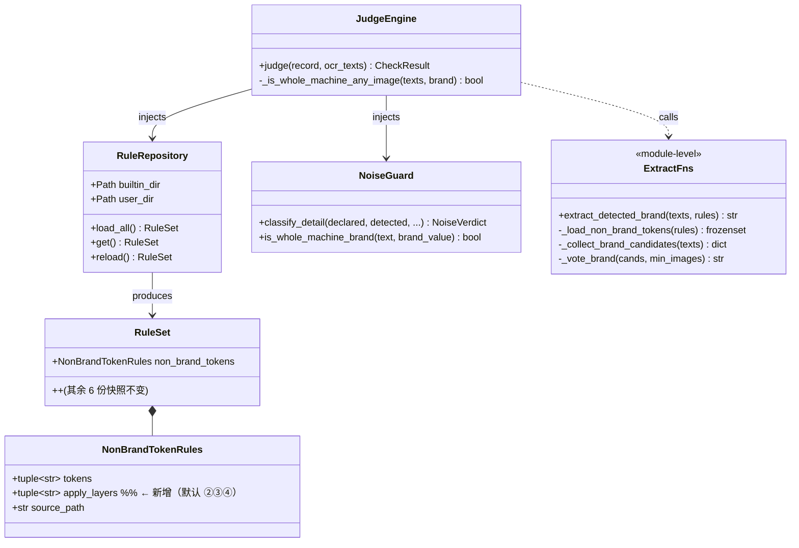
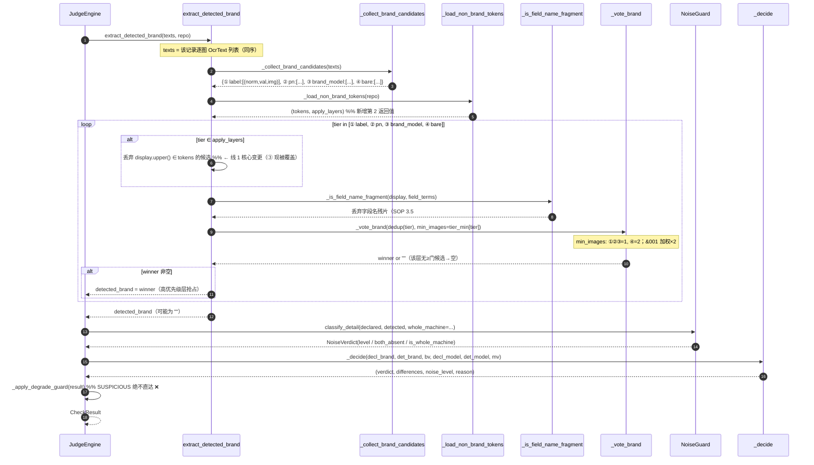

# 增量设计 · v0.1.1 / v0.1.2 / v0.2.0（报关申报要素自动校验工具）

> **作者**：高见远（架构师 software-architect）
> **日期**：2026-09-16
> **性质**：**增量迭代设计**（基线 = v0.1.0，`main@f15fbd6`；本文件**只新增，不改动 docs/01–08**）
> **回归基准**：SA26090215（18 条 / 113 图 / 129 张 jpg），当前分布 `✅1 / ❌12 / ⚠️5 / 🔵0`
> **口径权威**：`docs/01_SOP_报关申报要素自动校验_v2.0.md`（下称 **SOP**）
> **规格依据**：`docs/05_架构裁决_真OCR误报缺陷_R4b.md`（下称 **裁决**）
> **约束依据**：`docs/06_执行约束清单_0916.md`（**C1–C5**）

> ⚠️ **本阶段不修改任何源码**；第 5 章任务列表（T07-xx）的交由 T07 工程师实施。
> ⚠️ 本轮**不含现场 Win10 双击 exe 验收**（C1 暂缓，见 §10 Q7）。

---

## 1. 实现方案总览

### 1.1 三条线的目标 / 边界 / 不做什么

| 线 | 版本 | 目标（一句话） | 边界（做什么） | **不做什么（明确排除）** |
|---|---|---|---|---|
| **线 1** | v0.1.1 | 消除 `seq=5` 的 **PCB 丝印残片穿透虚高**，收口最后一类误报 | 把「非品牌 token 护栏」从 **④ 裸 token 层** 扩展到 ②/③ 层；补齐 PCB 残片词条 | ❌ 不改四类判定字符串；❌ 不改 SOP 判定口径；❌ 不为凑 `seq=5=✅` 而放宽噪声门；❌ 不引入需重装依赖的方案 |
| **线 2** | v0.1.2 | 对「真 OCR ↔ 离线回放」`seq 10–18` 的 **9 条品牌取值差异**逐条归因 | 建**归因方法论 + 工具 + 判据**（确定性判定 / 影响面判定 / 链路一致性硬断言） | ❌ 本阶段不跑结论；❌ 不因差异存在就改判定口径；❌ 不做 OCR 引擎替换 |
| **线 3** | v0.2.0 | 工程债清理：① 过程产出归档 ② 规则热加载裁决 ③ 打包体积瘦身 | 出**规则 + 工具 + 估算 + 风险**；热加载给**明确裁决** | ❌ 不动 `原始输入/`；❌ 不回退 `opencv-python`；❌ 不破坏 `six/colorlog/colorama/antlr4/flatbuffers/tqdm` 的 `collect_submodules` 显式收集；❌ 不引入需重装依赖 |

### 1.2 架构红线自检（本设计全程遵守）

| 红线 | 本设计落点 |
|---|---|
| 四层单向依赖 `ui→app→core→infra` | 全部改动落在 `core/`（纯 Python）/ `rules/` / `tools/`（开发边界）/ `tests/`；**不碰 ui/app** |
| `core/` `app/` 禁 import PySide6 | 无新增 Qt import |
| C2 规则外置（补规则=改 YAML 不改代码） | 线 1 的新增词条**全部进 YAML**；代码只改「读取与作用范围」 |
| 口径变更需确认 | 本设计的**默认方案（§6）不改口径**；凡涉及口径语义的选项**一律列入 §10 待确认** |
| 原始输入只读 | 线 3 归档工具**仅操作 `过程产出/`**，写入前 `infra.fs_lock.assert_within` |

---

## 2. 文件变更清单

> 路径均相对项目根 `customs_declaration_checker/`。**行数为预估**。
> 「D」= 本设计**实际新增**（架构师本阶段产出）；「E」= 交 T07 工程师实施的源码/规则/测试改动。

### 2.1 新增文件（D：架构产出，本阶段即交付）

| # | 相对路径 | 变更摘要 | 预估行数 | 归属 |
|---|---|---|---|---|
| D1 | `docs/09_增量设计_v0.1.x.md` | 本文件 | ~640 | 线1/2/3 |
| D2 | `docs/sequence-diagram-v0.1.1.mermaid` | 线 1 时序图（品牌取值→过滤→判定） | ~45 | 线 1 |
| D3 | `docs/class-diagram-v0.1.1.mermaid` | 线 1 类图（`NonBrandTokenRules` 增量） | ~35 | 线 1 |

### 2.2 新增文件（E：交 T07 实施）

| # | 相对路径 | 变更摘要 | 预估行数 | 线 |
|---|---|---|---|---|
| N1 | `tests/test_non_brand_layers.py` | ③ 层 non_brand 过滤回归锁（含 `seq=5` 形态复现） | ~90 | 1 |
| N2 | `tools/link_diff_attribution.py` | 双链路差异归因工具（真OCR JSON ↔ 离线回放 JSON） | ~200 | 2 |
| N3 | `tests/test_link_consistency.py` | 链路一致性硬断言（四类分布 + 关键 seq 品牌） | ~80 | 2 |
| N4 | `tools/archive_clean.py` | 过程产出归档：只读诊断→分级→规则化搬迁→索引 | ~250 | 3 |
| N5 | `docs/10_交付说明_v0.1.1.md` | 交付说明 v0.1.1（**新增，不改 08**） | ~120 | 1 |
| N6 | `过程产出/_归档索引.md` | 由 N4 生成的归档索引（产物，非源码） | ~60 | 3 |

### 2.3 修改文件（E：交 T07 实施）

| # | 相对路径 | 位置 | 变更摘要 | 预估行数 | 线 |
|---|---|---|---|---|---|
| M1 | `rules/non_brand_tokens.yaml` | 顶部 + 新增段 | 新增 `apply_layers:`（护栏作用层）；追加 PCB 丝印残片词条（`NMY`/`EMV`/`V-MA`…） | +10 | 1 |
| M2 | `core/constants.py` | §三 兜底区 | 新增 `DEFAULT_NON_BRAND_APPLY_LAYERS`；`DEFAULT_NON_BRAND_TOKENS` 同步追加残片 | +14 | 1 |
| M3 | `core/rule_repository.py` | `NonBrandTokenRules` + `_build_non_brand_tokens` | 快照新增 `apply_layers` 字段并解析 | +16 | 1 |
| M4 | `core/judge_engine.py` | `_load_non_brand_tokens` / `extract_detected_brand` | 返回值带 `apply_layers`；按层施加 non_brand 过滤 | +26 | 1 |
| M5 | `tests/test_rule_repository.py` | 漂移断言区 | 纳入 `apply_layers` + 残片词的 YAML↔constants 一致断言 | +22 | 1 |
| M6 | `tests/test_real_sample_sa26090215.py` | `seq=5` 相关 | `seq=5` 由硬断言改为**观测项**（预期 ⚠️，见 §6） | +12 | 1 |
| M7 | `CHANGELOG.md` | 顶部 | 新增 `[0.1.1]` 段 | +28 | 1 |
| M8 | `main.py` / `pyproject.toml` | 版本号 | `APP_VERSION` → `0.1.1`；`pyproject` version 同步 | +2 | 1 |
| M9 | `customs_checker.spec` | `excludes` / `datas` | 体积瘦身：追加排除项（见 §5 · T07-10） | +20 | 3 |

### 2.4 删除 / 搬迁（E：线 3 归档，全部在 `过程产出/` 内，**不动仓库源码**）

| # | 目标 | 动作 | 依据 |
|---|---|---|---|
| A1 | `过程产出/_pytest_tmp/**`（**5769** 文件） | **删除**（明确废弃：pytest 临时目录） | §5 · T07-08 |
| A2 | `过程产出/_t06_*.py`、`_t06_*.txt`（调试脚本/中间打印） | **搬迁**至 `_归档/v0.1.0/B_中间产物/` | 可重建 |
| A3 | `过程产出/_v01_pipinstall*.txt`、`_env_probe*.txt`、`*_status.txt`、`*_rc*.txt` | **搬迁**至 `B_中间产物/` | 可重建 |
| A4 | 证据链文件（见 §8.3 清单） | **原地保留**（建只读标记 + 入索引） | 红线：证据链必留 |
| A5 | `_archive_修复前成果产出_1350/`、`_pt_final*/`、`断点/` | **搬迁**至 `_归档/v0.1.0/D_待确认/` | 可能含历史证据，待人工确认 |

> **本阶段（架构师）不执行任何删除**；A1–A5 为 T07 实施项，且**必须先 `--dry-run` 出清单经主理人确认**（§10 Q5）。

---

## 3. 数据结构与接口变更

### 3.1 类图（线 1 增量）



### 3.2 函数签名变更（`core/judge_engine.py`）

| 函数 | 变更前 | 变更后 | 说明 |
|---|---|---|---|
| `_load_non_brand_tokens` | `(rules) -> frozenset[str]` | `(rules) -> tuple[frozenset[str], frozenset[str]]` | 返回 `(tokens, apply_layers)`；**签名变更需同步调用点**（唯一调用点 = `extract_detected_brand`） |
| `extract_detected_brand` | 仅对 `_TIER_BARE` 过滤 | 对 `tier ∈ apply_layers` 的层过滤 | 过滤判据 `display.strip().upper() in non_brand` |

> **向后兼容**：`_load_non_brand_tokens` 若被外部引用（当前无），改为返回 2 元组会破坏调用；**T07 需 `grep` 确认无其它调用点**（本设计已确认：仅 `extract_detected_brand` 一处，L500）。

### 3.3 YAML schema 变更（`rules/non_brand_tokens.yaml`）

```json
{
  "$schema_id": "non_brand_tokens@2",
  "apply_layers": {
    "type": "array",
    "items": {"enum": ["label", "pn", "brand_model", "bare"]},
    "default": ["pn", "brand_model", "bare"],
    "note": "护栏作用层：label=① 显式标签 / pn=② P/N 行 / brand_model=③ 品牌+型号行 / bare=④ 裸 token。默认不作用于 ①（最强结构锚点，避免抑制正当 Brand: 标签）。"
  },
  "tokens": {
    "type": "array",
    "items": "string",
    "note": "非品牌 token（大小写不敏感，归一化后比对）。补词条=改本文件，无需改代码（C2）。"
  }
}
```

**新增词条（`tokens` 追加，实测实证见 §6 附注）**：

```yaml
  # ── PCB 丝印残片（实测 seq=5 img&002：`NMY  809663` / `V-MA A00`；真OCR 变体 `EMV`）──
  - NMY
  - EMV
  - "V-MA"
```

> 层名 ↔ 代码 tier 常量映射：`label→_TIER_LABEL / pn→_TIER_PN / brand_model→_TIER_BRAND_MODEL / bare→_TIER_BARE`。

### 3.4 `core/constants.py` 同步（防漂移）

```python
#: 非品牌 token 护栏的作用层（裁决 §4.3「图片侧提取护栏」范围显式化）
DEFAULT_NON_BRAND_APPLY_LAYERS: list[str] = ["pn", "brand_model", "bare"]
# DEFAULT_NON_BRAND_TOKENS 追加： "NMY", "EMV", "V-MA"
```

由 `tests/test_rule_repository.py` 断言 `YAML == constants`，与既有 7 项漂移断言同机制。

---

## 4. 程序调用流程（线 1：品牌取值 → non_brand 过滤 → 判定）



**`seq=5` 变更点（实测验证）**：

| 阶段 | 变更前 | 变更后 |
|---|---|---|
| ③ 层候选 | `NMY`(img&002) + `V-MA`(img&002) | **被 non_brand 过滤 → 空** |
| ③ 层胜出 | `NMY` 抢占（③>④） | 无候选 → 落到 ④ |
| ④ 层候选 | `baori`(仅 img&004, 1 图) → ≥2 门拒绝 | 同上 → **空** |
| `detected_brand` | `NMY` | **`""`** |
| 判定 | `❌`（NMY≠baori，明确不一致） | **`⚠️`**（`_FIELD_DETECTED_MISSING`：申报有值、图内无品牌标识） |

---

## 5. 任务列表（有序 · 含依赖 · `T07-xx`）

> 组织原则：**批次 A（线 1，v0.1.1 核心）→ 批次 B（线 2，v0.1.2）→ 批次 C（线 3，v0.2.0）**。
> 批次 A 内 M1↔M2 必须**同批改**（否则 `test_rule_repository` 漂移断言红灯）。

### 批次 A · v0.1.1（线 1）：③ 层 non_brand 收口

| ID | 任务名 | 涉及文件 | 完成判据 | 依赖 |
|---|---|---|---|---|
| **T07-01** | 非品牌词表 schema 扩展 + 残片补词 | `rules/non_brand_tokens.yaml` | 新增 `apply_layers`（默认 `[pn,brand_model,bare]`）；追加 `NMY/EMV/V-MA`；`RuleRepository.load_all()` 无异常 | — |
| **T07-02** | constants 兜底同步 | `core/constants.py` | 新增 `DEFAULT_NON_BRAND_APPLY_LAYERS`；`DEFAULT_NON_BRAND_TOKENS` 追加 3 词；与 M1 逐项相等 | T07-01 |
| **T07-03** | 规则快照承载 `apply_layers` | `core/rule_repository.py` | `NonBrandTokenRules.apply_layers` 字段存在并解析；缺省值 = 默认层 | T07-01 |
| **T07-04** | 提取函数按层过滤 | `core/judge_engine.py` | `_load_non_brand_tokens` 返回 `(tokens, layers)`；`extract_detected_brand` 对 `tier ∈ layers` 施加 non_brand 过滤；**仅此一处调用点** | T07-02,03 |
| **T07-05** | 回归锁 | `tests/test_non_brand_layers.py`、`tests/test_rule_repository.py` | 新增：`test_non_brand_applies_to_brand_model_tier`（`NMY  809663` 形态 → ③ 无候选）；`test_apply_layers_sync_with_constants`；原漂移断言全绿 | T07-02,03,04 |
| **T07-06** | 真实样本回归改写 | `tests/test_real_sample_sa26090215.py` | `seq=5` 由确定性期望改为**观测项**（打印 verdict=⚠️ + diffs）；四层硬断言（seq 9/11/12/13/14/15=❌、2=❌、3/6/10=⚠️、7/8≠❌）**全部保持绿** | T07-04 |
| **T07-07** | 版本与留痕 | `main.py`、`pyproject.toml`、`CHANGELOG.md`、`docs/10_交付说明_v0.1.1.md` | 版本号 `0.1.1`；CHANGELOG 记录「③ 层 non_brand 收口 + 实测分布」 | T07-05,06 |
| **T07-A-验收** | 全量回归 | 全仓 | `pytest -q` 用例数 **≥ 656 + 新增**、0 失败；`ruff check` 全绿；`tools/check_env.py` exit 0；`--self-test` exit 0 | T07-01…07 |

### 批次 B · v0.1.2（线 2）：双链路差异归因

| ID | 任务名 | 涉及文件 | 完成判据 | 依赖 |
|---|---|---|---|---|
| **T07-08** | 归因工具 | `tools/link_diff_attribution.py` | 输入「真OCR JSON + 离线回放 JSON」→ 输出逐 seq 差异表（declared / offline_det / real_det / verdict × 2 / 根因分类 / 是否影响判定）；支持 `--rerun N`（同样本重跑 N 次判确定性） | 批次 A |
| **T07-09** | 链路一致性硬断言 | `tests/test_link_consistency.py` | 断言两条链路**四类分布一致**；对**影响判定的差异**（若有）断言 0 条 | T07-08 |

### 批次 C · v0.2.0（线 3）：工程债

| ID | 任务名 | 涉及文件 | 完成判据 | 依赖 |
|---|---|---|---|---|
| **T07-10** | 过程产出归档 | `tools/archive_clean.py` | `--scan`（只读）产出分级清单 → `--apply` 前须人工确认；**红线**：仅操作 `过程产出/`，`assert_within` 守卫，证据链文件零删除；产出 `_归档索引.md` | — |
| **T07-11** | 规则热加载裁决 | 本文件 §7.2（无代码） | 结论落定：**保持启动一次性加载**（不引入热加载）+ 依据 | — |
| **T07-12** | 打包体积瘦身 | `customs_checker.spec` | 追加排除项（§7.3）；exe 复打并**必须** `--self-test`/`--check-env` exit 0；记录新体积 | T07-10 |

---

## 6. 口径影响评估表（逐 seq · SA26090215）

> 方法：本表由**实测回放**（`过程产出/校验详细日志_SA26090215_累积.json`）+ **修复版提取函数模拟**得出，非估计。
> 现行分布 `✅1 / ❌12 / ⚠️5 / 🔵0` → **修后分布 `✅1 / ❌11 / ⚠️6 / 🔵0`**。

| seq | 申报(b/m) | 现状 | 修后预期 | 是否变 | 变化性质 | 依据 |
|---|---|---|---|---|---|---|
| 1 | baori / — | ❌ | ❌ | 否 | — | ① 层 `Brand:Daewoo`(img&003) 抢占；无变化 |
| **2** | — / — | ❌ | ❌ | 否 | — | 申报缺失但图内明确有（SOP §3.4 第147行第4条） |
| 3 | — / — | ⚠️ | ⚠️ | 否 | — | 低置信度证据不足（SOP §1.3） |
| 4 | 宇同 / — | ⚠️ | ⚠️ | 否 | — | 跨文字体系（SOP §1.2 不虚高） |
| **5** | **baori / —** | **❌** | **⚠️** | **✅ 是** | **实现补齐（消除虚高）** | PCB 残片 `NMY`/`V-MA` 被 ③ 层误捕 → 过滤后 ③/④ 均无候选 → 图内无品牌标识 → ⚠️（**非** ✅，见下「冲突标注」） |
| 6 | YUTONG / — | ⚠️ | ⚠️ | 否 | — | ① `Daewoo` 抢占 + 低置信度兜底 |
| 7 | YUTONG / — | ⚠️ | ⚠️ | 否 | — | 字段名残片判空（SOP §3.5#1） |
| 8 | — / — | ⚠️ | ⚠️ | 否 | — | 字段名残片 `SKYWORTH P/N` 判空 |
| 9 | — / L8M30E0 | ❌ | ❌ | 否 | — | 整机命中 + 品牌缺失（SOP §3.4 第147行 + 附录A.4） |
| 10 | — / L5B40L1 | ⚠️ | ⚠️ | 否 | — | 低置信度 |
| 11 | — / A9KB9G | ❌ | ❌ | 否 | — | 整机命中（品牌缺失） |
| 12 | — / A7A01G | ❌ | ❌ | 否 | — | 整机命中（品牌缺失） |
| 13 | — / A7A01G | ❌ | ❌ | 否 | — | 整机命中（品牌缺失） |
| 14 | — / A9KA8B | ❌ | ❌ | 否 | — | 整机命中（品牌缺失） |
| 15 | — / A9KFBG | ❌ | ❌ | 否 | — | 整机命中（品牌缺失；与 seq=12 同构） |
| 16 | DAEWOO / — | ❌ | ❌ | 否 | — | ② `SKYHORTH`→纠正 `SKYWORTH`≠`DAEWOO`（裁决 §4.6 裁决2） |
| 17 | DAEWOO / — | ❌ | ❌ | 否 | — | ① `Daewoo`（大小写一致）；型号侧差异不变 |
| 18 | DAEWOO / — | ❌ | ❌ | 否 | — | ① `Daewoo`；型号侧差异不变 |

**结论：全样本仅 `seq=5` 一条变化，`❌→⚠️`（消除 1 条虚高），不引入任何新的虚高/误放。**

**为什么「不引入新虚高」**：变更方向是**收紧**（③ 层多做一次「这不算品牌」的剔除）——它**只能减少**候选，**不会**新增候选；被剔除的 `NMY`/`V-MA` 是 PCB 丝印残片（非品牌），剔除后该记录落 ⚠️（保守方向），符合 SOP §1.2「宁可待人工复核，不可把假异常当真异常」。

### ⚠️ 与既有文档的冲突（显式标注，不静默覆盖）

| 冲突点 | 既有表述 | 本设计裁决 | 理由 |
|---|---|---|---|
| **seq=5 期望值** | 裁决 **§8.2** 依据表将 `seq=5` 列为 **✅**（依据「`baori` 一致」） | **修正为 ⚠️** | §8.2 的 ✅ 写于根因定位**之前**，隐含假设「`baori` 会被提取」。实测：`baori` 仅在 **1 张图（img&004）** 以裸 token 出现，**④ 层「≥2 图一致」门必然拒绝**；③ 层过滤后无候选。故修后落 ⚠️。**这是「期望值需按实测修正」，不是口径变更**——⚠️ 正是 SOP §1.3「图内无品牌标识」的正当落点 |
| **§九 版本规划表述** | 交付说明 §九：「v0.1.1 裁决 seq=5 归属（③ 层 non_brand 过滤）→ 消除最后一类 PCB 残片穿透」 | **一致**（目标=消除穿透，非「改判合格」） | 「穿透」=虚高；消除=不再误报 ❌。落 ⚠️ 即达成 |

> **不推荐**为达成 `seq=5=✅` 而放宽 ④ 层 `min_images 2→1`：那会**重新放行** `ONEL`/`WLO` 类单图噪声（裁决 §4.1 明确点名的误捕源），**违反「不虚高」红线**。若要 ✅，须走 §10 Q1 的 Option B（③ 模式泛化 + 外置，另行评估）。

---

## 7. 依赖包变化 & 线 3 专项裁决

### 7.1 依赖包变化

**无。** 三条线均**不新增/不升级/不删除**任何依赖：
- 线 1：仅改 YAML + `core/` 纯 Python（用标准库 `re`/`dataclasses`）。
- 线 2：归因工具用 `json`/`pathlib`/`argparse`（标准库）。
- 线 3：归档工具用 `pathlib`/`hashlib`/`shutil`（标准库）；瘦身**只减不增**（改 spec `excludes`）。

> **环境事实约束（务必遵守）**：沙箱 pip 有**三层拦截**（safe-delete / 批量删除阈值 50 / 前台 120s 超时）。**本设计刻意规避任何需要重新安装依赖的方案**（唯一 Python 解释器：`…\envs\default\Scripts\python.exe`）。

### 7.2 规则热加载评估（T07-11 裁决）

**裁决：保持现状（启动一次性加载为不可变快照），不引入自动热加载。**

| 维度 | 分析 |
|---|---|
| 「跑批中口径漂移」实际风险 | **高**。跑批可能持续 10–20 分钟（60 条票）甚至更久；若期间 `%APPDATA%\CustomsChecker\rules\` 被改动并热加载，则**同一票内前后记录用不同规则集判定** → 直击「可追溯」（SOP §1.2）与「断点续跑防串票」（C4）两条红线 |
| 现状已满足的诉求 | C2 只要求「**补规则 = 改 YAML 不改代码**」，**未要求热加载**；`RuleRepository.reload()` 已提供**手动重载**（菜单「重载规则文件」），语义 = 「下次跑批生效」 |
| 结论 | **维持**：启动 `load_all()` 冻结快照；`reload()` 仅允许**跑批间隙**由用户显式触发；**不注册文件监听、不做自动热加载** |
| 附带加固（可选，P2） | `reload()` 时记录规则文件 sha256 入日志，使「本次跑批用的是哪版规则」可审计 |

### 7.3 打包体积优化（T07-12）

**现状**：`dist/报关申报要素校验工具.exe` = **156,254,098 字节（约 149.0 MB）**，onefile。
**构成（估）**：rapidocr 模型 ~31 MB + PySide6 + numpy + onnxruntime + opencv-python-headless。

| # | 路径 | 预估收益 | 风险 | 判定 |
|---|---|---|---|---|
| P1 | 排除 Qt 软件渲染回退 `opengl32sw.dll` | **~20 MB** | ⚠️ 中：无硬件 OpenGL 的环境（部分远程桌面/虚拟机）可能白屏 | **待确认（§10 Q6）**，默认**暂不排除** |
| P2 | 排除 `PySide6/translations/**`（Qt 界面向来中文，本应用无 i18n） | ~3–5 MB | 低 | **推荐执行** |
| P3 | 追加排除 `PySide6.QtNetwork` / `Qt6Network.dll`（本应用不联网） | ~3 MB | 低-中（须确认无隐式依赖） | **推荐执行**（加回归冒烟） |
| P4 | 追加排除 `numpy.tests` / `numpy.f2py` / `numpy.distutils` / `opencv` 的 `data/` | ~5–10 MB | 低 | **推荐执行** |
| P5 | rapidocr 仅保留 `det+rec+cls` 三模型，剔除 wheel 内多余模型 | 0–10 MB | 中（须核对 wheel 内容） | 建议**先盘点**再定 |
| P6 | `--onedir`（目录形态，`CUSTOMS_ONEDIR=1`） | 单文件体积~不变（外露） | 低；启动更快、可增量更新 | 可选备选，不改变默认 |
| P7 | 关闭 UPX | 体积 **+**，不可取 | — | **不执行**（UPX 现开启，保留） |

**预计可达**：执行 P2+P3+P4（+P5 视盘点）→ **合计约省 11–25 MB → 目标 `~125–138 MB`**。
**不可动红线（重复强调）**：
1. **禁止**回退 `opencv-python`（双 Qt 冲突）；
2. **禁止**破坏 `six` / `colorlog` / `colorama` / `antlr4` / `flatbuffers` / `tqdm` 的 `collect_submodules` 显式收集（无静态 import 点的传递依赖，靠 spec 烤进 exe）；
3. 任何 `excludes` 新增后**必须**重跑 `--check-env` + `--self-test`（exe 冒烟是硬门，v0.1.0 的 10 个打包态缺陷皆由此暴露）。

---

## 8. 共享知识（跨文件约定）

### 8.1 命名与语义约定

| 约定 | 内容 |
|---|---|
| 层名 ↔ tier 常量 | `label`=`_TIER_LABEL`(显式标签①) / `pn`=`_TIER_PN`(P/N行②) / `brand_model`=`_TIER_BRAND_MODEL`(品牌+型号行③) / `bare`=`_TIER_BARE`(裸token④) |
| 三层护栏分工（**不得混用**） | 「**什么不算品牌/值**」→ `non_brand_tokens.yaml` + `fields_blacklist.yaml`；「**字段间共现**（整机）」→ `whole_machine_brand.yaml`；「**噪声三态**」→ `noise_signals.yaml` |
| `fields_blacklist.terms` vs `non_brand_tokens.tokens` | 前者=**字段名被当值**（`创维物料编号`/`MFR P/N`）；后者=**非品牌裸词**（单位/元件厂标/应用名）。**新词先判断属于哪一类**，勿混投 |
| YAML ↔ constants | 任何 `rules/*.yaml` 键的默认值**必须**在 `core/constants.py` 有同名 `DEFAULT_*` 兜底，且由 `tests/test_rule_repository.py` 断言一致（防两处漂移） |
| 口径字符串 | 四类判定字符串**只**在 `core/constants.py` 定义，**禁止**散落硬编码（`tests/test_constants.py` 逐字锁 SOP §1.3） |

### 8.2 错误处理与日志

| 约定 | 内容 |
|---|---|
| 规则加载失败 | `RuleRepository` **不静默降级**：语法/必填缺失 → 抛 `RuleConfigError`；仅「YAML 缺失」走 constants 兜底，且**兜底必须与 repo 路径等价**（裁决 §5B 缺陷 F 教训） |
| 新增可选字段（如 `apply_layers`） | **缺省即合法**：YAML 未写 → 用 constants 默认 → **绝不**因缺字段报错或改变既有行为（向后兼容） |
| 日志 | 走 `infra.logger.get_logger(Phase)`；**完整 OCR 原文只进 JSON 证据**、不进滚动日志（架构 9.3）；规则源路径入 `load_notes` |
| 判定层 | `SUSPICIOUS` **强制** `NO_MARK`，由 `_apply_degrade_guard` 唯一兜底（不虚高红线）；外箱整机品牌**保留 ❌**（SOP §3.4 第147行 + 附录A.4） |

### 8.3 线 3「证据链必留」清单（归档红线的白名单）

```
必留（KEEP · 零删除）：
  过程产出/校验详细日志_SA26090215_累积.json        # 真 OCR 端到端判定证据（回归基座）
  过程产出/_t06_real_ocr*.{py,json,txt}             # 真 OCR 端到端证据
  过程产出/_t06_readonly*.{py,txt}                  # 原始输入只读复验
  过程产出/_t06_verify_evidence.txt / _t06_offline_result.txt
  过程产出/<权威 junit>.xml                          # 二选一保留：_v01_junit_final.xml 或 _t06_junit_full.xml
  过程产出/_t06_verdict_table.md                     # 逐条判定依据（= docs/07 原始稿）
  过程产出/{架构裁决,架构设计,执行约束清单,PRD}_*.md  # 规格证据
  过程产出/{class-diagram,sequence-diagram}.mermaid
```

> 「可重建」（脚本/中间打印/pip 日志）移入 `_归档/v0.1.0/B_中间产物/`；「明确废弃」（`_pytest_tmp/**`）删除；「待确认」（历史成果产出目录）移入 `D_待确认/`。

---

## 9. 验收标准（可机器判定硬指标）

| # | 指标 | 判定方式 | 门槛 |
|---|---|---|---|
| 1 | 单元/回归测试 | 项目目录下 `python -m pytest -q` | **RC=0**；用例数 **≥ 656 + 新增**（v0.1.0 基线 656） |
| 2 | 静态检查 | `ruff check .` | **All checks passed** |
| 3 | 环境体检（源码态） | `tools/check_env.py` | **exit 0**（19 依赖 + 23 import + 无空壳包） |
| 4 | 架构守卫 | `tests/test_architecture_guard.py` | **绿**（`core/`/`app/` 无 PySide6） |
| 5 | 规则漂移 | `tests/test_rule_repository.py` | **绿**（含新增 `apply_layers` + 残片词断言） |
| 6 | 四类分布（离线回放） | `tests/test_real_sample_sa26090215.py` 观测项 | **✅1 / ❌11 / ⚠️6 / 🔵0**（`seq=5=⚠️`） |
| 7 | 四层硬断言 | 同上 | 全绿：`seq 9/11/12/13/14/15=❌(带"整机")`、`2=❌`、`3/6/10=⚠️`、`7/8≠❌`、总数=18 |
| 8 | 原始输入指纹不变 | 跑批前后 `(文件名+size)` sha256 比对 | **一致**（130 文件 / 394,140,543 字节） |
| 9 | exe 自检 | `dist\…exe --self-test` 与 `--check-env` | **均 exit 0** |
| 10 | 线 2 链路一致性 | `tests/test_link_consistency.py` | 两链路**四类分布一致**；影响判定的差异 = **0** |
| 11 | 线 3 归档红线 | `tools/archive_clean.py --verify` | `原始输入/` **零改动**；`_归档索引.md` 生成；证据链文件**零删除** |
| 12 | 口径未变 | `tests/test_constants.py` | 四类判定字符串与 SOP §1.3 **逐字一致**（绿） |

---

## 10. 待明确事项 / 需用户确认（Jason 拍板）

| # | 背景 | 选项 | **架构师建议** |
|---|---|---|---|
| **Q1** | `seq=5` 修后落 ⚠️（非 ✅）。若要 ✅ 需额外机制 | **A**：只做 ③ 层 non_brand 过滤 → `seq=5=⚠️`（转人工复核即可改判 ✅）<br>**B**：额外把 ③ 层泛化为「品牌 + UL/线材标记」模式并把该正则**外置到 YAML** → `seq=5=✅`；代价：新增一条模式 + 外置改造（工作量↑） | **A（推荐）**。A 已消除虚高、守住不虚高红线，且不碰口径；B 收益有限（1/18 条）且增加模式维护面 |
| **Q2** | `apply_layers` 默认作用层 | **A**：`[pn,brand_model,bare]`（②③④）<br>**B**：`[label,pn,brand_model,bare]`（①②③④，含显式 `Brand:` 标签） | **A（推荐）**。① 是「显式 `Brand:` 标签」，结构锚点最强，不宜被「裸词表」抑制 |
| **Q3** | 是否加**结构加固**（防未知残片） | **A**：不加（只靠词表）<br>**B**：③ 层也要求「≥2 图一致」或「与①/②互证」（§4.2 参数调整） | **暂 A**。词表+③过滤已覆盖实测残片；B 会改 §4.2 显式规格，且可能误杀单图真品牌（③ 层语义待观察）。建议**列为 v0.1.2 归因观察项** |
| **Q4** | 线 2：链路一致性是否设**硬断言门** | **A**：设硬断言（分布一致 + 影响判定的差异=0），红灯即卡<br>**B**：仅出报告不设门 | **A（推荐）**。但「影响判定的差异」门设 **0** 才可入交付；若归因发现 1 条影响判定 → 回修而非放宽门 |
| **Q5** | 线 3 归档：**谁批准删除** | **A**：`--scan` 出清单 → Jason/主理人确认 → `--apply`<br>**B**：工具直接按规则自动删 | **A（必须）**。`_pytest_tmp`(5769) 可直接删，但 `_archive_修复前成果产出_1350/`、`_pt_final*/`、`断点/` 须人工确认 |
| **Q6** | 线 3 瘦身：是否排除 `opengl32sw.dll`（~20MB，最大单项） | **A**：排除（省 20MB）<br>**B**：保留（保兼容） | **B（推荐保留）**。远程桌面/无 GL 环境可能白屏，风险>收益；优先执行 P2/P3/P4（低风险 ~11–20MB） |
| **Q7** | C1 现场 Win10 验收 | 本轮是否执行 | **暂缓（按本轮范围）**；v0.2.0 或专轮执行（干净 Win10 x64 双击 → 界面弹出 → 跑一次） |
| **Q8** | `seq=1` 归因（附带发现） | 实测 `seq=1=❌`（`Brand:Daewoo` 整机命中），裁决 §8.2 原列 ⚠️（争议项） | **依实测呈现**（整机命中→❌ 与裁决1同向）；**列为观测项**，不设硬断言。请确认是否接受 |

---

## 附：本设计的实证依据（可复现）

| 结论 | 实证手段 | 结果 |
|---|---|---|
| `seq=5` 当前检测值 = `NMY`，来自 ③ 层（`NMY  809663`） | 逐层 dump `_collect_brand_candidates` | ③ = [`V-MA`(img&002), `NMY`(img&002)] |
| ③ 层过滤后 ③/④ 均无候选 → `detected=""` | 修复版提取函数模拟 + `JudgeEngine.judge` | `seq=5: detected='' verdict=NO_MARK` |
| 全样本仅 `seq=5` 变化 | 18 条全量修复版回放 | 修后分布 `{PASS:1, FAIL:11, NO_MARK:6, NO_IMAGE:0}` |
| `baori` 仅单图 | 逐图 OCR 文本核对 | 仅 img&004（裸 token 行 ×2，去重后 1 图） |
